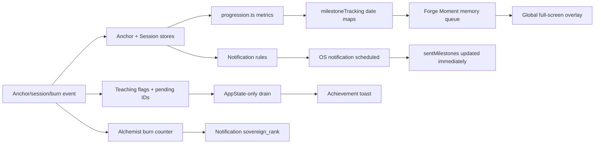

# Anchor Milestone Logic Audit

**Date:** 2026-07-12  
**Scope:** `anchor/mobile`, the notification milestone pipeline, authenticated hydration, and the backend burn/export paths that determine whether progression survives reinstall.  
**Implementation status:** Historical audit snapshot. The accepted rules and implementation slice are documented in `MILESTONE_ARCHITECTURE_DECISIONS_2026-07-12.md`.

## Executive verdict

Anchor does not currently have one milestone system. It has three user-facing milestone pipelines plus a fourth notification-priority counter:

1. Rank and Mark awards persisted as date maps and displayed by the full-screen Forge Moment overlay.
2. First-anchor, first-charge, and first-burn Micro Teaching IDs persisted in `teachingStore` and displayed as toasts.
3. Session-count and Thread Strength push-notification milestones persisted in notification state.
4. An Alchemist counter that sets a separate `sovereign_rank` notification flag.

Each pipeline has different IDs, persistence, dedupe, queueing, display, and analytics semantics. There is no complete milestone log, no durable award-to-display outbox, no account-scoped in-app milestone ledger, and no single place that explains which events are achievements versus progression stats, teachings, or notification checkpoints.

The highest-risk defects are lifecycle failures, not threshold math:

- Rank/Mark awards can be persisted and then permanently lose their popup if the process exits.
- Teaching milestones can remain pending until a later background/foreground cycle.
- A scheduled push milestone can be canceled while already marked as sent.
- Concurrent award checks can duplicate presentation or lose persisted dates.
- Milestone dates are device-global and can suppress another account's achievements.
- Rapid completion taps can record more than one session before milestone evaluation.
- Burned and some Deep Prime history can disappear after reinstall, causing rank, practice-day, release, and depth regression.

These issues are fixable without a broad rewrite. The safest direction is a small, versioned, account-scoped milestone ledger with a persisted outbox, permanent IDs, serialized mutations, and explicit presentation acknowledgements.

## Current architecture map



| Pipeline | Definitions | Trigger/evaluation | Persistence | Queue/display | Main problem |
|---|---|---|---|---|---|
| Rank + Mark | `src/utils/progression.ts:122-233` | `queueProgressionMilestonesFromStores`, called by ritual completion and burn flows | `anchor-milestone-dates` in plain AsyncStorage | Memory-only `forgeMomentStore` → global `ForgeMomentOverlay` | Award is durable before delivery; delivery is not durable |
| First anchor/charge/burn | `src/constants/teaching.ts:191-230` | String literals in `anchorStore`, `sessionStore`, and `BurningRitualScreen` | `anchor-teaching-storage` in AsyncStorage | Persisted `pendingMilestones` → `MainTabNavigator` toast drain | Drain is not driven by hydration or enqueue |
| Push milestones | `notificationTypes.ts:12`, `notificationRules.ts:250-299` | Notification controller reconciliation | `@anchor_notification_state`, also synced to server | OS notification scheduled five minutes later | Marked sent when scheduled, before delivery |
| Alchemist/Sovereign notification state | `NotificationPriority.ts:18-22` | Burn vault callback | Notification state | Changes notification behavior/copy | “Sovereign” conflicts with canonical Rank |

## Source of truth and definition audit

### What is centralized

- Canonical multi-factor Rank, per-anchor Depth, and Mark thresholds are centralized in `src/utils/progression.ts`.
- `practiceRank.ts` and `practiceDepth.ts` are compatibility re-exports of that canonical model.
- The three Micro Teaching milestone definitions have versioned IDs in `TEACHINGS`.
- Push notification milestone IDs are a stable string union: `sessions_3`, `sessions_7`, `sessions_30`, and `thread_strength_100`.

### What is scattered or identity-unsafe

- Rank/Mark persistence uses display names as keys, not permanent IDs (`milestoneTracking.ts:13-16`). Renaming “First Return Mark” or a Rank silently creates a new identity.
- Forge dedupe uses `${type}:${name}` (`forgeMomentStore.ts:22-23`), again binding identity to copy-facing names.
- Rank subtitles are duplicated in `ForgeMomentOverlay.tsx:38-46` instead of reading canonical descriptions. Sovereign copy already differs from `progression.ts`.
- Teaching IDs are defined centrally but trigger sites use raw string literals in three separate stores/screens.
- `useProgressionData.ts:32-105` contains a second, prime-only Rank/Depth ladder. Its depth ends at `Sovereign` at 300 primes, conflicting with canonical per-anchor `Embodied` at 30 primes, 21 days, and 3 Deep Primes.
- `milestoneTracking.ts:161-301` contains matching prime-only sheet milestone storage. Its writer functions have no production callers, and depth rows pass `achievedDate={null}` in `ProgressionSheet.tsx:466-483`.
- `subscribeToMilestoneDates` has no production subscriber; Mark dates are recorded but never displayed in the Progression Sheet.
- `NotificationEligibility`, `resolvePriority`, and the old notification-copy priority system have no production callers. Only `isSovereign` remains live.

## Trigger map

| Event | Current behavior | Assessment |
|---|---|---|
| First anchor created | `anchorStore.addAnchor` sets a teaching flag and queues `milestone_first_anchor_v1` before updating the anchor store (`anchorStore.ts:116-127`) | Cross-store ordering can leave a flag/queue without the anchor after process death |
| First Focus Session | `recordSession(type: activate)` sets the “first charge” flag and queues `milestone_first_charge_v1`; then Rank/Mark evaluation runs (`ActivationScreen.tsx:524-539`, `sessionStore.ts:352-360`) | The milestone name is broader than its trigger; commit is delayed until reflection completion |
| First/regular Prime | Reinforce session queues the same first-charge teaching and evaluates Rank/Mark | Works locally, but rapid taps and restart windows are unsafe |
| Deep Prime | Reinforce session contributes to total primes, practice days, per-anchor depth, and Rank/Mark | Local behavior works; backend restoration is incomplete |
| Stabilize | Sets `hasCompletedFirstStabilize`, but queues no milestone (`sessionStore.ts:361-363`) | Currently no user-facing milestone; Stabilize itself is effectively unreachable from current production navigation |
| Burn & Release | Releases locally, evaluates Rank/Mark, increments Alchemist state, queues first-burn teaching, and shows a separate post-burn toast (`BurningRitualScreen.tsx:85-105`) | Multiple overlapping progression/teaching signals; Forge overlay can interrupt the burn flow |
| Multiple sessions in one day | Total-prime/session milestones advance; Marks use unique practice days | Correctly different metrics, but the UI does not explain the distinction |
| Onboarding completion | No milestone | No accidental duplicate responsibility found |
| Visualize | Implemented as a Deep Prime phase/audio segment, not a standalone completed mode | No separate milestone should be added unless it becomes an independently completed event |
| Trial/Pro upgrade or purchase restore | No in-app milestone award | Correct boundary: entitlement is not an achievement |
| Paid Pro daily anchor cap | Entitlement layer returns `pro_daily_anchor_cap_reached` at 10 UTC-day creations (`entitlements.ts:11-21,102-117,216-230`) | Correctly handled as a limit state, not a milestone |

## Confirmed bugs

### P0 — trust/data-integrity failures

1. **Rank/Mark popup delivery is not durable.** `checkAndRecordMilestones` persists the earned date before `queueProgressionMilestonesFromStores` enqueues the popup (`milestoneTracking.ts:96-112`; `progressionMilestones.ts:30-58`). The Forge queue is memory-only, and `LAST_MILESTONE_SHOWN_KEY` is written at enqueue time (`forgeMomentStore.ts:26-58`). Process death in that window permanently loses the popup because the award is already considered recorded.

2. **Milestone data is not account-isolated.** `anchor-milestone-dates` and `anchor-sheet-milestone-dates` are device-global AsyncStorage keys (`milestoneTracking.ts:10,170`). Sign-out clears the last Forge key but not either date map and does not reset the Forge store (`authStore.ts:1008-1035`). A second account can inherit dates that suppress its achievements; an already-active overlay can also survive the account transition.

3. **Concurrent award checks can duplicate presentation or lose persistence.** `checkAndRecordMilestones` is an un-serialized read/modify/write (`milestoneTracking.ts:81-112`). Concurrent calls can both return the same milestone as new, or the later writer can overwrite a more complete date map. `forgeMomentStore.queueMilestone` awaits storage before checking Zustand state, so two callers can both pass its duplicate check (`forgeMomentStore.ts:30-58`).

4. **Teaching milestone toasts can stay queued indefinitely.** The drain runs only on a future `AppState` transition to `active` (`MainTabNavigator.tsx:222-254`). It does not run on mount, after teaching-store hydration, or when an item is queued while the app is already active. Persisted first-anchor/charge/burn messages therefore reappear after an unrelated later foreground—the exact “notification ghost” behavior the product brief wants to eliminate.

5. **Scheduled push milestones can be canceled while already marked sent.** Every scheduling pass cancels existing smart notifications before choosing a replacement (`useNotificationController.ts:190-200,246-264`). The controller adds the milestone to `sentMilestones` immediately after scheduling (`useNotificationController.ts:204-229`), although the notification fires five minutes later. Any reschedule during that delay can cancel the notification; the rule then permanently excludes it (`notificationRules.ts:250-299`).

6. **Rapid completion taps are not idempotent.** `CompletionModal` exposes Done and Skip without a synchronous submit guard (`CompletionModal.tsx:155-158,264-277`). `ActivationScreen` and `RitualScreen` also lack handler-entry guards (`ActivationScreen.tsx:524-539`; `RitualScreen.tsx:1305-1320`). A same-tick double tap can append two session-log entries, advance Thread Strength/session notification milestones twice, and launch concurrent Rank/Mark writes. `ChargeCompleteScreen` already demonstrates the correct minimal ref guard.

7. **Burn/reinstall can regress lifetime progression.** The backend burn route snapshots a burned anchor and hard-deletes the original, cascading its activations and charges (`backend/src/api/routes/anchors.ts:1342-1385`). Auth hydration rebuilds priming history only from exported activations and ignores burned-anchor history (`AuthHydrationService.ts:83-113,166-175`). After reinstall, Total Primes, practice days, released-anchor count, Rank, and per-anchor Depth can fall.

8. **Deep Prime history is not fully restorable.** Deep rituals create a local reinforce session, but the backend charge path does not create an activation record. Hydration only maps activations back into priming history. Deep Prime counts and depth can disappear after reinstall even without burning.

### P1 — lifecycle and dedupe defects

1. **Teaching milestones are removed before successful display.** `dequeueMilestone` mutates the queue first (`teachingStore.ts:142-147`); the navigator validates content and calls the toast afterward (`MainTabNavigator.tsx:232-238`). Unknown legacy IDs or presentation failures are silently lost. The drain never calls `recordShown`, so `maxShows: 1`, show counts, exhaustion, and milestone analytics are not updated.

2. **Opening Progression Sheet can suppress a legitimate new achievement.** Every open runs `backfillMilestoneDates` before `checkAndRecordMilestones` (`ProgressionSheet.tsx:244-267`). Backfill marks every missing currently-earned milestone `pre-launch`, so the normal check sees nothing new. Migration behavior is navigation-order dependent instead of versioned and one-time.

3. **Storage failure is reported as success.** Milestone writes swallow AsyncStorage errors (`milestoneTracking.ts:59-65,211-216`). `checkAndRecordMilestones` can still return “new” awards, leading to a popup with no durable award and a repeat later. The opposite order—date saved, queue failure—permanently suppresses presentation.

4. **Authoritative session commit happens too late.** Focus, quick-prime, and first-prime flows record session history and evaluate milestones only after a reflection action or follow-up screen. Killing the app after the ritual completes but before that step leaves anchor totals ahead of session history and practice days.

5. **Achievement dates use UTC while eligibility uses the profile timezone.** Dates are recorded with `toISOString().split('T')[0]` (`milestoneTracking.ts:90,239`), while practice-day thresholds use the profile timezone (`progressionMilestones.ts:18-23`). Near UTC midnight, the displayed date can differ from the day that actually earned the achievement.

6. **Old notification milestones are emitted in ascending order.** `detectMilestone` checks 3, then 7, then 30 sessions. A restored user first evaluated at 30 sessions can receive stale 3- and 7-session messages before the current one.

7. **“Sovereign” means two different things.** Canonical Rank requires 200 primes, 60 practice days, and 3 releases (`progression.ts:149-158`). Notification state sets `sovereign_rank` at 50 primes or 3 Alchemist milestones (`NotificationPriority.ts:18-22`). Even if the latter is intended as an internal audience segment, its naming and copy boundary are unsafe.

## Likely risks and policy gaps

- Reinstall behavior for in-app milestones is nondeterministic: the next ritual can replay all locally forgotten achievements, while opening Progression Sheet first can backfill and suppress them.
- Deleted/restored anchors can make current Rank fall while immutable earned-date maps remain. The product must explicitly decide whether Rank is permanent, reversible, or “highest achieved” plus “current standing.”
- Unknown keys and values survive the shallow date-map sanitizers. There is no allowlist, schema version, quarantine, or migration telemetry.
- The Forge overlay is mounted globally in `App.tsx`, so it can cover burn, onboarding, paywall, purchase, or an active practice route whenever a queued award becomes active.
- Multiple earned Rank/Mark items auto-advance as consecutive 7.8-second full-screen overlays. A reinstall/catch-up event could occupy the UI for nearly a minute.
- Teaching milestones are intentionally `guideOnly: false`, so Guide Mode off does not suppress first-anchor/charge/burn achievement toasts. That should be documented as product policy.
- Notification milestones use lifetime sessions at 3/7/30, while Marks use unique practice days at 3/7/30/100. Both can celebrate similar-looking numbers for different behavior.
- The Free weekly practice cap is enforced by the mobile entitlement gate, not the backend activation/stabilize routes. This is a security/abuse issue but should remain separate from milestone logic.

## Queue, log, and display behavior

There is no actual unified milestone log.

- Progression Sheet shows Rank dates only. It records Mark dates but does not render them; Depth rows always receive no date.
- Forge Moment keeps only active and queued in-memory items. It has no historic list, timestamps, skip reason, or restart recovery.
- Teaching store keeps pending IDs and generic show-count history, but the milestone drain does not record shows.
- Notification state keeps `sentMilestones`, but “sent” currently means scheduled, not delivered.

The full-screen Forge Moment is visually polished but operationally disruptive:

- It is globally mounted, auto-dismisses at 7.8 seconds, and immediately advances the next item.
- It does not use Reduce Motion.
- Its full-screen `Pressable` lacks modal accessibility semantics, a descriptive accessibility label, live-region announcement, accessibility escape, and a durable explicit acknowledgement.
- “Milestone Celebrations” in Settings controls only push milestones. It does not control Forge Moment or teaching milestone toasts (`SettingsScreen.tsx:627-635`; `notificationRules.ts:277-299`). The label is therefore misleading.

## Analytics and observability

Current coverage is insufficient to debug a user report end to end.

- No consistent event records Rank/Mark `awarded`, `queued`, `shown`, `dismissed`, `auto_dismissed`, `skipped`, or `persistence_failed`.
- No event records teaching milestone queue, successful toast display, stale/dead-letter removal, or show exhaustion.
- Push milestones emit `notification_scheduled`, but not a milestone-specific delivered/opened/canceled lifecycle tied to the permanent milestone ID.
- Milestone persistence catches errors without logging.
- The setting updater does not consistently track milestone preference changes.

Recommended event envelope:

```text
milestone_lifecycle {
  milestone_id,
  definition_version,
  transition,          // awarded|queued|shown|dismissed|skipped|failed
  source_event_type,
  source_event_id_hash,
  category,
  presentation,
  app_version,
  reason_code,
  occurred_at
}
```

Do not send intention text, sigil content, raw anchor IDs, or other sensitive content. Hash or omit correlation IDs.

## Security and privacy finding

### High — behavioral milestone telemetry is plaintext and device-global

`storageClassification.ts:58-67` classifies teaching history and pending milestones as high-sensitivity telemetry, but `milestoneTracking.ts:1,10,59-75,170,211-226` stores equivalent Rank/Mark achievement history in plain AsyncStorage with keys shared by every account on the device. A second account can inherit or suppress the first account's progress state; on a rooted or backed-up device, the behavioral history is also readable as plaintext.

No milestone currently grants Pro access or bypasses authorization, so this is not an entitlement escalation. The concrete impact is cross-account privacy leakage, incorrect award suppression, and locally exposed practice-history metadata.

```ts
// Before: device-global and plaintext
await AsyncStorage.setItem('anchor-milestone-dates', JSON.stringify(next));

// After: one encrypted, versioned envelope per authenticated account
const key = `anchor-milestones-v2:${userId}`;
await encryptedPersistStorage.setItem(key, JSON.stringify({
  version: 2,
  awards,
  pending,
}));
```

Also add the new ledger fields to `storageClassification.ts`, clear the active presenter synchronously on account transition, and switch ledgers only after the target account identity is known.

## Recommended data model

Keep definitions separate from user award state.

```ts
type MilestoneId =
  | 'anchor.first_created'
  | 'practice.first_prime'
  | 'anchor.first_released'
  | 'rank.practitioner'
  | 'rank.architect'
  | 'rank.sovereign'
  | 'mark.first_return'
  | 'mark.steady_thread'
  | 'mark.discipline'
  | 'mark.constancy'
  | 'notification.sessions_3'
  | 'notification.sessions_7'
  | 'notification.sessions_30'
  | 'notification.thread_strength_100';

interface MilestoneAward {
  id: MilestoneId;
  definitionVersion: number;
  ledgerVersion: number;
  userId: string;
  sourceEventId: string;       // idempotency key
  anchorId?: string;
  category: 'journey' | 'rank' | 'mark' | 'notification';
  awardedAt: string;
  awardedLocalDate: string;
  status: 'pending' | 'displaying' | 'shown' | 'dismissed' | 'skipped';
  shownAt?: string;
  dismissedAt?: string;
  presentationAttempts: number;
  lastErrorCode?: string;
}
```

Use one account-scoped, versioned persisted envelope for both the ledger and outbox. Serialize mutations. Award and enqueue in one write. Mark `shownAt` only after the presenter is visibly mounted; mark `dismissedAt` on user or timed acknowledgement. Permanent IDs must never be renamed, even when copy or thresholds evolve.

## Smallest safe patch plan

### P0 — restore trust and prevent state corruption

1. **Make completion idempotent.** Copy the `hasRecordedRef` pattern from `ChargeCompleteScreen` into `CompletionModal`, `ActivationScreen`, and `RitualScreen`; introduce a stable session completion ID.
2. **Add a serialized, account-scoped milestone envelope.** In `milestoneTracking.ts`, migrate current Rank/Mark maps into a versioned ledger keyed by authenticated user. Return explicit write success/failure.
3. **Persist Forge pending delivery.** Convert `forgeMomentStore` to a persisted outbox; do not write “shown” at enqueue. Reset/switch it during sign-out.
4. **Fix teaching drain activation.** Drain after hydration when already active and subscribe to empty→nonempty queue transitions. Change dequeue to peek/ack and call `recordShown` after success.
5. **Separate scheduled from delivered push milestones.** Preserve a scheduled notification record and add `sentMilestones` only after delivery/response acknowledgement. Ensure one notification controller/provider owns scheduling.
6. **Restore complete lifetime progression.** Include burned-anchor snapshots and Deep Prime/charge history in account export/hydration, or persist a server-authoritative append-only practice ledger.

### P1 — stabilize definitions, migrations, and timing

1. Add a permanent milestone registry that references canonical `RANK_TIERS`/`MARK_TIERS`; remove copy and threshold duplication from the overlay.
2. Move backfill to a one-time, versioned migration. Progression Sheet should read, not award or migrate.
3. Commit sessions at ritual completion; update reflection metadata afterward using the same event ID.
4. Record achievement dates with the same profile-timezone helper used for practice days.
5. Choose highest relevant notification catch-up milestone and explicitly baseline older thresholds.
6. Rename the notification `sovereign_rank` segment or derive canonical Rank from the progression service.

### P2 — calm UX and complete history

1. Add a route-aware presenter with safe surfaces. Never interrupt burn, onboarding, paywall/purchase, or a running session.
2. Coalesce catch-up awards into one summary instead of consecutive full-screen overlays; add pending-item age/TTL and dead-letter reasons.
3. Add Reduce Motion, screen-reader announcement, modal semantics, explicit Continue, and accessibility escape to Forge Moment.
4. Render a real history view with Rank, Mark, journey milestones, earned date, and a short “why this matters” explanation.
5. Rename Settings to “Milestone push notifications,” or add a separate in-app celebration preference.

### P3 — future enhancements

1. Sync the milestone ledger to the authenticated account with conflict-safe union semantics.
2. Add an internal diagnostics view showing ledger version, pending count, last transition, and redacted error codes.
3. Retire the dead prime-only sheet milestone model and legacy notification-priority code after migration telemetry confirms no remaining consumers.
4. Add a declarative event-to-milestone evaluator only after the current flow is stable; a large event-bus refactor is not required now.

## Files that need changes

| Priority | Files |
|---|---|
| P0 | `src/utils/milestoneTracking.ts`, `src/utils/progressionMilestones.ts`, `src/stores/forgeMomentStore.ts`, `src/stores/teachingStore.ts`, `src/stores/authStore.ts`, `src/navigation/MainTabNavigator.tsx`, `src/screens/rituals/components/CompletionModal.tsx`, `src/screens/rituals/ActivationScreen.tsx`, `src/screens/rituals/RitualScreen.tsx`, `src/hooks/useNotificationController.ts`, `src/services/NotificationState.ts`, `src/services/notifications/notificationRules.ts`, `src/services/AuthHydrationService.ts`, backend account export/burn history routes |
| P1 | `src/utils/progression.ts`, `src/components/profile/ProgressionSheet.tsx`, `src/constants/teaching.ts`, `src/services/NotificationPriority.ts`, notification delivery/response handling |
| P2 | `src/components/ForgeMomentOverlay.tsx`, `App.tsx`, `src/screens/settings/SettingsScreen.tsx`, `src/services/AnalyticsService.ts`, `src/stores/storageClassification.ts` |
| Cleanup | `src/hooks/useProgressionData.ts` prime-only tiers, sheet-milestone exports in `milestoneTracking.ts`, unused notification priority/copy modules |

## Tests to add

1. Concurrent identical and different `checkAndRecordMilestones` calls persist the union and return each ID once.
2. Storage write failure does not acknowledge or lose an award.
3. Forge outbox survives restart at award, queued, displaying, and dismissed boundaries.
4. Account A sign-out/account B sign-in does not share dates, active overlays, or pending items.
5. Legacy date maps migrate once; unknown IDs are quarantined; renamed copy does not alter identity.
6. Done + Skip same-tick taps produce one session, one milestone evaluation, and one navigation.
7. Process death after ritual completion but before reflection still restores exactly one completed session.
8. Teaching queue drains after hydration and active enqueue; unknown IDs dead-letter instead of disappearing.
9. Scheduled push survives a scheduler rerun before fire and is not marked delivered early.
10. Two notification-controller instances cannot cancel or overwrite each other.
11. UTC-boundary practice records the profile-local achievement date.
12. Burn → reinstall and Deep Prime → reinstall preserve total primes, practice days, releases, Rank, and Depth.
13. Progression Sheet open does not convert a new current-version award to `pre-launch`.
14. Guide Mode off still follows the documented achievement-toast policy.
15. Forge Moment respects Reduce Motion and screen-reader interaction.

## Verification performed

The following existing suites passed without code changes:

- `src/utils/__tests__/milestoneTracking.test.ts`
- `src/services/notifications/__tests__/notificationRules.test.ts`
- `src/navigation/__tests__/MainTabNavigator.test.tsx`
- `src/stores/__tests__/sessionStore.test.ts`
- `src/screens/rituals/__tests__/BurningRitualScreen.test.tsx`
- `src/screens/rituals/__tests__/RitualScreen.test.tsx`

Result: **6 suites, 68 tests passed**. These suites cover serial happy paths but not the P0 lifecycle and concurrency cases above.

The supporting graph artifact is in `graphify-out/milestone-audit/` (602 nodes, 788 edges). Its semantic extraction token counters are zero because the subagent tool path did not expose usage telemetry; this is recorded explicitly in `cost.json` rather than estimated.
