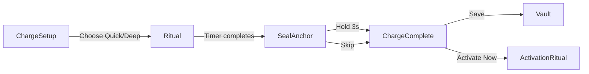

# SealAnchorScreen Integration Guide

## Overview

**SealAnchorScreen** is a premium, meditation-like ritual screen that replaces numeric countdowns with an embodied, tactile long-press gesture directly on the anchor symbol. This creates a more intentional and satisfying sealing moment.

---

## 📐 Design Philosophy

### Zen Architect Principles Applied

| Principle | Implementation |
|-----------|----------------|
| **Minimalism** | Navy-to-black gradient background, no UI chrome |
| **Embodiment** | Press and hold directly on symbol (not a button) |
| **Visual Feedback** | Progress ring + glow intensity (no text countdown) |
| **Intentionality** | 3-second hold creates deliberate, meditative pace |
| **Premium Feel** | Frosted glass orb, gold accents, bloom effect on success |

### Visual Hierarchy

```
Background Gradient (Navy → Black)
    └── Glow Halo (gold, animated)
        └── Frosted Glass Orb (240px)
            └── Anchor Sigil (160px, 40% opacity)
            └── Progress Ring (gold, circular)
    └── "Hold to seal" (Cinzel 18, gold)
```

---

## 🔄 Integration Options

### **Option A: Replace RitualScreen Seal Phase** (Recommended)

**Current Flow:**
```
ChargeSetup → Ritual (with built-in seal) → ChargeComplete
```

**Updated Flow:**
```
ChargeSetup → Ritual (ends at completion) → SealAnchor → ChargeComplete
```

**Implementation:**

1. **Update RitualScreen.tsx** to navigate to SealAnchor instead of ChargeComplete:

```typescript
// In RitualScreen.tsx, update handleRitualComplete function:

function handleRitualComplete() {
  // Navigate to standalone seal screen instead of ChargeComplete
  navigation.replace('SealAnchor', { anchorId });
}
```

2. **Remove seal phase logic** from RitualScreen (optional, for cleaner separation):

```typescript
// Remove/comment out seal phase detection in RitualScreen:
// - isSealPhase state
// - seal gesture rendering
// - long-press handlers

// Keep only timer completion logic
```

**Pros:**
- Cleaner separation of concerns (ritual timing vs sealing gesture)
- More immersive standalone seal experience
- Easier to A/B test different seal interactions

**Cons:**
- Adds one extra screen transition

---

### **Option B: Standalone Entry Point** (Alternative)

Keep RitualScreen as-is and provide SealAnchor as an optional entry point from other flows (e.g., re-charging, activation pre-ritual).

**Use Cases:**
- Re-charging an already-charged anchor (quick seal)
- Post-editing seal (after modifying intention)
- Standalone seal ritual (separate from timing-based charge)

**Implementation:**

Add navigation from AnchorDetailScreen:

```typescript
// In AnchorDetailScreen.tsx
const handleQuickSeal = () => {
  navigation.navigate('SealAnchor', { anchorId: anchor.id });
};
```

---

## 🛠️ Technical Implementation Details

### Animation Timing Values

```typescript
const TIMING = {
  SEAL_DURATION: 3000,           // 3s long-press
  GLOW_EASE_DURATION: 3000,      // Glow intensifies over 3s
  ORB_PULSE_DURATION: 1500,      // Subtle scale pulse (1.0 → 1.08)
  BLOOM_SCALE: 2.5,              // Bloom expansion on success
  BLOOM_FADE_DURATION: 600,      // Bloom fade-out
  HAPTIC_INTERVAL: 500,          // Gentle pulse every 0.5s
};
```

### Haptic Feedback Pattern

| Event | Haptic Type | Purpose |
|-------|-------------|---------|
| **Press Start** | Light Impact | Acknowledge touch |
| **During Hold** | Light Impact (every 0.5s) | Maintain engagement |
| **Release Early** | (none) | Silent cancellation |
| **Completion** | Success Notification | Strong celebratory confirmation |

### Null Safety

All anchor data access is guarded:

```typescript
if (!anchor) {
  return <ErrorState message="Anchor not found" />;
}

// Safe to use anchor.baseSigilSvg below
```

### Cleanup

All timers and intervals are properly cleaned up on unmount:

```typescript
useEffect(() => {
  return () => {
    if (holdTimerRef.current) clearTimeout(holdTimerRef.current);
    if (hapticIntervalRef.current) clearInterval(hapticIntervalRef.current);
  };
}, []);
```

---

## 🎨 Visual Specifications

### Colors

| Element | Color | Purpose |
|---------|-------|---------|
| **Background Top** | `#0F1419` (Navy) | Zen Architect primary |
| **Background Bottom** | `#0A0A0C` (Near-black) | Depth gradient |
| **Glow Halo** | `#D4AF3730` (Gold 30%) | Ambient highlight |
| **Progress Ring** | `#D4AF37` (Gold 100%) | Clear progress indicator |
| **Bloom Effect** | `#FFF9E6` (Gold-white) | Success celebration |
| **Orb Border** | `#D4AF3730` (Gold 30%) | Subtle framing |

### Dimensions

| Element | Size | Spacing |
|---------|------|---------|
| **Orb Diameter** | 240px | — |
| **Sigil Size** | 160px | Centered in orb |
| **Glow Halo** | 360px (initial) → 540px (peak) | — |
| **Progress Ring** | 130px radius, 4px stroke | Overlays orb |
| **Instruction Text** | 18pt (h4) | 48px below orb |

---

## 🧪 Testing Checklist

### Interaction Testing

- [ ] **Press and hold**: Starts progress animation + haptics
- [ ] **Release early (<3s)**: Cancels seal, resets progress smoothly
- [ ] **Hold to completion (3s)**: Triggers success haptic + bloom effect
- [ ] **Skip button**: Shows confirmation alert, saves without seal
- [ ] **Multiple attempts**: Can retry seal if cancelled

### Visual Testing

- [ ] **Glow halo**: Intensifies smoothly from 30% → 80% opacity
- [ ] **Progress ring**: Fills 0→360° linearly over 3 seconds
- [ ] **Orb scale pulse**: Subtle 1.0 → 1.08 pulse during hold
- [ ] **Bloom effect**: Gold-white flash scales to 2.5x, fades out
- [ ] **Sigil visibility**: Anchor symbol visible at 40% opacity inside orb

### Platform Testing

- [ ] **iOS**: BlurView renders frosted glass correctly
- [ ] **Android**: BlurView fallback works (may be less frosted)
- [ ] **iOS Haptics**: All haptic pulses feel appropriate
- [ ] **Android Haptics**: Vibration pattern feels good
- [ ] **Notched devices**: Safe area respected (skip button, gradient)

### Edge Cases

- [ ] **Null anchor**: Shows error state gracefully
- [ ] **Rapid press/release**: No crashes or animation glitches
- [ ] **Background/Foreground**: App returning doesn't break seal state
- [ ] **Low-end devices**: Animations maintain 60fps
- [ ] **Memory**: No leaks from intervals/timers

---

## 📊 Metrics to Track

### User Behavior

- **Seal Completion Rate**: % of users who complete 3s hold (vs skip/cancel)
- **Average Hold Duration**: Typical time users hold before release
- **Retry Rate**: % of users who cancel and retry
- **Skip Rate**: % of users who use skip button

### Performance

- **Mount Time**: Screen renders in <300ms
- **Animation FPS**: Maintain 60fps throughout seal
- **Haptic Latency**: Haptics fire within 50ms of trigger

---

## 🚀 Recommended Flow (Option A)



### Updated Navigation Sequence

1. **AnchorDetailScreen** → `ChargeSetup` (user taps "Charge")
2. **ChargeSetupScreen** → `Ritual` (user selects Quick/Deep)
3. **RitualScreen** → `SealAnchor` (timer completes, no seal gesture)
4. **SealAnchorScreen** → `ChargeComplete` (seal completes or skipped)
5. **ChargeCompleteScreen** → `Vault` or `ActivationRitual`

---

## 📝 Code Changes Required for Option A

### 1. Update RitualScreen.tsx

```typescript
// Line ~150: Update handleRitualComplete function
function handleRitualComplete() {
  // OLD: navigation.replace('ChargeComplete', { anchorId });
  // NEW:
  navigation.replace('SealAnchor', { anchorId });
}

// Line ~200: Remove seal phase detection (optional cleanup)
// REMOVE:
// const isSealPhase = remainingSeconds <= config.sealDurationSeconds;
// ... seal gesture rendering ...
```

### 2. Update useRitualController.ts (Optional)

If you want to remove seal logic entirely from the ritual controller:

```typescript
// REMOVE seal-related state:
// - isSealActive
// - sealProgress
// - isSealComplete
// - startSeal, cancelSeal, completeSeal actions

// Keep only timer and phase management
```

---

## ✅ Sign-Off

**Integration Completed:** ☐
**Option Selected:** ☐ A (Replace seal phase) ☐ B (Standalone)
**Testing Completed:** ☐
**Metrics Configured:** ☐
**Ready for QA:** ☐

---

## 🎯 Next Steps

1. **Choose Integration Option**: Recommend Option A for cleanest UX
2. **Update RitualScreen**: Modify navigation to SealAnchor
3. **Test End-to-End**: ChargeSetup → Ritual → SealAnchor → ChargeComplete
4. **QA Sign-Off**: Complete checklist above
5. **Track Metrics**: Monitor seal completion rate and user behavior

---

## 📚 Related Files

- `/apps/mobile/src/screens/rituals/SealAnchorScreen.tsx` (new)
- `/apps/mobile/src/screens/rituals/RitualScreen.tsx` (update required)
- `/apps/mobile/src/hooks/useRitualController.ts` (optional update)
- `/apps/mobile/src/types/index.ts` (navigation types updated)
- `/apps/mobile/src/navigation/VaultStackNavigator.tsx` (route added)

---

**Created:** 2026-01-28
**Author:** Claude (Sonnet 4.5)
**Session:** `session_01XKHi2N56diDhUTrfxnTcPm`
