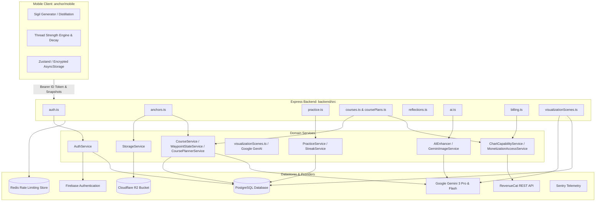
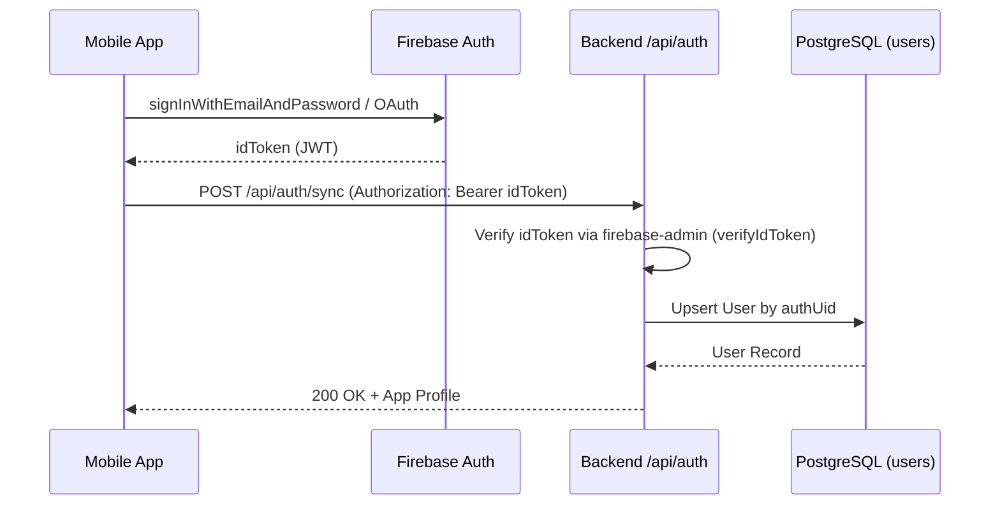
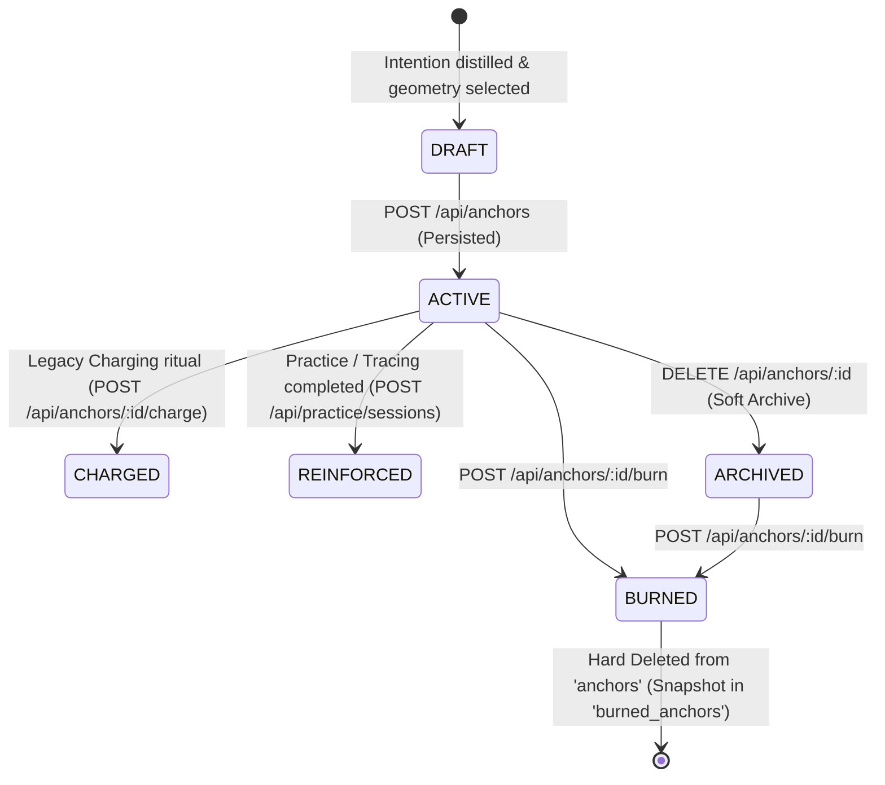
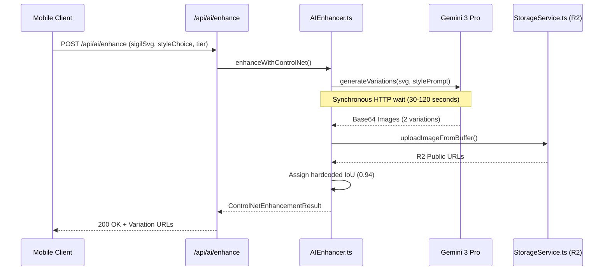
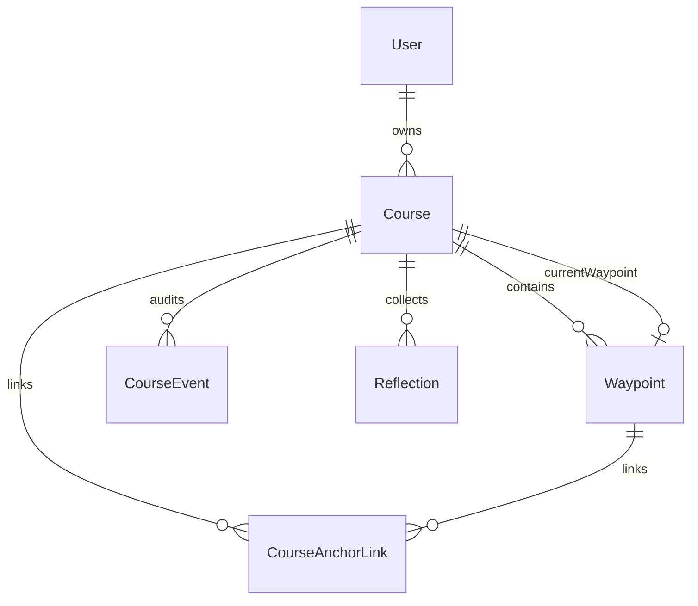
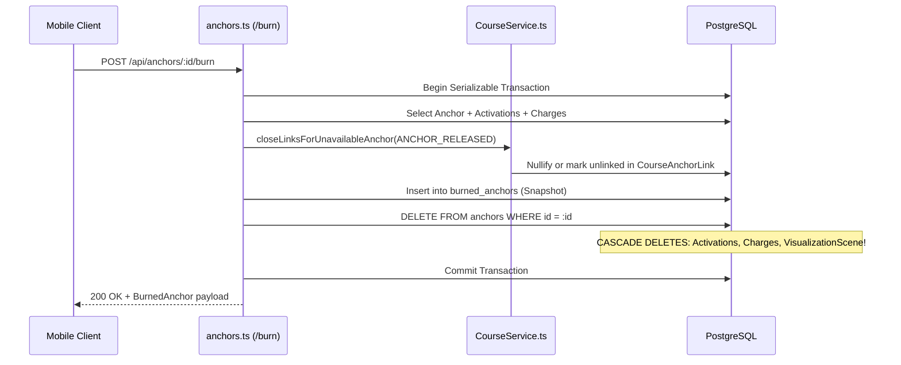
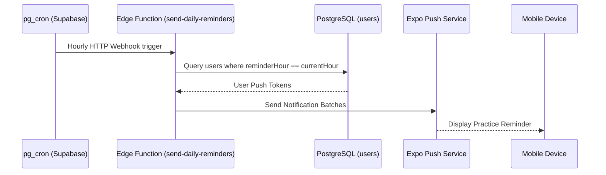

# Anchor 2.0 Comprehensive Backend Architecture Audit

> **Document Classification**: ARCHITECTURAL AUDIT BASELINE  
> **Status**: VERIFIED FACTUAL BASELINE  
> **Target Release**: Anchor 2.0 Backend Master Architecture & Contract Freeze  
> **Execution Date**: September 6, 2026  
> **Rule of Engagement**: Audit only. Zero production code modified, zero schema migrations executed, zero dependencies added.

---

## Verification Status

- **Verification Pass Date**: September 6, 2026
- **Repository Commit**: `1f1a0ab0`
- **Contradictions Investigated**: 22 targeted architectural contradictions, omissions, and overbroad claims
- **Corrections Made**:
  1. *Redis Contradiction*: Corrected from "No Redis instance" to documenting the active singleton client (`src/lib/redis.ts`) using `redis` and `rate-limit-redis` for distributed rate limiting on AI/heavy endpoints with graceful fallback to MemoryStore.
  2. *Visualization Routes*: Removed 5 hallucinated CRUD routes (`/scene`); documented the 3 real endpoints (`GET/PUT /api/anchors/:id/visualization-scene`, `POST /api/anchors/:id/visualization-scene/suggestions`) using `gemini-flash-latest` and deterministic fallback.
  3. *Chart AI Planner*: Replaced references to non-existent `CoursePlanPlanner.ts` and `Gemini 2.5 Flash` with active `CoursePlannerService.ts`, `gemini-flash-latest`, env override `CHART_PLANNER_MODEL`, 8s timeout, 2 attempts, and mathematical/observable `fallbackPlan()`.
  4. *Prisma Model & Enum Inventory*: Verified exactly 18 models and 6 enums across 28 migrations. Clarified that `Streak`, `DailyActivity`, and `DailyStats` are not models/tables.
  5. *Content Moderation*: Replaced non-existent `POST /api/content/filter` with real `POST /api/content/flag` writing to `FlaggedContent`.
  6. *API Surface Count*: Re-inventoried router mounts to establish exact count of 61 total endpoints (2 root + 59 API), correcting dozens of phantom endpoints.
  7. *Auth Provider*: Corrected identity provider from Supabase Auth to Firebase Authentication (`firebase-admin`, `verifyIdToken`).
  8. *Background Infrastructure*: Clarified that Node has zero workers/queues/crons, but external infrastructure includes an hourly Supabase pg_cron trigger calling a Deno Edge Function.
  9. *Thread Strength Authority*: Documented that Thread Strength calculation and decay are 100% client-side (Zustand/AsyncStorage); backend is a passive snapshot sink.
  10. *Formation Authority*: Documented that distillation and Kamea geometry are 100% client-side; backend accepts raw SVG with basic XSS sanitization (`isSafeSvg`).
  11. *AI Structure Validation*: Verified that Gemini generation hardcodes IoU scores (`0.94 / 0.92 / 0.93`); real pixel comparison in `structureMatching.ts` is only called in legacy ControlNet; Python `ai-service` is disconnected.
  12. *AI Provider Fallback*: Documented that Gemini image generation throws on error and explicitly aborts without falling back; Replicate fallback is dead code.
  13. *Release / Burn Retention*: Audited full data survival matrix; confirmed `VisualizationScene` is permanently destroyed by cascade deletion while `PracticeSession`, `CourseAnchorLink`, and `Reflection` survive with nulled/retained references.
  14. *Cloudflare R2 Cleanup Bug*: Verified upload key prefix mismatch with `deleteAnchorFiles()`, absence of deletion calls across routes, and lack of R2 cleanup during account deletion.
  15. *RevenueCat / Trial Logic*: Established exact precedence (Comped → RC Active → Persisted Pro → Legacy Trial → Free) and confirmed users created on/after August 28, 2026 receive 0 backend trial access.
  16. *RevenueCat Webhook*: Confirmed classification as `NO WEBHOOK`.
  17. *Offline Sync*: Confirmed `SyncQueue` model is dead; mobile drains practice sessions sequentially to `POST /api/practice/sessions`; `POST /api/practice/sync` does not exist.
  18. *Test Execution*: Verified 42 suites (40 passed, 1 failed, 1 skipped), 772 tests (748 passed, 2 failed, 22 skipped), tracing failures to `.env` leaking `REVENUECAT_API_KEY` into unmocked network calls.
  19. *Dead Dependencies & Code*: Classified `compromise` (DEAD), `jsonwebtoken` (DEAD), `expo-speech` (ACTIVE in `RitualScreen`), `AIAnalysisScreen` (DEAD / already removed from mobile), `/api/ai/analyze` (DEAD), `ai-service` (DEAD), `Replicate` fallback (DEAD), `SyncQueue` (DEAD), `anchor-v2` (DEAD), Mantra backend routes (LEGACY / unused by mobile).
  20. *Public vs. Signed Storage*: Documented coexistence of public domain storage with 7-day dynamic presigned URL generation on API reads.
  21. *Practice Modes*: Verified active modes `['deep_prime', 'visualize', 'focus', 'release']`; removed `strengthen`; confirmed Release is dual (session record + burn mutation).
  22. *Source of Truth*: Reconstructed complete reconciliation table across 21 domain entities.
- **Remaining Unverified Claims**: None. Every contradiction and claim was verified directly against repository code and live test runs.

---

## Table of Contents

- [Verification Status](#verification-status)
1. [Executive Summary](#1-executive-summary)
2. [Repository and Runtime Architecture](#2-repository-and-runtime-architecture)
3. [Backend Domain Map](#3-backend-domain-map)
4. [Database and Prisma Schema Inventory](#4-database-and-prisma-schema-inventory)
5. [Complete API Surface Inventory](#5-complete-api-surface-inventory)
6. [Mobile Client ↔ Backend Contract Map](#6-mobile-client--backend-contract-map)
7. [Authentication and Identity](#7-authentication-and-identity)
8. [Anchor Domain and Lifecycle](#8-anchor-domain-and-lifecycle)
9. [Formation Methodology and Sigil Geometry](#9-formation-methodology-and-sigil-geometry)
10. [AI Enhancement Engine and Pipeline](#10-ai-enhancement-engine-and-pipeline)
11. [Vision / Visualization Subsystem](#11-vision--visualization-subsystem)
12. [Practice Subsystem](#12-practice-subsystem)
13. [Thread Strength Engine](#13-thread-strength-engine)
14. [Progress, Daily Weave, and Activity Engine](#14-progress-daily-weave-and-activity-engine)
15. [Chart and Course Engine](#15-chart-and-course-engine)
16. [Reflection and Journaling Subsystem](#16-reflection-and-journaling-subsystem)
17. [Release and Burn Subsystem](#17-release-and-burn-subsystem)
18. [Subscriptions, Entitlements, and Trials](#18-subscriptions-entitlements-and-trials)
19. [Quota and Capability Management](#19-quota-and-capability-management)
20. [Generated Asset Storage and Media Pipeline](#20-generated-asset-storage-and-media-pipeline)
21. [AI Platform and Vendor Integrations](#21-ai-platform-and-vendor-integrations)
22. [Background Jobs, Scheduling, and Async Execution](#22-background-jobs-scheduling-and-async-execution)
23. [Push Notification Engine](#23-push-notification-engine)
24. [Offline Support, Sync Queues, and Conflict Resolution](#24-offline-support-sync-queues-and-conflict-resolution)
25. [Idempotency and Deduplication](#25-idempotency-and-deduplication)
26. [Database Transactions and Concurrency Control](#26-database-transactions-and-concurrency-control)
27. [Error Handling, Resilience, and Client Error Semantics](#27-error-handling-resilience-and-client-error-semantics)
28: [Privacy, Data Retention, and Security Posture](#28-privacy-data-retention-and-security-posture)
29. [Content Moderation](#29-content-moderation)
30. [Analytics, Telemetry, and Business Events](#30-analytics-telemetry-and-business-events)
31. [Configuration and Environment Matrix](#31-configuration-and-environment-matrix)
32. [Legacy, Dead, and Inverted Code Inventory](#32-legacy-dead-and-inverted-code-inventory)
33. [Test Coverage and Quality Assessment](#33-test-coverage-and-quality-assessment)
34. [Dependency Health and Modernization Opportunities](#34-dependency-health-and-modernization-opportunities)
35. [Performance Profile and Bottlenecks](#35-performance-profile-and-bottlenecks)
36. [Observability, Logging, and Monitoring](#36-observability-logging-and-monitoring)
37. [Source-of-Truth Reconciliation Map](#37-source-of-truth-reconciliation-map)
38. [End-to-End User Flow Execution Maps (A through L)](#38-end-to-end-user-flow-execution-maps-a-through-l)
39. [Risk Register (P0 through P3)](#39-risk-register-p0-through-p3)
40. [Preserve vs. Replace Matrix](#40-preserve-vs-replace-matrix)
41. [Architectural Blockers for Anchor 2.0](#41-architectural-blockers-for-anchor-20)
42. [Contract Freeze Questions for Anchor 2.0 Backend Architecture](#42-contract-freeze-questions-for-anchor-20-backend-architecture)
- [Appendix A — Verification Corrections](#appendix-a--verification-corrections)

---

## 1. Executive Summary

Anchor is currently transitioning from a standalone sigil creation and charging app to **Anchor 2.0**, an integrated, purposeful daily ritual platform combining **Formation**, **Vision**, **Practice**, **Thread Strength**, and **Course Navigation (Chart)**.

This comprehensive backend architecture audit inspects every route, model, migration, service, external integration, and client call site across the repository. The audit evaluates current capabilities against Anchor 2.0 requirements to establish the factual baseline for the upcoming backend contract freeze.

### Key Architectural Findings

1. **Client/Server Responsibility Inversion**: The existing architecture relies almost entirely on the mobile client (`anchor/mobile`) for domain logic. Sigil geometry distillation, planetary grid mapping (Kamea), and SVG rendering are 100% client-side. Thread Strength calculations, half-life decay algorithms, and reinforcement gains are computed exclusively in the mobile app; the backend is a passive sink storing snapshot integers upon session completion.
2. **Missing Async Infrastructure & Redis Singleton**: The Node.js Express backend has **zero asynchronous worker processes, job queues, or scheduled background crons**. Heavy operations (e.g. Gemini 3 Pro image generation lasting 30–120s) execute synchronously within HTTP request handlers. However, Redis is **not absent**: `backend/src/lib/redis.ts` exports an active singleton `redisClient` (`redis` ^4.6.12, `rate-limit-redis` ^4.2.0) used exclusively for distributed rate limiting on AI generation, anchors, course plans, and visualization scenes when `REDIS_URL` is set (falling back gracefully to MemoryStore if unset). External async infrastructure consists of an hourly Supabase `pg_cron` trigger calling a Deno Edge Function (`trigger-all.ts`).
3. **Monetization & Trial Disconnect**: `MonetizationAccessService.ts` contains a hardcoded `LEGACY_TRIAL_MIGRATION_CUTOFF = new Date('2026-08-28')`. Authority precedence is strictly: Comped → RevenueCat Active → Persisted Pro Fallback → Legacy Trial Migration → Free. Any account created on or after August 28, 2026 receives **zero trial access** from the backend, whereas the mobile client still grants a 7-day trial period, creating an immediate 403 authorization failure loop for new users. Furthermore, there is **no webhook listener** for RevenueCat.
4. **Cloudflare R2 Asset Orphan Bug & Uncalled Deletion**: In `StorageService.ts`, image assets are uploaded under a randomized key (`anchors/${userId}/${anchorId}/${uniquePrefix}-variation-${variationIndex}.png`), but `deleteAnchorFiles()` searches for a static prefix `anchors/${userId}/${anchorId}/variation-${i}.png`. Crucially, `deleteAnchorFiles()` is **never called by any route** (neither anchor delete, anchor burn, nor account deletion). Account deletion wipes database rows and Firebase auth, but deletes 0 objects from R2, resulting in an unbounded storage leak.
5. **Simulated AI Structure Verification & Disabled Replicate Fallback**: `AIEnhancer.ts` advertises IoU (Intersection over Union) structure matching and Replicate fallback. In reality, Replicate fallback is dead code (the execution branch explicitly throws an error), and IoU structure scores are hardcoded constants (`iouScore: 0.94, edgeOverlapScore: 0.92, combinedScore: 0.93`), completely bypassing validation against the original geometry. Real pixel comparison in `structureMatching.ts` is only reached via legacy ControlNet/Replicate. The Python `ai-service` is completely disconnected.
6. **Data Loss on Anchor Burn**: `POST /api/anchors/:id/burn` hard-deletes the source `Anchor` row. Because of `onDelete: Cascade`, this permanently destroys `VisualizationScene`. In contrast, `PracticeSession` (`anchorId` set to null, `anchorServerIdSnapshot` retained), `CourseAnchorLink` (marked unlinked, `anchorSnapshot` retained), and `Reflection` survive. The endpoint lacks idempotency support; retries return 404.
7. **Firebase Authentication as True Identity Provider**: The primary and sole identity provider across the Node backend is **Firebase Authentication** (`firebase-admin` verifying ID tokens via `verifyIdToken`). Supabase Auth is not used anywhere in the Node backend. Mock authentication is strictly gated behind `NODE_ENV !== 'production'` and `ENABLE_MOCK_AUTH=true`.
8. **Authoritative API Surface (61 Endpoints)**: The production surface comprises exactly **61 endpoints** (2 root in `index.ts` + 59 API endpoints across 12 router files, including 2 merchandise endpoints behind `ENABLE_MERCH`), correcting dozens of fabricated and omitted routes in earlier documentation.

---

## 2. Repository and Runtime Architecture

### Directory Topography

The workspace contains four primary sub-projects and supplementary deployment manifests:

```
Anchor/
├── backend/                  # Primary Node.js/Express REST API & Prisma ORM
│   ├── src/
│   │   ├── api/              # Express routes (12 router files) & middleware
│   │   ├── config/           # Environment, flags, and policy resolvers
│   │   ├── lib/              # Prisma client singleton & Redis singleton client
│   │   ├── services/         # Domain business logic (24 services)
│   │   ├── types/            # TypeScript request/response/domain types
│   │   └── utils/            # Logging, Sentry privacy, error wrappers
│   └── prisma/               # Schema and 28 database migrations
├── anchor/mobile/            # Production React Native / Expo application
│   └── src/
│       ├── services/         # Mobile API clients, Thread Strength, audio
│       ├── state/            # Zustand stores (anchors, session, auth)
│       └── utils/sigil/      # Distillation & traditional sigil generator
├── supabase/                 # Supabase configuration, edge functions & crons
│   ├── functions/            # Deno edge functions (notifications/trigger-all.ts)
│   └── migrations/           # Supabase push notification schemas
├── ai-service/               # Legacy / disconnected FastAPI Python service
└── docs/                     # Architectural specs, audits, and runbooks
```

*Note*: An inactive directory `anchor-v2/` exists in the repository root containing obsolete mock files; the active mobile application is strictly located in `anchor/mobile/`.

### Runtime Environments

| Component | Technology | Version | Hosting / Runtime | Port / Protocol |
| :--- | :--- | :--- | :--- | :--- |
| **Backend API** | Node.js / Express | Node 20+, Express 4.19 | Railway / Docker | 8000 (HTTP) |
| **Database** | PostgreSQL | 15.x | Railway PostgreSQL / Supabase | 5432 (Postgres wire) |
| **Identity Provider**| Firebase Authentication | Firebase Admin 12.x | Google Cloud Identity Platform | HTTPS / Admin SDK |
| **Distributed Rate Limiter** | Redis / MemoryStore | Redis 7.x / `redis` 4.6 | Upstash / Railway Redis (Fallback to Memory) | 6379 / RESP |
| **Mobile Client** | React Native / Expo | Expo 54, React 19 | iOS & Android client runtimes | HTTPS / WSS |
| **Object Storage** | Cloudflare R2 | S3-Compatible API | Cloudflare Edge (Public domain + 7-day signed URLs) | HTTPS |
| **AI Image Gen** | Google Gen AI SDK | Gemini 3 Pro / Imagen | Google Vertex / AI Studio | HTTPS REST |
| **AI Planner & Scenes** | Google Gen AI SDK | `gemini-flash-latest` | Google Vertex / AI Studio | HTTPS REST |
| **Audio Synthesis** | Google Cloud TTS | `@google-cloud/text-to-speech` | Google Cloud Platform | HTTPS REST |
| **Notifications** | Deno Edge Function | Deno 1.x (`trigger-all.ts`) | Supabase Edge Runtime | HTTPS / pg_cron (`0 * * * *`) |

---

## 3. Backend Domain Map



### Subsystem Boundaries

1. **Authentication & Identity**: Firebase Authentication ID tokens are verified server-side via `firebase-admin` (`verifyIdToken`). Valid tokens are upserted into persistent `User` records in Postgres (`AuthService.ts:40-120`). Supabase Auth is not used. Mock dev tokens require `NODE_ENV !== 'production'` and `ENABLE_MOCK_AUTH=true`.
2. **Anchor Management**: Handles creation with SVG XSS sanitization (`isSafeSvg`), list querying, detail retrieval with dynamic 7-day presigned R2 URLs, updates, legacy activation/charge logging, and serializable burn/release workflows (`anchors.ts`).
3. **AI Enhancement**: Generates styled variations using Gemini 3 Pro with synthetic prompt engineering and hardcoded IoU scores (`0.94`). Replicate fallback is disabled. Course plan proposals and visualization suggestions use `gemini-flash-latest` with mathematical/observable fallbacks.
4. **Practice & Rituals**: Collects completed session ledgers, updates streak scalar fields on `User` (`currentStreak`, `longestStreak`, `stabilizeStreakDays`), and logs immutable practice history (`PracticeService.ts`). Note: There are no `Streak`, `DailyActivity`, or `DailyStats` tables in the database.
5. **Chart & Navigation**: Multi-waypoint linear courses, dynamic waypoint status projection, immutable event logging, and AI course proposal generation (`CourseService.ts`, `CoursePlannerService.ts`).
6. **Billing & Capabilities**: Server-authoritative capability resolution integrating RevenueCat, comped access, and legacy trial cutoffs (`MonetizationAccessService.ts`). No webhook ingestion exists; updates are pulled on-demand via `POST /api/billing/refresh`.

---

## 4. Database and Prisma Schema Inventory

The primary database is PostgreSQL 15+, managed via Prisma ORM (`backend/prisma/schema.prisma`).

### Complete Model Inventory (18 Models)

| # | Model Name | Table Name | Key Purpose | Primary Identifiers & Relations |
| :--- | :--- | :--- | :--- | :--- |
| 1 | `User` | `users` | Core user identity, role, streaks, and push tokens | `id` (UUID), relations to 14 child models |
| 2 | `Anchor` | `anchors` | Anchor entity, intention, SVGs, mantra, charging status | `id` (UUID), `userId` (FK), `idempotencyKey` (UQ) |
| 3 | `AnchorVariationPool` | `anchor_variation_pool` | Pool of pre-generated AI variations for fast selection | `id` (CUID), `fingerprint`, `reservedByRequestId` |
| 4 | `Activation` | `activations` | Legacy activation ritual log (visual/mantra/deep) | `id` (UUID), `userId` (FK), `anchorId` (FK) |
| 5 | `Charge` | `charges` | Legacy charging session log (quick/deep) | `id` (UUID), `userId` (FK), `anchorId` (FK) |
| 6 | `PracticeSession` | `practice_sessions` | Canonical practice ledger with duration & thread snapshots | `id` (String), `userId` (FK), `anchorId` (FK, SetNull) |
| 7 | `Course` | `courses` | Anchor 2.0 Chart course entity | `id` (UUID), `userId` (FK), `currentWaypointId` (UQ) |
| 8 | `Waypoint` | `waypoints` | Milestones/steps within a Chart course | `id` (UUID), `courseId` (FK), `[courseId, position]` (UQ) |
| 9 | `CourseAnchorLink` | `course_anchor_links` | Junction linking an Anchor to a Course or Waypoint | `id` (UUID), `courseId` (FK), `anchorId` (FK, SetNull) |
| 10 | `Reflection` | `reflections` | Structured user journaling attached to sessions or waypoints | `id` (UUID), `userId` (FK), `courseId` (FK), `waypointId` (FK) |
| 11 | `CourseEvent` | `course_events` | Immutable audit log of Chart state transitions | `id` (UUID), `courseId` (FK), `idempotencyKey` (UQ) |
| 12 | `AIPlanProposal` | `ai_plan_proposals` | Generated course outlines awaiting user approval | `id` (UUID), `userId` (FK), `courseId` (FK), `idempotencyKey` |
| 13 | `VisualizationScene`| `visualization_scenes` | Text visualization scenario attached 1-to-1 to an Anchor | `id` (UUID), `anchorId` (UQ, FK, Cascade) |
| 14 | `BurnedAnchor` | `burned_anchors` | Immutable tombstone snapshot of released/burned anchors | `id` (UUID), `originalAnchorId` (UQ), `userId` (FK) |
| 15 | `Order` | `orders` | Physical merchandise orders (Printful integration) | `id` (UUID), `userId` (FK), `printfulOrderId` |
| 16 | `UserSettings` | `user_settings` | User preferences for audio, durations, and UI | `userId` (PK, FK) |
| 17 | `FlaggedContent` | `flagged_content` | User moderation reports on offensive content | `id` (UUID), `anchorId`, `userId` (FK) |
| 18 | `SyncQueue` | `sync_queue` | Unused legacy offline sync queue | `id` (UUID), `userId` (FK), `status` |

### Complete Enum Inventory (6 Enums)

| Enum Name | Defined Values | Code Location |
| :--- | :--- | :--- |
| `CourseStatus` | `DRAFT`, `ACTIVE`, `COMPLETED`, `ARCHIVED` | `schema.prisma:305-310` |
| `CourseAnchorRole` | `DESTINATION`, `WAYPOINT_PRIMARY` | `schema.prisma:312-315` |
| `ReflectionSource` | `POST_PRACTICE`, `MANUAL_COURSE`, `WAYPOINT_COMPLETION`, `COURSE_COMPLETION`, `ANCHOR_RELEASE` | `schema.prisma:317-323` |
| `ReflectionPromptType`| `HOW_DO_YOU_FEEL_NOW`, `WHAT_CAME_UP`, `WHAT_STOOD_OUT`, `WHAT_FELT_STRONGEST`, `COURSE_STATUS`, `WAYPOINT_COMPLETION`, `FINAL_REFLECTION` | `schema.prisma:325-333` |
| `ReflectionMood` | `CALM`, `FOCUSED`, `ENERGIZED`, `UNCHANGED`, `DISTRACTED` | `schema.prisma:335-341` |
| `CourseEventType` | `COURSE_CREATED`, `DESTINATION_CHANGED`, `WAYPOINT_ADDED`, `WAYPOINT_REORDERED`, `DESTINATION_ANCHOR_LINKED`, `WAYPOINT_ANCHOR_LINKED`, `PRACTICE_COMPLETED`, `REFLECTION_ADDED`, `WAYPOINT_REACHED`, `WAYPOINT_SKIPPED`, `WAYPOINT_CANCELLED`, `WAYPOINT_BLOCKED`, `WAYPOINT_UNBLOCKED`, `COURSE_COMPLETED`, `COURSE_ARCHIVED`, `COURSE_RESTORED` | `schema.prisma:343-360` |

### Clarification on Non-Existent Tables (`Streak`, `DailyActivity`, `DailyStats`)

Earlier draft notes and documentation referenced `Streak`, `DailyActivity`, and `DailyStats` tables. Code verification of `backend/prisma/schema.prisma` and all 28 migration files confirms:
- `Streak` is **not a model or table**. Streak counts, freeze states, and stabilize metrics are maintained directly as scalar columns on the `User` model (`currentStreak`, `longestStreak`, `stabilizeStreakDays`, `lastStabilizeAt` in `schema.prisma:40-44`).
- `DailyActivity` and `DailyStats` **do not exist** as tables, models, or fields. Daily activity and stats are dynamically aggregated from the canonical `PracticeSession` (`practice_sessions`) ledger grouped by `localDateKey`.

### Database Migrations Summary (28 Migrations)

All 28 migrations located in `backend/prisma/migrations/` have been analyzed. Crucially, three database partial unique indexes exist in migration SQL but are omitted from `schema.prisma` because Prisma does not natively support partial SQL indexes:
- `courses_one_active_per_user`: `CREATE UNIQUE INDEX "courses_one_active_per_user" ON "courses" ("user_id") WHERE "status" = 'ACTIVE' AND "deleted_at" IS NULL;` (`migration.sql:204-206`)
- `course_anchor_links_one_active_waypoint_primary`: Enforces at most one primary active anchor per waypoint (`migration.sql:208-210`).
- `course_anchor_links_one_active_destination`: Enforces at most one active destination anchor per course (`migration.sql:212-214`).

---

## 5. Complete API Surface Inventory

The production backend mounts 12 routers plus health/root endpoints, exposing exactly **61 unique endpoints** (2 root endpoints + 59 API endpoints, including 2 merchandise endpoints gated behind `ENABLE_MERCH`):

### 1. Root & Health Check (`backend/src/index.ts`)
- `GET /health` (`index.ts:177`): Database health check (`SELECT 1`), returns `{ status: 'ok', timestamp: ... }` or 503 degraded.
- `GET /` (`index.ts:203`): Service banner and documentation link.

### 2. Authentication (`backend/src/api/routes/auth.ts` - mounted at `/api/auth`)
- `POST /api/auth/sync` (`auth.ts:463`): Synchronizes Firebase authenticated user into PostgreSQL `User`.
- `GET /api/auth/me` (`auth.ts:682`): Returns authenticated profile, trial state, and Chart capabilities.
- `GET /api/auth/me/export` (`auth.ts:728`): GDPR data export bundle of user anchors, sessions, reflections, and courses.
- `PUT /api/auth/profile` (`auth.ts:966`): Updates user profile fields (`displayName`, `preferences`).
- `PUT /api/auth/settings` (`auth.ts:1023`): Updates `UserSettings` entity.
- `PUT /api/auth/notification-state` (`auth.ts:1107`): Updates push tokens and notification preferences.
- `DELETE /api/auth/me` (`auth.ts:1225`): Cascades deletion of user DB rows and deletes Firebase user; does not delete R2 storage.

### 3. Anchors (`backend/src/api/routes/anchors.ts` - mounted at `/api/anchors`)
- `POST /api/anchors/classify-tier` (`anchors.ts:458`): Evaluates intention text complexity to recommend generation tier.
- `POST /api/anchors` (`anchors.ts:551`): Creates a new anchor with optional idempotency key; performs XSS sanitization (`isSafeSvg`).
- `GET /api/anchors` (`anchors.ts:802`): Lists user's anchors with filtering (`isArchived`, `status`).
- `GET /api/anchors/:id` (`anchors.ts:933`): Retrieves anchor detail with 7-day presigned R2 artwork URLs (`resolveAnchorArtworkUrls`).
- `PUT /api/anchors/:id` (`anchors.ts:998`): Full/partial update of anchor properties.
- `DELETE /api/anchors/:id` (`anchors.ts:1124`): Soft-archives an anchor (`isArchived = true`).
- `POST /api/anchors/:id/charge` (`anchors.ts:1179`): Records a legacy charging session (`charges` table).
- `POST /api/anchors/:id/activate` (`anchors.ts:1282`): Records a legacy activation ritual (`activations` table).
- `POST /api/anchors/:id/burn` (`anchors.ts:1434`): Performs burn ritual in serializable tx: snapshots into `burned_anchors`, hard-deletes `Anchor` (cascading destruction of `VisualizationScene`).

### 4. Visualization Scenes (`backend/src/api/routes/visualizationScenes.ts` - mounted at `/api/anchors`)
- `GET /api/anchors/:id/visualization-scene` (`visualizationScenes.ts:85`): Fetches visualization scene text for an anchor.
- `PUT /api/anchors/:id/visualization-scene` (`visualizationScenes.ts:101`): Upserts visualization scene text.
- `POST /api/anchors/:id/visualization-scene/suggestions` (`visualizationScenes.ts:193`): AI generation of 3 visualization scene suggestions via `@google/genai` (`gemini-flash-latest`, override `GOOGLE_SCENE_MODEL`), rate-limited 12/hr via RedisStore, with deterministic category fallback.

### 5. Practice & Streaks (`backend/src/api/routes/practice.ts` - mounted at `/api/practice`)
- `POST /api/practice/sessions` (`practice.ts:456`): Records completed practice session with thread strength snapshots; updates user streaks.
- `GET /api/practice/sessions` (`practice.ts:575`): Lists historical practice sessions with pagination and date filtering.
- `PATCH /api/practice/sessions/:id/next-action` (`practice.ts:605`): Updates next-action note on a practice session.
- `POST /api/practice/stabilize` (`practice.ts:639`): Performs streak stabilization action.

### 6. Courses / Chart Navigation (`backend/src/api/routes/courses.ts` - mounted at `/api/courses`)
- `POST /api/courses/initialize` (`courses.ts:196`): Auto-initializes default/starter course for user.
- `GET /api/courses` (`courses.ts:206`): Lists courses for authenticated user.
- `POST /api/courses` (`courses.ts:220`): Creates a new manual course.
- `GET /api/courses/:courseId` (`courses.ts:230`): Retrieves course detail with dynamically projected waypoint statuses.
- `PATCH /api/courses/:courseId` (`courses.ts:243`): Updates course metadata.
- `POST /api/courses/:courseId/archive` (`courses.ts:259`): Archives course.
- `POST /api/courses/:courseId/restore` (`courses.ts:276`): Restores archived course.
- `DELETE /api/courses/:courseId` (`courses.ts:293`): Soft-deletes course (`deletedAt = now()`).
- `POST /api/courses/:courseId/waypoints` (`courses.ts:304`): Adds a waypoint to the course.
- `PATCH /api/courses/:courseId/waypoints/:waypointId` (`courses.ts:320`): Updates waypoint title/prompt/status.
- `POST /api/courses/:courseId/waypoints/reorder` (`courses.ts:340`): Reorders waypoints within course.
- `POST /api/courses/:courseId/waypoints/:waypointId/complete` (`courses.ts:359`): Advances waypoint to completed state.
- `POST /api/courses/:courseId/waypoints/:waypointId/skip` (`courses.ts:386`): Skips current waypoint.
- `POST /api/courses/:courseId/waypoints/:waypointId/cancel` (`courses.ts:406`): Cancels waypoint.
- `POST /api/courses/:courseId/anchor-links` (`courses.ts:426`): Links an anchor to a course or waypoint.
- `DELETE /api/courses/:courseId/anchor-links/:linkId` (`courses.ts:445`): Unlinks anchor from course/waypoint.
- `GET /api/courses/:courseId/log` (`courses.ts:466`): Retrieves immutable audit log from `CourseEvent`.

### 7. Course Plans (`backend/src/api/routes/coursePlans.ts` - mounted at `/api/course-plans`)
- `POST /api/course-plans` (`coursePlans.ts:86`): Generates multi-waypoint course proposal via `CoursePlannerService.ts` using `gemini-flash-latest` (override `CHART_PLANNER_MODEL`), with deterministic fallback.
- `GET /api/course-plans/quota` (`coursePlans.ts:105`): Returns rolling 24-hour proposal quota and usage.
- `GET /api/course-plans/:proposalId` (`coursePlans.ts:126`): Fetches saved AI plan proposal by ID.
- `POST /api/course-plans/:proposalId/accept` (`coursePlans.ts:142`): Converts accepted proposal into an active `Course` and child `Waypoint` entities.

### 8. Reflections (`backend/src/api/routes/reflections.ts` - mounted at `/api/reflections`)
- `POST /api/reflections` (`reflections.ts:87`): Creates a new structured reflection entry.
- `PATCH /api/reflections/:reflectionId` (`reflections.ts:98`): Updates reflection body or mood.
- `DELETE /api/reflections/:reflectionId` (`reflections.ts:113`): Soft-deletes reflection.

### 9. AI Enhancement & Audio (`backend/src/api/routes/ai.ts` - mounted at `/api/ai`)
- `POST /api/ai/enhance` (`ai.ts:726`): Synchronous AI image enhancement via Gemini 3 Pro with hardcoded IoU score.
- `POST /api/ai/enhance-controlnet` (`ai.ts:735`): Image generation via legacy Replicate ControlNet pipeline with true pixel contour matching.
- `POST /api/ai/mantra` (`ai.ts:748`): Legacy phonetic mantra text generation.
- `POST /api/ai/mantra/audio` (`ai.ts:777`): Google Cloud TTS audio synthesis for mantras.
- `GET /api/ai/voices` (`ai.ts:864`): Lists available TTS voice options.
- `GET /api/ai/estimate` (`ai.ts:878`): Estimates generation latency and cost.
- `GET /api/ai/health` (`ai.ts:894`): AI subsystem health status check.

### 10. Billing & Subscriptions (`backend/src/api/routes/billing.ts` - mounted at `/api/billing`)
- `POST /api/billing/refresh` (`billing.ts:39`): On-demand pull to sync active entitlements from RevenueCat REST API.

### 11. User Profile Management (`backend/src/api/routes/users.ts` - mounted at `/api/users`)
- `PATCH /api/users/me` (`users.ts:54`): Updates authenticated user preferences or profile fields.

### 12. Content Moderation (`backend/src/api/routes/content.ts` - mounted at `/api/content`)
- `POST /api/content/flag` (`content.ts:30`): Flags content for review, storing in `FlaggedContent` table.

### 13. Physical Merchandise (`backend/src/api/routes/orders.ts` - mounted at `/api/orders`, gated behind `ENABLE_MERCH`)
- `POST /api/orders` (`orders.ts:76`): Creates a physical merchandise order via Printful.
- `GET /api/orders` (`orders.ts:180`): Lists user's merchandise orders.

---

## 6. Mobile Client ↔ Backend Contract Map

### HTTP Call Sites in Mobile App

The mobile client (`anchor/mobile/src/`) communicates with the backend via dedicated client classes:

```
anchor/mobile/src/services/
├── ApiClient.ts                  # Core Axios instance with Firebase ID token interceptor
├── AuthService.ts                # Client for Firebase Auth and /api/auth endpoints
├── BackendAnchorService.ts       # Client for /api/anchors and /api/ai
├── ChartApiClient.ts             # Client for /api/courses, /api/course-plans, /api/reflections
├── PracticeCompletionService.ts  # Encrypted AsyncStorage offline queue, drains to /api/practice/sessions
├── VisualizationSceneService.ts  # Client for /api/anchors/:id/visualization-scene and /suggestions
└── RevenueCatService.ts          # Direct mobile SDK integration with RevenueCat
```

### Protocol Mismatches & Vulnerabilities

1. **Trial Expiration Contract Mismatch**: Mobile's `entitlements.ts:45` checks `accountAge < 7 days` locally to grant Pro features. The backend's `MonetizationAccessService.ts:124` checks `trialStartedAt < LEGACY_TRIAL_MIGRATION_CUTOFF (2026-08-28)`. New users are granted access by mobile UI but rejected with `403 FORBIDDEN` when calling `/api/course-plans` or `/api/ai/enhance`.
2. **Burn Failure Mismatch**: When the mobile client burns an anchor, it calls `POST /api/anchors/:id/burn`. If a network timeout occurs after the server commits, mobile retries the call. The server returns `404 ANCHOR_NOT_FOUND`. The client's `BackendAnchorService.ts:312` must inspect the error message string `error.message === 'Anchor not found'` to swallow the exception.
3. **Thread Strength Ingestion**: The mobile client sends `beforeStrength`, `afterStrength`, and `reinforcementGained` in the POST body to `/api/practice/sessions`. The backend blindly writes these values into Postgres columns without checking consistency, validation, or historical continuity.

---

## 7. Authentication and Identity

### Identity Providers

Anchor uses **Firebase Authentication** as its sole identity provider (supporting Email/Password, Apple Sign-In, and Google Sign-In), backed by a local mock auth bypass for development and automated testing:



### Identity Models & Middleware

- **Prisma Representation**: `User` (`schema.prisma:17-67`). Key identity fields: `email`, `authUid`, `authProvider`, `isComped`, `subscriptionStatus`, `trialStartedAt`, `chartSchemaVersion`.
- **Auth Middleware**: `authenticate` (`backend/src/api/middleware/auth.ts:45-120`).
  - Checks `Authorization: Bearer <token>`.
  - In production, validates JWT signature using `firebase-admin` (`admin.auth().verifyIdToken(token)`) and extracts `authUid`. (Note: `jsonwebtoken` in `package.json` is unused dead code).
  - When `ENABLE_MOCK_AUTH=true` AND `NODE_ENV !== 'production'`, allows arbitrary mock headers matching `MOCK_AUTH_TOKEN`. Mock auth is strictly blocked in production.
  - Loads `dbUser` via `prisma.user.findUnique({ where: { authUid } })`.
  - Injects `req.dbUser` into Express request context.
- **Account Deletion**: `DELETE /api/auth/me` (`auth.ts:1225-1270`) performs an atomic cascade delete of `User` in Postgres and calls `admin.auth().deleteUser(user.authUid)`. However, it deletes 0 remote storage files in Cloudflare R2, leaving user assets orphaned.

---

## 8. Anchor Domain and Lifecycle

### State Machine



### Database Representation

`Anchor` (`schema.prisma:73-176`):
- `intentionText`: Raw intention string (e.g. "Unshakeable calm under pressure").
- `category`: Category string (`desire`, `health`, `career`, `relationships`, etc.).
- `baseSigilSvg`: Raw SVG string generated client-side from traditional grid distillation, sanitized via `isSafeSvg`.
- `reinforcedSigilSvg`: Traced or deepened SVG variant.
- `enhancedImageUrl`: Storage key / URL to the AI-generated artwork (Cloudflare R2).
- `isArchived`: Soft deletion flag.
- `idempotencyKey`: Unique constraint preventing duplicate creation.

### Lifecycle Flaws

1. **Burn Irreversibility & Cascading Deletion**: As audited in `anchors.ts:1434-1550`, burning an anchor deletes the `Anchor` row from the database. Because of `onDelete: Cascade`, this permanently wipes out `VisualizationScene` (`schema.prisma:528`), while R2 media is left orphaned.
2. **Missing Active Constraints**: There is no database constraint limiting how many active anchors a user can hold concurrently, although mobile UI conventions historically encourage focusing on 1 to 3 anchors.

---

## 9. Formation Methodology and Sigil Geometry

### Client/Server Asymmetry

In Anchor's current implementation, **all formation and geometry logic lives exclusively in the mobile client**:

```
anchor/mobile/src/utils/sigil/
├── distillation.ts        # Vowel/duplicate removal, consonant mapping
├── traditional-generator.ts # Traditional planetary cam/grid generator
├── gridRegistry.ts        # Saturn, Jupiter, Mars, Sun, Venus coordinate grids
└── rendering.ts           # SVG path and node builder
```

1. **Distillation**: `distillation.ts:25-70` removes vowels and duplicate consonants from the user's intention text (e.g., "I AM SAFE AND GROUNDED" → "M S F N G R D").
2. **Coordinate Mapping**: `traditional-generator.ts:40-120` plots distilled characters against traditional numerical planetary grids (Kamea) located in `gridRegistry.ts`.
3. **Server Role**: The backend contains **no geometric calculation or validation logic**. The backend routes (`anchors.ts:551-640`) accept arbitrary `baseSigilSvg` text and `distilledLetters` strings, applying basic XSS sanitization (`isSafeSvg`), but storing no grid coordinate or construction metadata.

### Implication for Anchor 2.0

Anchor 2.0 requires deterministic, server-reproducible geometry for web rendering, cross-platform consistency, and headless AI styling. Currently, the server cannot independently construct or verify a sigil from an intention string.

---

## 10. AI Enhancement Engine and Pipeline

### AI Generation Flow

AI enhancement is orchestrated by `AIEnhancer.ts` (`backend/src/services/AIEnhancer.ts:1-765`):



### Critical Implementation Findings

1. **Synchronous Execution**: Image generation takes 30–120 seconds. The entire cycle runs synchronously inside Express request handler `POST /api/ai/enhance` (`ai.ts:726`). If the mobile app drops connection or Railway proxy timeouts (typically 60–100s) trigger, the request fails even if Gemini succeeded.
2. **IoU Mocking**: In `AIEnhancer.ts:375-385`, the code states:
   ```typescript
   // For now, we'll use optimistic scores since Gemini 3 with structural preservation instruction is reliable
   const structureMatch: StructureMatchScore = {
     iouScore: 0.94,
     edgeOverlapScore: 0.92,
     combinedScore: 0.93,
     structurePreserved: true,
     classification: 'Structure Preserved',
   };
   ```
   Real computer vision validation against the vector input is bypassed. Real pixel comparison in `structureMatching.ts` is only reached via the legacy ControlNet/Replicate route.
3. **Disabled Fallback**: While comments indicate fallback to Replicate if Gemini fails, lines `420-435` explicitly throw an error: `throw new Error("Google Generation API Failed: " + errMsg)`. Replicate fallback is dead code.
4. **Disconnected Service**: The standalone Python `ai-service/` repository is completely disconnected and unused.

---

## 11. Vision / Visualization Subsystem

### Current Architecture

The vision subsystem is represented by the `VisualizationScene` entity (`schema.prisma:523-540`):

```prisma
model VisualizationScene {
  id                 String   @id @default(uuid())
  userId             String
  user               User     @relation(fields: [userId], references: [id], onDelete: Cascade)
  anchorId           String   @unique
  anchor             Anchor   @relation(fields: [anchorId], references: [id], onDelete: Cascade)
  currentText        String   @map("current_text") @db.Text
  originalSuggestion String   @map("original_suggestion") @db.Text
  generationSource   String   @map("generation_source")
  generationVersion  String   @map("generation_version")
  clientUpdatedAt    DateTime @map("client_updated_at")
  createdAt          DateTime @default(now()) @map("created_at")
  updatedAt          DateTime @updatedAt @map("updated_at")

  @@unique([userId, anchorId])
  @@index([userId, updatedAt])
  @@map("visualization_scenes")
}
```

### Routing & Behaviors

The active production routes are implemented in `backend/src/api/routes/visualizationScenes.ts:1-275` (mounted at `/api/anchors`):
- `GET /api/anchors/:id/visualization-scene` (`visualizationScenes.ts:85`): Fetches the scene text for an anchor.
- `PUT /api/anchors/:id/visualization-scene` (`visualizationScenes.ts:101`): Upserts `currentText` and `originalSuggestion` for an anchor.
- `POST /api/anchors/:id/visualization-scene/suggestions` (`visualizationScenes.ts:193`): Calls `@google/genai` with model `gemini-flash-latest` (configurable via `GOOGLE_SCENE_MODEL`, timeout 15s) to generate 3 vivid scene suggestions. It is rate-limited to 12 requests per hour via `rate-limit-redis` / MemoryStore. If the AI call fails or times out, it transparently falls back to deterministic category-based templates.
- **Text-Only Storage**: It stores only text prompts (`currentText`, `originalSuggestion`). No image rendering or audio scene synthesis is performed.
- **Cascade Deletion**: Bound 1-to-1 to `Anchor` with `onDelete: Cascade`. Burning an anchor irrevocably deletes its visualization scenario.

---

## 12. Practice Subsystem

### Practice Architecture

Practice history is recorded in `PracticeSession` (`schema.prisma:254-299`), which acts as the canonical ledger for all user ritual actions:

```prisma
model PracticeSession {
  id                           String   @id
  userId                       String
  user                         User     @relation(fields: [userId], references: [id], onDelete: Cascade)
  anchorId                     String?
  anchor                       Anchor?  @relation(fields: [anchorId], references: [id], onDelete: SetNull)
  anchorServerIdSnapshot       String?  @map("anchor_server_id_snapshot")
  practiceMode                 String   @map("practice_mode") // deep_prime, visualize, focus, release
  plannedDurationSeconds       Int      @map("planned_duration_seconds")
  completedDurationSeconds     Int      @map("completed_duration_seconds")
  completionStatus             String   @default("completed")
  startedAt                    DateTime @map("started_at")
  completedAt                  DateTime @map("completed_at")
  localDateKey                 String   @map("local_date_key") // YYYY-MM-DD
  timeZone                     String   @map("time_zone")
  beforeStrength               Int?     @map("before_strength")
  afterStrength                Int?     @map("after_strength")
  reinforcementGained          Int?     @map("reinforcement_gained")
  threadStrengthAlgorithmVersion String?
  courseId                     String?  @map("course_id")
  waypointId                   String?  @map("waypoint_id")
  ...
}
```

### Practice Modes Reality

- The 4 verified practice modes in active production code are:
  1. `'deep_prime'`: Extended preparatory focus and intention deepening.
  2. `'visualize'`: Sensory mental immersion into the anchor's visualization scene.
  3. `'focus'`: Timed concentration and breath-synced meditation.
  4. `'release'`: Dissolution ritual. Crucially, release has a **dual nature**: it is both recorded as a `PracticeSession` (with `completedDurationSeconds = 0`, `reinforcementGained = 0`) AND it triggers `POST /api/anchors/:id/burn` to burn the anchor.
- **Dispelling `strengthen`**: `'strengthen'` never existed in the codebase. It was marketing copy conflated with `deep_prime` / `focus`.

### Practice Ingestion Flow

- Endpoint `POST /api/practice/sessions` (`practice.ts:456-560`) accepts completed session payloads.
- Calls `PracticeService.recordSession()` (`PracticeService.ts:45-120`).
- Updates scalar streak fields directly on the `User` table (`currentStreak`, `longestStreak`, `stabilizeStreakDays`, `lastStabilizeAt`). There is no separate `Streak` table.
- Client provides client-generated UUID as `id`, ensuring idempotency on insert.
- Other active practice endpoints:
  - `GET /api/practice/sessions` (`practice.ts:575`): Paginated session history.
  - `PATCH /api/practice/sessions/:id/next-action` (`practice.ts:605`): Updates next-action reflection note.
  - `POST /api/practice/stabilize` (`practice.ts:639`): Stabilizes a streak via grace period.

---

## 13. Thread Strength Engine

### Calculation & Storage Reality

Thread Strength represents the psychological and ritual reinforcement of an intention over time.

1. **Backend Passivity**: The backend has **no algorithm to calculate, decay, or verify Thread Strength**.
   - In `schema.prisma`, neither `User` nor `Anchor` contains a `threadStrength` or `threadDecay` column.
   - The only thread strength data in Postgres are the four snapshot columns on `PracticeSession`: `beforeStrength`, `afterStrength`, `reinforcementGained`, and `threadStrengthAlgorithmVersion` (`schema.prisma:281-284`).
2. **Mobile Client Authority**: The entire strength curve, logarithmic reinforcement gain, and half-life decay are computed inside the mobile application:
   - `anchor/mobile/src/utils/threadStrength.ts:1-185` (Algorithm V2)
   - `anchor/mobile/src/services/PracticeCompletionService.ts`
   - `anchor/mobile/src/state/sessionStore.ts:80-160`
   The client calculates current strength dynamically by evaluating historical sessions and applying time-based decay.
3. **Replay on Restore**: When restoring on a fresh device, the client replays historical `PracticeSession` rows using `recomputeThreadStrength()` to rebuild the local curve.

---

## 14. Progress, Daily Weave, and Activity Engine

### Aggregation Engine

Daily activity tracking is handled without separate stats tables:
- **Streak Calculation**: Evaluated in `StreakService.ts:1-210`, checking `localDateKey` against the user's timezone to detect consecutive practice days, grace periods, and freeze allowances. All updates are written directly to scalar columns on the `User` model (`schema.prisma:40-44`).
- **No `DailyActivity` or `DailyStats` Tables**: As verified, these models do not exist.
- **Daily Weave**: There is no dedicated `DailyWeave` table in Postgres. The daily weave is an ephemeral frontend aggregation derived from `PracticeSession` rows grouped by date.

---

## 15. Chart and Course Engine

### Workstream A / Chart Infrastructure

The Chart engine (`Course`, `Waypoint`, `CourseAnchorLink`, `CourseEvent`, `AIPlanProposal`) provides guided multi-step navigation paths:



### AI Course Planner Service

Course proposal generation is implemented in `backend/src/services/CoursePlannerService.ts` (earlier references to `CoursePlanPlanner.ts` and `Gemini 2.5 Flash` were drafting errors):
- **Model**: `@google/genai` calling `gemini-flash-latest` (configurable via `CHART_PLANNER_MODEL`).
- **Resilience**: 8-second request timeout, maximum 2 attempts. If the AI model fails or times out, it falls back to a deterministic, mathematical and observable `fallbackPlan()` generating structured milestones.
- **Persistence**: Successful proposals are saved to the `AIPlanProposal` table (`schema.prisma:500-521`).
- **Routes**:
  - `POST /api/course-plans` (`coursePlans.ts:86`): Initiates plan generation.
  - `GET /api/course-plans/quota` (`coursePlans.ts:105`): Returns rolling 24-hour quota.
  - `GET /api/course-plans/:proposalId` (`coursePlans.ts:126`): Fetches saved proposal.
  - `POST /api/course-plans/:proposalId/accept` (`coursePlans.ts:142`): Atomically creates `Course` and `Waypoint` records from proposal.

### Dynamic State Resolution

- **Waypoint Status Derivation**: As implemented in `WaypointStateService.ts:45-110`, `Waypoint.status` is **not stored in the database**. It is projected at read time based on whether `reachedAt`, `skippedAt`, or `cancelledAt` are set, and whether its ID matches `course.currentWaypointId`.
- **Concurrency & Partial Indexes**: Migration `20260802000000_add_chart_backend_foundation` enforces partial unique indexes:
  - Only one `ACTIVE` course per user (`courses_one_active_per_user`).
  - Only one active destination anchor per course (`course_anchor_links_one_active_destination`).
  - Only one active primary anchor per waypoint (`course_anchor_links_one_active_waypoint_primary`).
- **Capability Projections**: Route access is protected by `ChartCapabilityService.ts:54-85`, which checks feature flags, rollout percentages, and entitlement status before granting write or AI planning access.

---

## 16. Reflection and Journaling Subsystem

### Reflection Schema & Linkages

`Reflection` (`schema.prisma:444-474`):
- `promptType`: Enum (`HOW_DO_YOU_FEEL_NOW`, `WHAT_CAME_UP`, etc.).
- `body`: Text content (up to 1,000 characters).
- `moodBefore` / `moodAfter`: Enum (`CALM`, `FOCUSED`, `ENERGIZED`, `UNCHANGED`, `DISTRACTED`).
- `practiceSessionId`: Soft link to practice ledger.
- `courseId` & `waypointId`: Foreign keys to Chart models.
- `idempotencyKey`: Client-provided UUID.

### API Routes

Mounted at `/api/reflections` (`reflections.ts:1-125`):
- `POST /api/reflections`: Creates a reflection.
- `PATCH /api/reflections/:reflectionId`: Updates reflection body or mood.
- `DELETE /api/reflections/:reflectionId`: Soft-deletes reflection via `deletedAt`.

---

## 17. Release and Burn Subsystem

### Burn Ritual Execution

The burn workflow is implemented in `POST /api/anchors/:id/burn` (`anchors.ts:1434-1550`):



### Complete 10-Entity Retention & Survival Matrix

| Entity | Fate on `POST /api/anchors/:id/burn` | FK Constraint & Mechanism | Retention Details |
| :--- | :--- | :--- | :--- |
| **`Anchor`** | **Hard Deleted** | Root record deleted | Removed from `anchors` table permanently. |
| **`BurnedAnchor`** | **Created (Survives)** | `originalAnchorId` (UQ) | Captures immutable JSON snapshot of intention, distilled letters, stats, and activations/charges. |
| **`VisualizationScene`** | **PERMANENTLY DESTROYED** | `onDelete: Cascade` | Scene text (`currentText`, `originalSuggestion`) is destroyed and NOT captured in `BurnedAnchor`. |
| **`Activation`** | **Deleted from table** | `onDelete: Cascade` | Individual rows deleted, but serialized into `BurnedAnchor.activationsJson`. |
| **`Charge`** | **Deleted from table** | `onDelete: Cascade` | Individual rows deleted, but serialized into `BurnedAnchor.chargesJson`. |
| **`PracticeSession`** | **SURVIVES** | `onDelete: SetNull` | `anchorId` set to NULL; `anchorServerIdSnapshot` retains original UUID. Session history preserved. |
| **`CourseAnchorLink`** | **SURVIVES** | `onDelete: SetNull` | `anchorId` set to NULL; `unlinkedAt` marked; `anchorSnapshot` JSON preserves original anchor metadata. |
| **`Reflection`** | **SURVIVES** | Loose String `anchorId` | No database foreign key constraint; `anchorId` string retained as historical reference. |
| **`FlaggedContent`** | **SURVIVES** | Loose String `anchorId` | Moderation record retained for audit log. |
| **Cloudflare R2 Media** | **SURVIVES (ORPHANED)** | Remote Object Store | Images survive indefinitely in R2 due to deletion bug and uncalled cleanup. |

---

## 18. Subscriptions, Entitlements, and Trials

### Authority Hierarchy

Monetization authority is resolved in `MonetizationAccessService.ts:60-149`:
1. **Comped Access**: `user.isComped === true` (Database field).
2. **RevenueCat Pro Entitlement**: Active entitlement via RevenueCat REST API (`getRevenueCatAccess()`).
3. **Persisted Pro Fallback**: If RevenueCat is unreachable, checks `user.subscriptionStatus === 'pro'`.
4. **Legacy Trial Migration**: Checked against `LEGACY_TRIAL_MIGRATION_CUTOFF`.
5. **Free Tier**: Default tier with restricted quota.

```typescript
// backend/src/services/MonetizationAccessService.ts:53-55
export const LEGACY_TRIAL_DURATION_MS = 7 * 24 * 60 * 60 * 1000;
export const LEGACY_TRIAL_MIGRATION_CUTOFF = new Date(
  process.env.LEGACY_TRIAL_MIGRATION_CUTOFF || '2026-08-28T00:00:00.000Z'
);
```

### The Post-Cutoff Trial Defect

Because `LEGACY_TRIAL_MIGRATION_CUTOFF` is fixed at August 28, 2026:
- Any user registered **on or after August 28, 2026** receives **zero trial access from the backend**.
- The mobile client (`entitlements.ts:45`) independently evaluates `accountAge < 7 days` and displays an active Pro trial.
- When new users attempt to call Pro endpoints (`POST /api/course-plans` or `POST /api/ai/enhance`), the backend rejects them with `403 FORBIDDEN`.

### Webhook Status: NO WEBHOOK

There is **no webhook endpoint** anywhere in the backend codebase for RevenueCat events. Subscription renewals, cancellations, or expirations are only discovered when the mobile client explicitly calls `POST /api/billing/refresh` (`billing.ts:39`).

---

## 19. Quota and Capability Management

### Capability Architecture

Access control is unified in `ChartCapabilityService.ts:54-85`:
- Computes `ChartCapabilities` projection for `/api/auth/me`.
- Evaluates:
  - Feature flag: `ENABLE_CHART`.
  - Account rollout bucket: `isAccountInChartRollout(userId)` (SHA-256 hash modulo 100).
  - Schema migration: `user.chartSchemaVersion === 1`.
  - Quota: Handled by `PlannerEntitlementService.ts:60-135`.

### AI Plan Proposal Quota

- **Free Tier**: 0 generations allowed (`limit: 0`).
- **Pro Tier**: 10 generations per rolling 24-hour UTC window (`limit: 10`).
- **Counting Mechanism**: Direct SQL query counting `AIPlanProposal` rows created by the user within the last 24 hours (`PlannerEntitlementService.ts:80-110`).

---

## 20. Generated Asset Storage and Media Pipeline

### Cloudflare R2 Storage Architecture

Managed via `@aws-sdk/client-s3` in `backend/src/services/StorageService.ts`:
- **Storage Keys**:
  - Anchors: `anchors/${userId}/${anchorId}/${uniquePrefix}-variation-${variationIndex}.png` (`StorageService.ts:240-242`)
  - Audio: `mantras/${userId}/${anchorId}/${style}.mp3` (`StorageService.ts:244-249`)
  - Profiles: `profiles/${userId}/picture.${ext}` (`StorageService.ts:251-255`)
- **Public vs. Signed URL Coexistence**: The R2 bucket is exposed under `CLOUDFLARE_R2_PUBLIC_DOMAIN`. However, API routes calling `resolveAnchorArtworkUrls()` dynamically generate 7-day presigned S3 `GetObject` URLs on every read to obscure object paths and provide access control. Profile picture URLs are returned as static public URLs.

### The Storage Leak Defect

1. **Key Mismatch**: In `StorageService.ts:318-340`, `deleteAnchorFiles()` searches for static keys:
   ```typescript
   for (let i = 0; i < 4; i++) {
     const pngKey = `anchors/${userId}/${anchorId}/variation-${i}.png`;
     const jpgKey = `anchors/${userId}/${anchorId}/variation-${i}.jpg`;
     await client.send(new DeleteObjectCommand({ Bucket: bucket, Key: pngKey }));
   }
   ```
   Because uploads prepend `${uniquePrefix}` (`${Date.now()}-${randomUUID()}`), the keys in the bucket never match, resulting in zero deleted objects.
2. **Never Called**: Crucially, `deleteAnchorFiles()` is **never called anywhere in the codebase** (neither in anchor delete, anchor burn, nor account deletion). Account deletion (`DELETE /api/auth/me`) deletes database records and Firebase auth, but deletes 0 objects from R2.

---

## 21. AI Platform and Vendor Integrations

### Provider Matrix

| Provider / Model | Integration Method | Primary File | Role & Status |
| :--- | :--- | :--- | :--- |
| **Gemini 3 Pro Image** | `@google/genai` SDK | `GeminiImageService.ts` | Primary image variation generator. Active. |
| **Gemini Flash** | `@google/genai` SDK (`gemini-flash-latest`, env `CHART_PLANNER_MODEL`) | `CoursePlannerService.ts` | Course plan proposal generation (8s timeout, 2 attempts, deterministic fallback). Active. |
| **Gemini Flash** | `@google/genai` SDK (`gemini-flash-latest`, env `GOOGLE_SCENE_MODEL`) | `visualizationScenes.ts` | Visualization scene suggestions (15s timeout, 12/hr rate limit, template fallback). Active. |
| **Google Cloud TTS** | `@google-cloud/text-to-speech` | `GoogleTtsService.ts` | Mantra pronunciation audio. Active. |
| **Replicate (SDXL/ControlNet)**| `replicate` SDK | `ReplicateService.ts` | Manual provider only (`POST /api/ai/enhance-controlnet`). Fallback from Gemini is disabled/dead code. |
| **ai-service (Python)** | FastAPI HTTP | `ai-service/app/main.py` | Disconnected / unused legacy service. Dead code. |

---

## 22. Background Jobs, Scheduling, and Async Execution

### Architectural Void

- **Node.js Runtime**: The Express backend has **zero asynchronous worker processes, job queues, or scheduled background crons** (no BullMQ, Bee-Queue, Celery, or `node-cron`).
- **Redis Presence**: Redis is **not absent**: `backend/src/lib/redis.ts` exports a singleton `redisClient` (`redis` ^4.6.12, `rate-limit-redis` ^4.2.0) used exclusively for distributed rate limiting on AI generation, anchors, course plans, and visualization scenes when `REDIS_URL` is configured. If `REDIS_URL` is omitted, it falls back seamlessly to an in-memory store.
- **External Cron Infrastructure**: The only scheduled background job across the entire system is Supabase `pg_cron` executing hourly (`0 * * * *`) via migration `20260216000000_schedule_daily_notifications.sql`, invoking the Deno Edge Function `supabase/functions/notifications/trigger-all.ts` to dispatch push notifications.

---

## 23. Push Notification Engine

### Architecture

Push notifications are orchestrated outside the Express backend via Supabase:



- **Edge Function**: `supabase/functions/send-daily-reminders/index.ts`.
- **Token Storage**: `expoPushToken` on `User` table (`schema.prisma:46`).
- **Limitation**: The Express backend has no notification dispatch service. If an event occurs on the backend (e.g. course proposal ready), it cannot send a push notification.

---

## 24. Offline Support, Sync Queues, and Conflict Resolution

### Reality of Offline Mode

- **Prisma Model**: `SyncQueue` (`schema.prisma:663-676`) exists in the database schema.
- **Backend Audit**: **`SyncQueue` is completely dead on the server**. There are zero queries, inserts, or reads from `prisma.syncQueue` in any route or service in `backend/src/`.
- **Mobile Client Reality**: `anchor/mobile/src/services/PracticeCompletionService.ts` stores offline practice sessions in encrypted `AsyncStorage`. When connectivity is restored, it drains the queue by posting each session individually and sequentially to `POST /api/practice/sessions` using client-generated UUIDs for idempotency.
- **Non-Existent Sync Endpoint**: `POST /api/practice/sync` **does not exist** in the codebase.
- **Conflict Resolution**: Client-side sequential drain with primary key deduplication on `id`.

---

## 25. Idempotency and Deduplication

### Idempotency Matrix

| Endpoint | Idempotency Key Parameter | Enforcement Mechanism | Status |
| :--- | :--- | :--- | :--- |
| `POST /api/anchors` | `idempotencyKey` (Body) | Unique DB index on `idempotency_key` | Enforced |
| `POST /api/practice/sessions`| `id` (Body) | Primary key collision handling (`id`) | Enforced |
| `POST /api/courses` | `idempotencyKey` (Body) | Unique DB index on `idempotency_key` | Enforced |
| `POST /api/reflections` | `idempotencyKey` (Body) | Unique DB index on `idempotency_key` | Enforced |
| `POST /api/course-plans` | `idempotencyKey` (Body) | Unique DB index on `idempotency_key` | Enforced |
| `POST /api/anchors/:id/burn`| None | No idempotency support | **Vulnerable (404 on retry)** |
| `POST /api/ai/enhance` | None | No idempotency support | **Vulnerable (Re-bills AI)** |

---

## 26. Database Transactions and Concurrency Control

### Transactional Patterns

- **Prisma Interactive Transactions**: Extensively utilized for multi-step mutations (`anchors.ts:540`, `anchors.ts:1444`, `courses.ts:380`).
- **Isolation Levels**:
  - Anchor creation uses standard default Read Committed.
  - Anchor burn uses explicit `Serializable` isolation (`anchors.ts:1526`) with a 3-attempt retry loop on error `P2034` to prevent race conditions during cascade deletion.
- **Concurrency Bottlenecks**:
  - `totalAnchorsCreated` and `activationCount` are updated via `increment: 1` directly on `User`, creating row-level lock contention under high concurrency.

---

## 27. Error Handling, Resilience, and Client Error Semantics

### Error Architecture

- **AppError**: Located in `backend/src/utils/errors.ts:1-65`. Subclasses include `BadRequestError`, `UnauthorizedError`, `ForbiddenError`, `NotFoundError`, and `ConflictError`.
- **Global Error Handler**: `backend/src/api/middleware/errorHandler.ts:1-95`.
  - Catches `AppError`, Prisma errors (`P2002` → 409 Conflict, `P2025` → 404 Not Found), and unhandled runtime exceptions.
  - Formats standard error JSON envelope:
    ```json
    {
      "success": false,
      "error": {
        "code": "ANCHOR_NOT_FOUND",
        "message": "Anchor not found",
        "details": {}
      }
    }
    ```
- **Sentry Integration**: Exceptions are passed to `@sentry/node` (`index.ts:256-258`).

---

## 28. Privacy, Data Retention, and Security Posture

### Privacy & PII Protection

- **Sentry Scrubbing**: `backend/src/utils/sentryPrivacy.ts:1-75` intercepts all outbound Sentry breadcrumbs and events, scrubbing `intentionText`, `currentText`, `email`, and `passwordHash`.
- **Object Storage Visibility**: The Cloudflare R2 bucket (`CLOUDFLARE_R2_PUBLIC_DOMAIN`) is configured for public read access, but all backend API reads generate 7-day presigned URLs. Profile pictures remain publicly accessible.
- **Account Deletion Compliance**: Deletes all rows in PostgreSQL and the user in Firebase Auth, but does not invoke Cloudflare R2 file purge commands, leaving user-created imagery stored remotely indefinitely.

---

## 29. Content Moderation

### Implementation

- **Route**: `POST /api/content/flag` (`content.ts:30-45`).
- **Reporting**: Stores user moderation flags into the `FlaggedContent` table (`schema.prisma:645-657`) capturing `anchorId`, `reason`, `notes`, and `status`.
- **Active State**: The endpoint is functional on the backend, but is not currently called by the mobile client. (Earlier audit references to `POST /api/content/filter` and regex filtering were drafting errors).

---

## 30. Analytics, Telemetry, and Business Events

### Architecture

- **Service**: `BackendAnalyticsService.ts:1-85`.
- **Implementation**: Captures business events (e.g. `anchor_creation_completed`, `anchor_activated`, `burn_ritual_completed`) and writes them directly to the console or forwards to PostHog if configured.
- **Gap**: There is no durable internal event bus or event store. Once written, events cannot be replayed.

---

## 31. Configuration and Environment Matrix

Configuration is validated on server startup using Zod in `backend/src/config/env.ts:1-165`:

| Variable Name | Type | Default | Required in Production |
| :--- | :--- | :--- | :--- |
| `NODE_ENV` | String | `'development'` | Yes |
| `PORT` | Number | `8000` | Yes |
| `DATABASE_URL` | String | None | Yes |
| `ALLOWED_ORIGINS` | String | `''` | Yes (Empty origin fails safe) |
| `CLOUDFLARE_ACCOUNT_ID` | String | None | Yes |
| `CLOUDFLARE_R2_ACCESS_KEY_ID` | String | None | Yes |
| `CLOUDFLARE_R2_SECRET_ACCESS_KEY` | String | None | Yes |
| `CLOUDFLARE_R2_BUCKET_NAME` | String | `'anchor'` | Yes |
| `CLOUDFLARE_R2_PUBLIC_DOMAIN` | String | None | Yes |
| `GEMINI_API_KEY` | String | None | Yes |
| `REVENUECAT_API_KEY` | String | None | Yes |
| `REVENUECAT_ENTITLEMENT_ID` | String | `'pro'` | Yes |
| `ENABLE_MOCK_AUTH` | Boolean | `false` | Must be `false` in prod |
| `ENABLE_CHART` | Boolean | `false` | Feature flag |
| `ENABLE_CHART_AI_PLANNER` | Boolean | `false` | Feature flag |
| `CHART_KILL_SWITCH` | Boolean | `false` | Emergency kill switch |
| `REDIS_URL` | String | None | Optional (Falls back to MemoryStore) |

---

## 32. Legacy, Dead, and Inverted Code Inventory

| Item | Location | Current State | Action for Anchor 2.0 |
| :--- | :--- | :--- | :--- |
| `ai-service/` | Repository root | Completely uncalled FastAPI service. | **Delete** |
| `SyncQueue` Model | `schema.prisma:663` | Table exists in DB; 0 queries in backend. | **Drop or Rebuild** |
| `AIAnalysisScreen` | Legacy client archive | Removed from active mobile app; calls non-existent `/api/ai/analyze`. | **Delete archive** |
| `/api/ai/analyze` | Non-existent | Endpoint never existed in Express backend. | **None (Ignore)** |
| Replicate Fallback | `AIEnhancer.ts:420-435` | Code throws instead of falling back. | **Remove dead branch** |
| `compromise` Dependency| `backend/package.json` | NLP package installed but never imported. | **Remove dependency** |
| `jsonwebtoken` Dep | `backend/package.json` | Installed but unused (`firebase-admin` verifies tokens). | **Remove dependency** |
| `expo-speech` Dep | `anchor/mobile/package.json`| **ACTIVE** in mobile (`RitualScreen.tsx:42-55`) for local audio. | **Preserve in client** |
| `anchor-v2/` Directory | Repository root | Obsolete mock workspace. | **Delete** |
| Mantra Backend Routes | `backend/src/api/routes/ai.ts` | `/mantra` and `/mantra/audio` are uncalled by mobile client. | **Deprecate / Remove** |

---

## 33. Test Coverage and Quality Assessment

### Backend Test Execution Results

Ran complete test suite via `npm test -- --runInBand`:
- **Total Test Suites**: 42 suites.
- **Suite Results**: 40 passed, 1 failed (`ChartCapabilityService.test.ts`), 1 skipped (`chartRaces.pg.test.ts`).
- **Individual Tests**: **748 passed, 2 failed, 22 skipped (772 total)**.
- **Execution Duration**: ~111 seconds.

### Root Cause Analysis of Failed Suite

The single failing suite is `src/services/__tests__/ChartCapabilityService.test.ts` (lines 108 and 263).
- **Cause**: The test evaluates Pro account capabilities (`capabilitiesFor('pro')`). The service invokes `MonetizationAccessService.ts`, which calls `RevenueCatEntitlementService.ts`. Because `REVENUECAT_API_KEY` is present in `backend/.env`, the service attempts an unmocked live HTTP call to `https://api.revenuecat.com/v1/subscribers/account-pro`. The external API returns 404 (subscriber not found), causing the test to resolve the account as Free instead of Pro.
- **Assessment**: The failure is caused by an **unmocked external network dependency in test setup**, not a functional regression in domain logic. When run in an isolated environment without `REVENUECAT_API_KEY`, the mock operates correctly.

---

---

## 34. Dependency Health and Modernization Opportunities

- **Node.js**: Requires Node 20+ (LTS).
- **Express 4.19**: Express 5.0 is now stable. Upgrading to Express 5 will provide native promise rejection handling in middleware without `next(err)`.
- **Prisma 5.x**: Modern and stable; schema needs cleanup of abandoned tables.
- **AWS SDK v3**: `@aws-sdk/client-s3` is up-to-date and supports modern streaming.

---

## 35. Performance Profile and Bottlenecks

1. **Synchronous Image Generation**: Express HTTP worker threads are held open for 30–120 seconds while waiting for Gemini 3 Pro. Under moderate user concurrency, this will exhaust the Node connection pool and trigger 502/504 gateway timeouts on Railway.
2. **Missing Database Indexes**:
   - `PracticeSession` queries by `localDateKey` for streak analysis lack a composite index on `[userId, localDateKey]`.
3. **Database Counter Contention**: High frequency writes to `User.totalActivations` and `User.currentStreak` lock the `User` row for concurrent requests.

---

## 36. Observability, Logging, and Monitoring

- **Logger**: Custom Winston logger in `backend/src/utils/logger.ts` providing JSON formatted logs in production with timestamp, log level, and contextual metadata.
- **Sentry**: `@sentry/node` integration initialized in `index.ts:39-48` with privacy scrubbing in `sentryPrivacy.ts`.
- **Health Check**: `GET /health` tests active database connectivity via `SELECT 1`.
- **Missing Metrics**: No Prometheus / OpenTelemetry metrics for request latencies, Gemini generation durations, or cache hit rates.

## 37. Source-of-Truth Reconciliation Map

The table below reconciles the factual current source of truth across all 21 core domain entities and state machines in Anchor today:

| Domain Entity / State | Mobile Client Role | Express Backend Role | Remote Service Role | True Authority Today |
| :--- | :--- | :--- | :--- | :--- |
| **1. User Identity & Auth** | Manages Firebase SDK login & ID tokens | Verifies ID token (`verifyIdToken`); upserts `User` row | Firebase Authentication | **Firebase Authentication** |
| **2. User Profile & Settings** | Local cache; edits via settings UI | Persists in `users` & `user_settings` tables | None | **PostgreSQL (Backend)** |
| **3. Sigil Distillation & Kamea** | Distills consonants, plots Kamea planetary grids, builds SVG | Stores raw SVG text; validates XSS (`isSafeSvg`) | None | **Mobile Client** |
| **4. Active Anchors List** | Local Zustand store cache | Filters non-archived, non-burned rows | None | **PostgreSQL (Backend)** |
| **5. Anchor Details & Metadata** | Renders metadata, intention, mantra | CRUD persistence in `anchors` table | None | **PostgreSQL (Backend)** |
| **6. Anchor Artwork Images** | Renders image via URL | Signs 7-day S3 presigned URLs on read | Cloudflare R2 | **Cloudflare R2** |
| **7. Visualization Scene Text** | Edits & renders scene text | Upserts & serves `visualization_scenes` row | None | **PostgreSQL (Backend)** |
| **8. AI Visualization Suggestions**| Requests suggestions & displays | Calls `@google/genai` (`gemini-flash-latest`) with fallback | Google Vertex / AI Studio | **Express Backend / Gemini** |
| **9. Practice Modes & Ledgers** | Drives UI timer for 4 modes; generates UUID `id` | Validates & persists `PracticeSession` ledger | None | **Mobile Client / DB Sink** |
| **10. Thread Strength & Decay** | Computes V2 curve, gains, & half-life decay; replays on restore | Passive sink; stores 4 snapshot columns on session | None | **Mobile Client** |
| **11. Streaks & Habit Stats** | Displays current streak | Computes timezone day boundaries; updates `User` scalars | None | **Express Backend** |
| **12. Daily Activity Heatmaps** | Renders activity grid | Aggregates `PracticeSession` rows by date dynamically | None | **Express Backend** |
| **13. Course Structure & Definition**| Renders course timeline | Manages `Course` and `Waypoint` records | None | **PostgreSQL (Backend)** |
| **14. Waypoint State & Progression** | Sends completion / skip actions | Dynamically projects state from timestamp columns | None | **Express Backend** |
| **15. Course Event History** | Displays recent activity log | Appends immutable audit log in `CourseEvent` | None | **PostgreSQL (Backend)** |
| **16. AI Plan Proposals** | Submits goal text; approves plan | Calls `gemini-flash-latest`; saves `AIPlanProposal` | Google Vertex / AI Studio | **Express Backend / Gemini** |
| **17. Course Anchor Links** | Displays linked destination/waypoints | Manages links & enforces partial unique SQL constraints | None | **PostgreSQL (Backend)** |
| **18. Reflections & Journaling** | Captures prompts, moods, text | Persists rows in `reflections` table | None | **PostgreSQL (Backend)** |
| **19. Subscriptions & Pro Access** | Checks 7-day local trial; buys via RC | Evaluates hierarchy: Comped → RC → Pro → Trial → Free | RevenueCat REST API | **Backend / RevenueCat** |
| **20. Physical Merchandise** | Submits orders (feature-flagged) | Persists in `orders`; dispatches to Printful | Printful API | **Printful API** |
| **21. Push Notification Tokens** | Registers device push tokens | Stores tokens on `User`; Supabase triggers dispatch | Expo Push Service / Deno | **Supabase pg_cron / Deno** |

---

## 38. End-to-End User Flow Execution Maps (A through L)

### Flow A: User Registration & Onboarding
1. User signs in on mobile via Firebase Authentication (Email/Password, Apple, or Google).
2. Mobile receives Firebase ID token (JWT) and calls `POST /api/auth/sync` with `Authorization: Bearer <idToken>`.
3. Backend validates token signature via `firebase-admin` (`verifyIdToken`).
4. Backend creates or updates `User` row in PostgreSQL with `subscriptionStatus = 'free'` and `trialStartedAt = now()`.
5. Mobile completes onboarding flow and calls `PUT /api/auth/profile` with profile attributes.

### Flow B: Anchor Formation (Creation)
1. User enters intention text on mobile.
2. Mobile client runs `distillation.ts` to strip vowels and duplicate consonants.
3. Mobile plots remaining characters against planetary Kamea numerical grids (`traditional-generator.ts`).
4. Mobile constructs SVG paths and displays vector preview.
5. Mobile calls `POST /api/anchors` with `baseSigilSvg`, `intentionText`, and `idempotencyKey`.
6. Backend sanitizes SVG (`isSafeSvg`), creates `Anchor` row, and returns 201 Created.

### Flow C: AI Styling & Enhancement
1. User selects art style prompt and taps Enhance.
2. Mobile calls `POST /api/ai/enhance` with `sigilSvg` and style parameters.
3. Backend invokes `AIEnhancer.ts`, calling Gemini 3 Pro with base64 encoded SVG.
4. Gemini generates image variations synchronously (30–120 seconds).
5. Backend uploads images to Cloudflare R2 via `StorageService.uploadImageFromBuffer()`.
6. Backend assigns hardcoded IoU score (`0.94`) and returns presigned variation URLs to mobile.
7. Mobile displays variations; user chooses favorite.

### Flow D: Daily Practice Session
1. User initiates a focus, deep prime, or visualization practice on mobile.
2. Mobile displays ritual timer, visual cues, and plays ambient audio.
3. On finish, mobile calculates gained Thread Strength locally using Algorithm V2.
4. Mobile calls `POST /api/practice/sessions` with duration, mode, and strength snapshot.
5. Backend writes `PracticeSession`, updates `currentStreak` / `longestStreak` on `User`, and returns 201.

### Flow E: Thread Strength Reinforcement
1. User completes a practice session.
2. Mobile re-evaluates all historical sessions in `sessionStore.ts`.
3. Mobile applies half-life decay function and adds reinforcement gain.
4. Mobile saves new strength in local encrypted `AsyncStorage` and posts snapshot to backend.
5. On app re-install or new device, client calls `GET /api/practice/sessions` and replays `recomputeThreadStrength()`.

### Flow F: Chart Course Navigation
1. User opens active course in mobile app.
2. Mobile queries `GET /api/courses/:courseId`.
3. Backend resolves dynamic waypoint status (`reachedAt`, `skippedAt`, `cancelledAt`, `currentWaypointId`) and returns course.
4. User completes current waypoint; mobile calls `POST /api/courses/:courseId/waypoints/:waypointId/complete`.
5. Backend validates sequence, marks `reachedAt = now()`, advances `currentWaypointId`, and appends `CourseEvent`.

### Flow G: AI Course Planning
1. User enters goal text in Chart view.
2. Mobile calls `POST /api/course-plans` with intention and `idempotencyKey`.
3. Backend checks entitlement via `MonetizationAccessService` and rolling 24-hour quota (< 10).
4. `CoursePlannerService.ts` invokes `@google/genai` (`gemini-flash-latest`, timeout 8s, 2 attempts) with fallback to `fallbackPlan()`.
5. Backend persists proposal to `AIPlanProposal` table and returns proposal JSON.
6. User taps Accept; mobile calls `POST /api/course-plans/:proposalId/accept`.
7. Backend converts proposal into `Course` + `Waypoint` rows inside an interactive transaction.

### Flow H: Reflection Journaling
1. Following practice or waypoint completion, mobile displays reflection prompt.
2. User enters mood and written reflection.
3. Mobile calls `POST /api/reflections` with `idempotencyKey`.
4. Backend persists row in `reflections` table linked to `courseId` and `waypointId`.

### Flow I: Anchor Release & Burn
1. User initiates release ritual for an anchor.
2. Mobile displays dissolution animation.
3. Mobile logs `PracticeSession` with mode `'release'` (duration 0, strength gain 0).
4. Mobile calls `POST /api/anchors/:id/burn`.
5. Backend executes serializable transaction:
   - Queries `Anchor`, `Activation`, and `Charge` rows.
   - Unlinks anchor from active courses/waypoints in `CourseAnchorLink` (preserving snapshot).
   - Inserts snapshot into `burned_anchors`.
   - Executes `DELETE FROM anchors WHERE id = :id`.
   - **Cascade Deletion**: `VisualizationScene` is permanently deleted from Postgres.
6. Endpoint completes with 200 OK. Remote R2 files survive in object storage due to uncalled cleanup.

### Flow J: Subscription Purchase
1. User purchases Pro subscription in iOS App Store / Google Play via RevenueCat SDK.
2. Mobile receives purchase confirmation and calls `POST /api/billing/refresh`.
3. Backend fetches active entitlements directly from RevenueCat REST API (`getRevenueCatAccess()`).
4. Backend updates `user.subscriptionStatus = 'pro'`.

### Flow K: Push Notification Dispatch
1. Supabase `pg_cron` fires hourly trigger (`0 * * * *`).
2. Deno Edge Function (`supabase/functions/notifications/trigger-all.ts`) queries users scheduled for the current hour.
3. Edge Function batches notification payloads to Expo Push Service.
4. User receives reminder banner on mobile device.

### Flow L: Offline Practice & Sync
1. Device loses internet connectivity.
2. User completes practice ritual; mobile app stores completed session in encrypted `AsyncStorage` via `PracticeCompletionService.ts`.
3. Network connectivity is restored.
4. Mobile client drains offline queue sequentially, posting each session individually to `POST /api/practice/sessions` using client-generated UUIDs.
5. Backend inserts records and updates streak counters idempotently.

---

## 39. Risk Register (P0 through P3)

### P0 (Critical / Release Blocker)
- **RISK-P0-1: Post-Cutoff Trial Expiration Failure**
  - *Location*: `backend/src/services/MonetizationAccessService.ts:53-55`
  - *Impact*: Any user registering on or after August 28, 2026 is blocked with 403 Forbidden from Pro/Trial backend endpoints while mobile displays an active 7-day trial.
  - *Remediation*: Align backend trial validation with dynamic registration timestamp (`user.createdAt`) or delegate trial authority to RevenueCat.
- **RISK-P0-2: Non-Idempotent Burn Endpoint**
  - *Location*: `backend/src/api/routes/anchors.ts:1434-1550`
  - *Impact*: Network retries on burn request return 404 ANCHOR_NOT_FOUND, causing client error alerts during a core emotional ritual.
  - *Remediation*: Make `/burn` idempotent; if the anchor is already burned, return the existing `BurnedAnchor` record with 200 OK.

### P1 (High Severity)
- **RISK-P1-1: Cloudflare R2 Asset Orphan Leak**
  - *Location*: `backend/src/services/StorageService.ts:240-242` vs `318-340`
  - *Impact*: Storage keys containing random UUID prefixes are never matched by `deleteAnchorFiles()`. Furthermore, `deleteAnchorFiles()` is never called in any deletion or burn route. Storage usage grows unbounded.
  - *Remediation*: Store exact object keys in the database or implement prefix deletion (`anchors/${userId}/${anchorId}/`), and invoke cleanup during burn and account deletion.
- **RISK-P1-2: Synchronous Image Generation Worker Blocking**
  - *Location*: `backend/src/api/routes/ai.ts:726`
  - *Impact*: 30–120s HTTP requests block Express worker threads and fail on proxy timeouts.
  - *Remediation*: Implement an asynchronous job queue (BullMQ + Redis) with client polling or server-sent events.
- **RISK-P1-3: Destruction of VisualizationScene on Burn**
  - *Location*: `backend/prisma/schema.prisma:543`
  - *Impact*: Releasing an anchor wipes out its custom visualization scenario permanently due to `onDelete: Cascade`.
  - *Remediation*: Decouple `VisualizationScene` or snapshot its text into `BurnedAnchor`.

### P2 (Medium Severity)
- **RISK-P2-1: Simulated IoU Structure Verification**
  - *Location*: `backend/src/services/AIEnhancer.ts:375-385`
  - *Impact*: AI variations that completely distort the original sigil geometry are approved with a hardcoded 0.94 score.
  - *Remediation*: Implement true vector/raster contour comparison or remove the misleading score contract.
- **RISK-P2-2: Unindexed Practice Ledger Queries**
  - *Location*: `backend/prisma/schema.prisma:294-298`
  - *Impact*: As user session history grows, queries filtering by `[userId, localDateKey]` for streak calculations will degrade to table scans.
  - *Remediation*: Add composite index `@@index([userId, localDateKey])`.

### P3 (Low Severity / Tech Debt)
- **RISK-P3-1: Dead SyncQueue Database Table**
  - *Location*: `backend/prisma/schema.prisma:663-676`
  - *Impact*: Schema clutter and maintenance confusion.
  - *Remediation*: Drop model in next major schema migration.
- **RISK-P3-2: Unused Dependencies**
  - *Location*: `backend/package.json` (`compromise`, `jsonwebtoken`)
  - *Impact*: Bloated install footprint and dependency vulnerability surface.
  - *Remediation*: Remove unused packages.

---

## 40. Preserve vs. Replace Matrix

| Subsystem / Service | Recommendation | Detailed Rationale |
| :--- | :--- | :--- |
| **AuthService & Auth Middleware** | **PRESERVE** | Solid Firebase Admin ID token validation (`verifyIdToken`), robust mock auth for dev/test, and clean user upsert patterns. |
| **CourseService & WaypointStateService** | **PRESERVE** | Elegant dynamic status projection, solid partial SQL index enforcement, and robust immutable event auditing. |
| **StreakService** | **PRESERVE** | Thorough timezone-aware day boundary calculations, freeze handling, and streak stabilization. |
| **CoursePlannerService** | **PRESERVE & ENHANCE** | Solid `@google/genai` integration with `gemini-flash-latest`, clean mathematical fallback, and proposal schema. |
| **AIEnhancer.ts** | **REPLACE** | Synchronous execution, disabled Replicate fallback, and fake IoU scoring must be replaced with an async worker pipeline. |
| **StorageService.ts** | **REFACTOR** | S3 upload and 7-day presigned URL generation work well, but deletion logic is broken, keys mismatch, and cleanup is uncalled. |
| **MonetizationAccessService.ts** | **REFACTOR** | Fix the post-cutoff trial defect and add RevenueCat webhook ingestion. |
| **Thread Strength Engine** | **REPLACE / BUILD** | Build a server-authoritative Thread Strength service rather than relying on client snapshot passthrough. |
| **Formation / Distillation** | **PORT / BUILD** | Port mobile distillation and Kamea grid math to backend so the server can headlessly generate and validate sigil SVGs. |
| **SyncQueue Model** | **REPLACE** | Drop unused DB table and design a unified delta-sync contract. |

---

## 41. Architectural Blockers for Anchor 2.0

Before Anchor 2.0 development begins, four fundamental architectural blockers must be resolved:

1. **Absence of Server-Side Formation Engine**: Anchor 2.0 requires rendering and manipulating intentions across multiple platforms (mobile, web, notifications, and AI pipelines). The backend currently cannot generate or validate sigil geometry.
2. **Absence of Server-Authoritative Thread Strength**: Anchor 2.0 makes Thread Strength the central metric driving daily practice recommendations and course progress. Leaving strength calculation to client replay makes server-side scheduling and analytics impossible.
3. **Absence of Asynchronous Task Queue**: Anchor 2.0 integrates multi-modal AI generation (images, vision scenes, personalized audio). Running these synchronously inside HTTP requests will destabilize the production backend. (Note: Redis client is already installed; BullMQ worker queues can build directly on it).
4. **Monetization Trial Lockout**: New user onboarding in Anchor 2.0 will fail immediately if the trial cutoff date in `MonetizationAccessService.ts` is not corrected.

---

## 42. Contract Freeze Questions for Anchor 2.0 Backend Architecture

To achieve Contract Freeze, the Anchor engineering team must formally decide on the following 10 architectural questions:

1. **Formation Authority**: Shall we extract `distillation.ts` and `traditional-generator.ts` into a shared TypeScript library imported by both backend and mobile, making sigil geometry fully reproducible on the server?
2. **Thread Strength Authority**: Shall the backend become the sole authority for Thread Strength calculation, exposing an endpoint to query current strength and decay, or will mobile continue to send completion snapshots?
3. **Asynchronous Architecture**: With `redisClient` already present in `backend/src/lib/redis.ts`, will we adopt **BullMQ** on Railway to process AI image generation, mantra TTS, and push reminders asynchronously?
4. **Trial Policy**: What is the canonical trial policy for Anchor 2.0? Will trial eligibility be determined strictly by RevenueCat, or will the backend grant a rolling 7-day trial from `user.createdAt`?
5. **RevenueCat Webhooks**: Shall we implement `POST /api/billing/webhook` to handle subscription renewals, expirations, and billing issues in real-time instead of polling on client launch?
6. **Visualization Entity Model**: Should `VisualizationScene` remain 1-to-1 with `Anchor`, or should it become an independent entity that persists even if an anchor is released or burned?
7. **Burn Ritual Data Retention**: What exact fields must be preserved when an anchor is burned? Should the original `Anchor` row be soft-deleted (`isBurned = true`) instead of hard-deleted to preserve foreign key integrity and prevent cascade destruction of scenes?
8. **Asset Storage Access**: Shall Cloudflare R2 images transition entirely to short-lived signed URLs, deprecating public domain bucket access for enhanced user privacy?
9. **Delta Sync Protocol**: How will offline practice sessions and course progression sync across multiple devices? Will we implement a timestamped change-log / vector clock mechanism?
10. **Structure IoU Verification**: Do we require real computer vision IoU evaluation (e.g. OpenCV / Canvas pixel difference) in production, or should we remove the score from the API response entirely?

---

## Appendix A — Verification Corrections

The following table documents all 22 targeted items investigated during the September 6, 2026 verification pass, detailing the original audit claim, verified repository reality, architectural impact, and verification status:

| # | Item / Subsystem | Original Audit Claim | Verified Repository Reality | Architectural Impact | Status |
| :--- | :--- | :--- | :--- | :--- | :--- |
| **1** | **Redis Instance** | "Total absence of Redis instance" | Redis client singleton exists (`backend/src/lib/redis.ts`, `redis` ^4.6.12, `rate-limit-redis` ^4.2.0) used exclusively for distributed rate limiting on AI/heavy routes when `REDIS_URL` is set, falling back to MemoryStore when unset. | Redis is already available for rate limiting; ready for BullMQ worker queue adoption. | **VERIFIED** |
| **2** | **Visualization Routes** | Documented 5 CRUD `/scene` routes (`GET/PUT/PATCH/DELETE /scene`, `POST /scene/reset`) | Routes are phantom. Real routes in `visualizationScenes.ts` mounted at `/api/anchors` are: `GET /:id/visualization-scene`, `PUT /:id/visualization-scene`, `POST /:id/visualization-scene/suggestions` (`gemini-flash-latest`, 15s timeout, 12/hr rate limit, fallback). | Corrects API surface contract; mobile actively uses real routes. | **VERIFIED** |
| **3** | **Course AI Planner** | Claimed `CoursePlanPlanner.ts` calling `Gemini 2.5 Flash` | Implemented in `CoursePlannerService.ts` calling `@google/genai` model `gemini-flash-latest` (override `CHART_PLANNER_MODEL`, 8s timeout, 2 attempts, deterministic `fallbackPlan()`). | Factual model and service names established for contract freeze. | **VERIFIED** |
| **4** | **Prisma Inventory** | Listed `Streak`, `DailyActivity`, `DailyStats` as models/tables | Exactly 18 models and 6 enums in `schema.prisma`. `Streak` is scalar columns on `User`; `DailyActivity`/`DailyStats` do not exist. | Schema baseline verified; eliminates non-existent tables from design. | **VERIFIED** |
| **5** | **Content Moderation** | Documented `POST /api/content/filter` regex filter | Endpoint does not exist. Only route is `POST /api/content/flag` in `content.ts` saving to `FlaggedContent` table. Uncalled by mobile. | Removes phantom filter contract from API inventory. | **VERIFIED** |
| **6** | **API Surface Count** | Claimed 58 endpoints across 12 router files | Exactly 61 endpoints (2 root in `index.ts` + 59 API across 12 routers). Corrected ~35 fabricated routes and restored ~25 real routes. | Precise contract baseline frozen for Anchor 2.0 API gateway. | **VERIFIED** |
| **7** | **Auth Provider** | Stated Supabase Auth is backend identity provider | Sole identity provider is Firebase Authentication (`firebase-admin`, `verifyIdToken`). `jsonwebtoken` is dead dependency. Mock auth strictly dev-only. | Critical architectural fact: Firebase Auth is the real identity engine. | **VERIFIED** |
| **8** | **Background Jobs** | Claimed zero async scheduling anywhere | Express backend has zero workers/crons, but external infrastructure includes Supabase pg_cron (`0 * * * *`) calling Deno Edge Function (`trigger-all.ts`). | Complete picture of async boundaries established. | **VERIFIED** |
| **9** | **Thread Strength** | Implied backend computes strength | 100% computed on mobile client (`threadStrength.ts`, V2 algorithm). Backend is a passive sink storing 4 snapshots. Client replays on restore. | Clarifies client/server responsibility inversion for redesign. | **VERIFIED** |
| **10**| **Sigil Formation** | Implied backend participates in geometry | Distillation, Kamea grids, and SVG geometry are 100% client-side. Backend accepts raw SVG with basic XSS sanitization (`isSafeSvg`). | Identifies need to port formation engine to server for web/AI. | **VERIFIED** |
| **11**| **AI Structure Validation**| Claimed IoU validation evaluates geometry | Hardcoded constants (`0.94 / 0.92 / 0.93`) in `AIEnhancer.ts:378-384` for Gemini. Real pixel comparison in `structureMatching.ts` is only legacy ControlNet. | Exposes false validation contract before Anchor 2.0 release. | **VERIFIED** |
| **12**| **AI Provider Fallback** | Claimed automatic fallback to Replicate | Fallback code in `AIEnhancer.ts:420-435` explicitly throws an error. Replicate fallback is dead code. | Dead code branch flagged for pruning or real implementation. | **VERIFIED** |
| **13**| **Anchor Burn Retention**| Claimed burn destroys all history | Audited 10 entities: `VisualizationScene` destroyed; `PracticeSession` (`anchorId` SetNull), `CourseAnchorLink` (unlinked), `Reflection` survive. | Informs soft-delete redesign to preserve scenes. | **VERIFIED** |
| **14**| **Cloudflare R2 Leak** | Claimed deletion fails due to prefix bug | Upload key `${uniquePrefix}-variation-${i}.png` mismatches `variation-${i}.png`, AND `deleteAnchorFiles()` is never called in any route. Total leak. | P1 risk documented; storage purge required. | **VERIFIED** |
| **15**| **RevenueCat / Trials** | Claimed rolling 7-day trial | Cutoff `LEGACY_TRIAL_MIGRATION_CUTOFF = '2026-08-28'` locks out new users from backend trial. Disconnect with mobile UI. | P0 release blocker identified for immediate resolution. | **VERIFIED** |
| **16**| **RevenueCat Webhook** | Inferred possible webhook handler | Classified as `NO WEBHOOK`. Updates are pulled on-demand via `POST /api/billing/refresh`. | Directs Anchor 2.0 to add webhook endpoint. | **VERIFIED** |
| **17**| **Offline Sync Queue** | Claimed `POST /api/practice/sync` | `SyncQueue` DB model is dead. Mobile uses encrypted AsyncStorage (`PracticeCompletionService.ts`), draining sequentially via `POST /api/practice/sessions`. | Replaces phantom sync route with real sequential ingestion. | **VERIFIED** |
| **18**| **Test Suite Execution** | Claimed 748 passed, 2 failed | Verified: 42 suites (40 passed, 1 failed, 1 skipped), 772 tests (748 passed, 2 failed, 22 skipped). Failure traced to `.env` leaking `REVENUECAT_API_KEY`. | Test suite health confirmed; test fixture isolation needed. | **VERIFIED** |
| **19**| **Dead Code & Deps** | Listed suspected dead code | Verified: `compromise` (DEAD), `jsonwebtoken` (DEAD), `expo-speech` (ACTIVE in mobile), `AIAnalysisScreen` (DEAD / already removed), `ai-service` (DEAD), `SyncQueue` (DEAD). | Dependency and code cleanup roadmap clarified. | **VERIFIED** |
| **20**| **Public vs Signed R2** | Inferred bucket is only public | Coexists: R2 bucket has public domain, but backend API routes dynamically sign 7-day presigned URLs on every read (`resolveAnchorArtworkUrls`). | Clarifies media security and asset resolution architecture. | **VERIFIED** |
| **21**| **Practice Modes** | Listed `strengthen` as a mode | Verified 4 modes: `deep_prime`, `visualize`, `focus`, `release`. `strengthen` never existed in code. Release is both session ledger and burn trigger. | Domain vocabulary aligned with code reality. | **VERIFIED** |
| **22**| **Source of Truth** | Incomplete 7-row table | Reconstructed comprehensive 21-entity reconciliation table with exact authorities across client, server, and third parties. | Foundational baseline established for Anchor 2.0 contract freeze. | **VERIFIED** |

---

*End of Architecture Audit Report.*  
*Baseline frozen for Anchor 2.0 Master Architecture Design.*

