# Anchor 2.0 Backend Master Architecture & Contract Freeze

> **Document Classification**: ARCHITECTURAL SPECIFICATION & CONTRACT FREEZE  
> **Status**: CONTRACT FREEZE: APPROVED (READY FOR CONTRACT FREEZE)  
> **Target Release**: Anchor 2.0  
> **Execution Date**: September 6, 2026  
> **Rule of Engagement**: Architecture Blueprint only. Zero production code modified, zero schema migrations executed, zero dependencies added.

---

## 1. Executive Architecture Decision

Anchor 2.0 is an intentional-progress ritual operating system that unites symbolic intention formation, visual immersion, focused meditative practice, psychological thread reinforcement, guided course navigation (Chart), structured reflection, and conscious release into a single, cohesive product journey.

To eliminate the architectural fragility, client-server inversions, and data leaks identified in the authoritative baseline audit (`docs/ANCHOR_2_BACKEND_CURRENT_STATE_AUDIT.md`), the Anchor 2.0 backend transitions from a passive snapshot sink to an **authoritative, event-informed, modular monolith**.

```
INTENTION
    ↓
FORMATION
    ↓
ANCHOR
    ↓
EXPRESSION
    ↓
VISION
    ↓
PRACTICE
    ↓
THREAD STRENGTH
    ↓
PROGRESS
    ↓
CHART
    ↓
REFLECTION
    ↓
RELEASE
```

### Architectural Topology

Anchor 2.0 remains a **Modular Monolith** running on Node.js 20+ / Express with TypeScript, backed by PostgreSQL 15+ (via Prisma ORM), Cloudflare R2 (S3-compatible private object store with signed URLs), Firebase Authentication (sole identity provider), RevenueCat (subscription billing authority), and **two isolated Redis instances**:
1. **Redis Rate-Limit Instance**: Existing distributed rate limiting service, ephemeral keys, `allkeys-lru` eviction, with graceful fallback to local MemoryStore.
2. **Dedicated Queue Redis Instance**: Production-critical durable infrastructure dedicated exclusively to BullMQ queues, job states, delayed retries, and scheduled tasks, configured strictly with `maxmemory-policy = noeviction`.

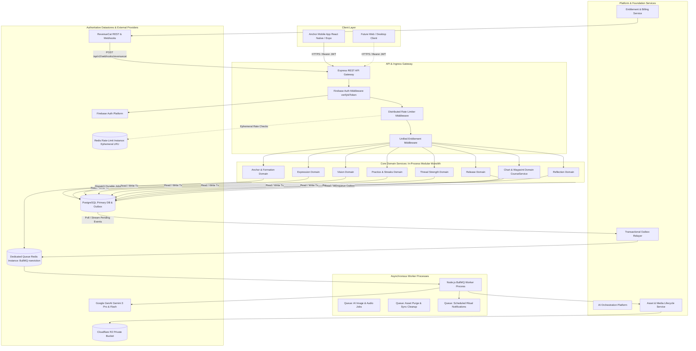

---

## 2. Architecture Principles

The design of Anchor 2.0 is governed by eleven non-negotiable architectural axioms:

1. **Consequential State is Server-Authoritative**: The client owns ephemeral interactions (touch gestures, canvas coordinates, timer animations, audio playheads, local drafting). The backend owns consequential state (Anchor records, geometry provenance, active expression selection, vision assets, practice validation, Thread Strength movement, course progress, waypoint status, reflections, releases, and entitlements).
2. **Deterministic Provenance Over Inference**: An Anchor created in 2026 must be fully explainable in 2028. The system never discards or infers the mathematical inputs, category, letter distillation, planetary grid, and algorithm version that produced an Anchor's geometry.
3. **Release is a Transition, Not Annihilation**: An intentional letting-go (Release) is an emotional culmination, not a destructive SQL `DELETE`. The Anchor and its linked visualizations, practice history, thread movements, reflections, and course links survive in an immutable `RELEASED` archive.
4. **Release Must Never Be Paywalled**: Subscription state may gate premium creation, enhancement, and expanded practice experiences, but it must never trap a user's existing Anchor or prevent the user from completing its lifecycle. Eligible users retain full authority to view existing Anchors, view Visions, view historical Progress, Release existing Anchors, and export/delete their account regardless of billing status.
5. **Authentic Methodology Over Generic Visuals**: Formation methodology is sacred product IP. AI models enhance atmosphere, lighting, texture, and physical rendering, but never redefine the core symbolic geometry.
6. **No Fabricated Confidence Contracts**: Deceptive metrics (such as the legacy hardcoded IoU score `0.94`) are abolished. Structural preservation is guaranteed by construction (deterministic vector compositing) rather than simulated computer vision.
7. **Durable Asynchrony for Long-Running Operations**: HTTP requests must never hang waiting for multi-second or multi-minute generative models. All heavy generation is queued durably, processed asynchronously by workers over dedicated queue infrastructure, and reconciled via idempotent polling or push streams.
8. **Explicit Lifecycle Over Account Age**: User capability and billing transitions (such as trials) are triggered by explicit domain events and authoritative provider timestamps, never by client clock heuristics or static date cutoffs.
9. **Real Media Ownership and Complete Purge Paths**: Every binary object uploaded to Cloudflare R2 is an indexed `Asset` entity with an explicit owner, content type, visibility tier, and deletion lifecycle. Account deletion guarantees complete cloud storage purging, and unselected generation candidates purge after 48 hours.
10. **Transactional Outbox for Cross-Domain Integrity**: Core business transactions (completing a practice session, advancing a waypoint, or starting a trial) commit atomically with a `DomainEvent` outbox record in PostgreSQL. Asynchronous consumers handle telemetry, push notifications, and cache projection without jeopardizing the database transaction.
11. **Privacy by Design & Two-Tier AI Consent**: Explicit AI generation requests authorize the user-provided generation input for that specific request (e.g. Vision text, anchor geometry). Optional private historical context (e.g. personal reflections, journal entries) requires separate, explicit opt-in consent.

---

## 3. Product Domain Map

Anchor 2.0 organizes backend capabilities into 17 distinct bounded domains:

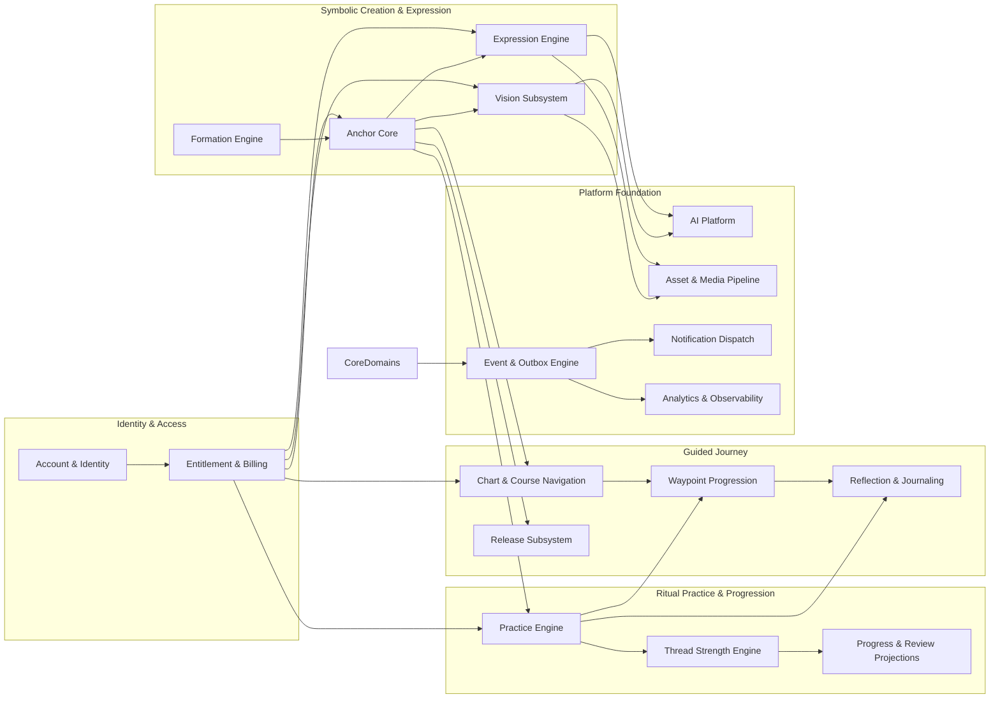

---

## 4. Domain Ownership & Boundaries

To prevent coupling and database deadlocks, domains communicate exclusively through public service interfaces, database foreign keys with explicit cascade policies, and asynchronous domain events.

### Domain Boundary Matrix

| Domain | Owns (Entities) | Reads Directly | Emits Events | Depends On | Must NOT Own |
| :--- | :--- | :--- | :--- | :--- | :--- |
| **Account & Identity** | `User`, `UserSettings` | None | `account.created`, `account.deleted` | Firebase Auth | Billing status, Thread data |
| **Entitlement & Billing**| `SubscriptionProjection`, `EntitlementOverride`, `RevenueCatWebhookEvent` | `User` | `trial.started`, `subscription.changed` | RevenueCat REST / Webhooks | Feature unlock gating inside domain services |
| **Formation** | Algorithm definitions, Kamea matrices, distillation rules | None | `formation.distilled` | None | Anchor persistence, SVG rendering |
| **Anchor Core** | `Anchor`, `AnchorFormation` | `User` | `anchor.created`, `anchor.archived`, `anchor.restored`, `anchor.status_changed` | Formation, Entitlement | AI generation, Practice timers, Course links |
| **Expression** | `AnchorExpression`, `ExpressionCandidate` | `Anchor`, `Asset` | `expression.generated`, `expression.selected` | AI Platform, Asset Platform | SVG geometry, Sigil coordinates |
| **Vision** | `Vision`, `VisionScenario`, `VisionGeneration` | `Anchor`, `Asset` | `vision.created`, `vision.generated`, `vision.selected` | AI Platform, Asset Platform | Practice timers, Anchor burn/deletion |
| **Practice** | `PracticeSession`, `UserStreak` | `Anchor`, `Course`, `Waypoint` | `practice.started`, `practice.completed`, `practice.abandoned` | Thread Strength, Chart | Decay calculation, Waypoint advancement |
| **Thread Strength** | `ThreadMovement`, `AnchorThreadState` | `PracticeSession`, `Anchor` | `thread.changed`, `thread.milestone_reached` | Practice (events) | Practice session logging, Streaks |
| **Progress / Review** | Ephemeral projections & cache | `PracticeSession`, `ThreadMovement`, `Course` | None | Practice, Thread, Chart | Raw practice records, Streaks |
| **Chart & Course** | `Course`, `CourseAnchorLink`, `CourseEvent` | `User`, `Anchor` | `course.created`, `course.completed`, `course.archived` | Waypoint, Entitlement | Practice timers, Thread decay |
| **Waypoint** | `Waypoint` | `Course`, `Anchor` | `waypoint.reached`, `waypoint.completed`, `waypoint.skipped` | Chart, Practice | Course aggregate state |
| **Reflection** | `Reflection` | `PracticeSession`, `Course`, `Waypoint`, `Anchor` | `reflection.created`, `reflection.updated` | User consent | AI training pipelines |
| **Release** | `AnchorRelease` | `Anchor`, `PracticeSession`, `Course` | `anchor.released` | Anchor, Thread, Chart | Hard file deletion, DB row wiping |
| **AI Platform** | `AIJob`, `AIJobAttempt`, `AIUsage` | None | `ai.job_queued`, `ai.job_completed`, `ai.job_failed` | Google GenAI, Queue Redis | Business entities, Final asset links |
| **Asset & Media** | `Asset` | `User` | `asset.uploaded`, `asset.purged` | Cloudflare R2 | Anchor metadata, Image prompts |
| **Notification** | `NotificationSchedule`, `NotificationHistory` | `User`, `UserSettings`, `Course` | `notification.sent` | Expo Push API, Outbox | Practice session logic |
| **Analytics & Telemetry**| Observability streams & sanitizers | All (sanitized) | None | PostHog / Sentry | Any product state |

---

## 5. Source-of-Truth Matrix

The following authoritative matrix defines the exact system of record and mutation authority across all 24 core domain entities in Anchor 2.0:

| Domain Entity / State | Client Role | Express Backend Role | Remote Authority | Authoritative System of Record |
| :--- | :--- | :--- | :--- | :--- |
| **1. User Identity & Auth** | Firebase SDK credentials | Verify ID token; upsert `User` | Firebase Auth | **Firebase Authentication** |
| **2. User Profile & Settings** | Local cache; settings UI | Validates & persists `User`/`UserSettings` | None | **PostgreSQL (`users`, `user_settings`)** |
| **3. Entitlement & Paid Status**| Reads capabilities; shows paywall| Ingests webhooks; evaluates access | RevenueCat | **RevenueCat (Projected to PostgreSQL)** |
| **4. Trial Eligibility & Active**| Triggers explicit trial start | Validates 1st practice/vision rule; sets `trialStartedAt` | None | **PostgreSQL (`users.trial_started_at`)** |
| **5. Formation Methodology** | UI slider / preview inputs | Deterministic distillation & Kamea geometry | None | **Shared Library (`@anchor/formation`)** |
| **6. Anchor Entity & Lifecycle**| Local cache; selection UI | Validates state machine; persists `Anchor` | None | **PostgreSQL (`anchors`)** |
| **7. Canonical Geometry (SVG)** | Ephemeral display & rendering | Persists canonical vector & coordinate sequence | None | **PostgreSQL (`anchor_formations`)** |
| **8. Selected Expression** | Displays artwork | Enforces 1 active expression per anchor | None | **PostgreSQL (`anchor_expressions`)** |
| **9. Expression Candidates** | Carousel UI / selection | Manages ephemeral generation candidates (48h purge) | None | **PostgreSQL (`expression_candidates`)** |
| **10. Vision Entity & Text** | Text editor & scene reader | Versioned persistence; 1 active per anchor | None | **PostgreSQL (`visions`, `vision_scenarios`)** |
| **11. Practice Session Ledger** | Drives UI timer; posts facts | Validates duration; writes immutable ledger | None | **PostgreSQL (`practice_sessions`)** |
| **12. Thread Strength State** | Displays curve; local cache | Derives movements & versioned algorithm decay | None | **PostgreSQL (`thread_movements`, `anchor_thread_states`)** |
| **13. Streaks & Grace Days** | Displays flame icon & count | Evaluates timezone day boundaries | None | **PostgreSQL (`user_streaks`)** |
| **14. Progress & Weekly Review**| Visual charts & graphs | Derives dynamic SQL projections | None | **PostgreSQL (Dynamic Projections)** |
| **15. Course Definition (Chart)**| Displays course map | Manages `Course` lifecycle (1 active) | None | **PostgreSQL (`courses`)** |
| **16. Waypoint Progression** | Sends manual completion action | Projects dynamic status; logs `CourseEvent` | None | **PostgreSQL (`waypoints`, `course_events`)** |
| **17. Course Anchor Links** | Displays linked anchors | Enforces partial unique constraints | None | **PostgreSQL (`course_anchor_links`)** |
| **18. AI Plan Proposals** | Submits goal; accepts plan | Invokes Gemini Flash; persists proposal | Google Vertex | **PostgreSQL (`ai_plan_proposals`)** |
| **19. Reflection Journaling** | Captures prompt & mood | Enforces privacy & AI consent rules | None | **PostgreSQL (`reflections`)** |
| **20. Released Anchors Archive** | Displays historical context | Executes soft release & snapshots metrics | None | **PostgreSQL (`anchors.status`, `anchor_releases`)** |
| **21. AI Generation Jobs** | Polls job status / listens | BullMQ queue orchestration & attempts | Google GenAI | **PostgreSQL (`ai_jobs`) + Dedicated Queue Redis** |
| **22. Binary Media Assets** | Displays image/audio from URL| Issues 1-hour presigned URLs; tracks keys | Cloudflare R2 | **PostgreSQL (`assets`) + Cloudflare R2** |
| **23. Transactional Events** | None | Writes outbox atomically in domain tx | None | **PostgreSQL (`outbox_events`)** |
| **24. Notification Dispatch** | Displays push banners | Schedules & logs dispatches | Expo Push | **PostgreSQL (`notification_schedules`)** |

---

## 6. Account & Identity Architecture

### Identity Provider Boundary

Anchor 2.0 maintains **Firebase Authentication** as its primary identity provider for all consumer clients (Apple Sign-In, Google Sign-In, Email/Password).
- Backend authentication is enforced via `firebase-admin` validating cryptographically signed Firebase ID tokens (`admin.auth().verifyIdToken(token)`).
- The `authUid` (Firebase UID) is the immutable foreign anchor linking an external identity to the internal PostgreSQL `User` record.
- **Mock Authentication Policy**: Mock authentication headers are strictly constrained to `NODE_ENV === 'development'` or `NODE_ENV === 'test'` guarded by `ENABLE_MOCK_AUTH=true`. Any attempt to present mock authentication headers in staging or production results in an immediate `401 UNAUTHORIZED`.

### Account Deletion & GDPR Compliance

When a user exercises their right to account erasure via `DELETE /api/v2/auth/me`:
1. The backend begins an atomic database transaction.
2. All child records with personal sentiment (`reflections`, `visualization_scenes`, `practice_sessions`) are marked for permanent deletion.
3. The `AssetPlatformService` enqueues a high-priority background job to purge all Cloudflare R2 objects owned by `userId`.
4. The database row in `users` is permanently deleted (cascading through foreign keys).
5. The user is deleted from Firebase Authentication via `admin.auth().deleteUser(authUid)`.
6. RevenueCat is notified via REST API to erase the subscriber record.

---

## 7. Entitlement & Subscription Architecture

### Account Monetization State vs. Capability Decision

Anchor 2.0 strictly separates **Account Monetization State** (the subscription billing status) from **Capability Decisions** (the granular permission to execute a specific product action).

#### 1. Account Monetization States
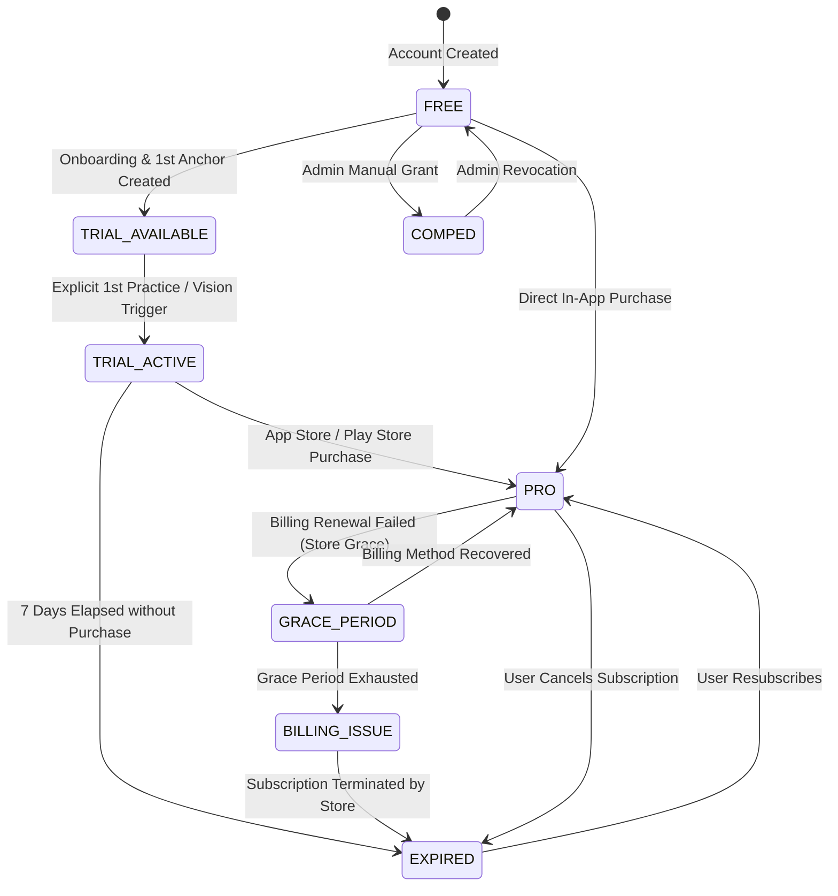

#### 2. Capability Decision Contract
Domain services never inspect subscription strings directly. They query `EntitlementService.evaluateCapability(userId, capability)`:

```typescript
interface CapabilityDecision {
  allowed: boolean;
  reason: 'PRO_SUBSCRIBER' | 'TRIAL_ACTIVE' | 'COMPED' | 'DAILY_FREE_ALLOWANCE' | 'LIFECYCLE_UNRESTRICTED' | 'TRIAL_AVAILABLE' | 'LIMIT_REACHED' | 'EXPIRED' | 'REQUIRES_PAYWALL';
  paywallContext?: {
    paywallId: 'PRIMARY_TRIAL' | 'PRO_UPGRADE' | 'QUOTA_EXHAUSTED';
    remainingQuota?: number;
    resetAt?: string;
    secondaryFreeActionAvailable?: boolean; // e.g. Free Focus available today
  };
}
```

### The Locked Trial Product Model

Anchor 2.0 permanently eliminates the legacy static cutoff (`LEGACY_TRIAL_MIGRATION_CUTOFF = '2026-08-28'`):
- **Onboarding & Creation are Free**: Creating an account, completing onboarding, and creating the first Anchor are 100% accessible on the `FREE` tier.
- **The Paywall Gate**: The user lands on Home with their newly formed Anchor. The primary trial paywall is presented when the user attempts their **first Practice session** OR initiates **Vision generation**.
- **Dual Presentation**: The paywall presents **"Start 7-day trial"** as the primary CTA, while also offering a secondary Free path allowing the user's available daily Focus session.
- **Explicit Activation**: The 7-day trial clock starts **only** when the user explicitly triggers the trial via in-app confirmation (or App Store introductory trial). The backend records this via `POST /api/v2/billing/trial/start`, setting `users.trial_started_at = now()`.

### Free Tier Practice Rules (Approved)

- **Focus Practice**: Free tier users are permitted **1 completed Focus practice per user-local calendar day**.
- **Deep Prime**: Gated behind `TRIAL_ACTIVE` or `PRO`.
- **Visualize**: Gated behind `TRIAL_ACTIVE` or `PRO`.
- **Vision AI Generation**: Gated behind `TRIAL_ACTIVE` or `PRO`.
- **Release**: **Always available** for any existing active Anchor regardless of billing state.

### Release Must Never Be Paywalled

> **Core Monetization Principle**: Subscription state may gate premium creation, enhancement, and expanded practice experiences, but it must never trap a user's existing Anchor or prevent the user from completing its lifecycle.

An eligible user retains continuous access to:
- View existing Anchors and canonical geometry
- View existing Vision text and rendered imagery
- View historical Progress and Daily Weave
- View Chart and historical course logs
- **Release an existing Anchor**
- Delete or export account data
- Manage billing settings

Even if their account is in `EXPIRED`, `BILLING_ISSUE`, or `FREE` status, `release.perform` evaluates to `allowed: true`.

### RevenueCat Webhook Integration

Anchor 2.0 introduces an authoritative, idempotent webhook ingestion endpoint at `POST /api/v2/webhooks/revenuecat`:

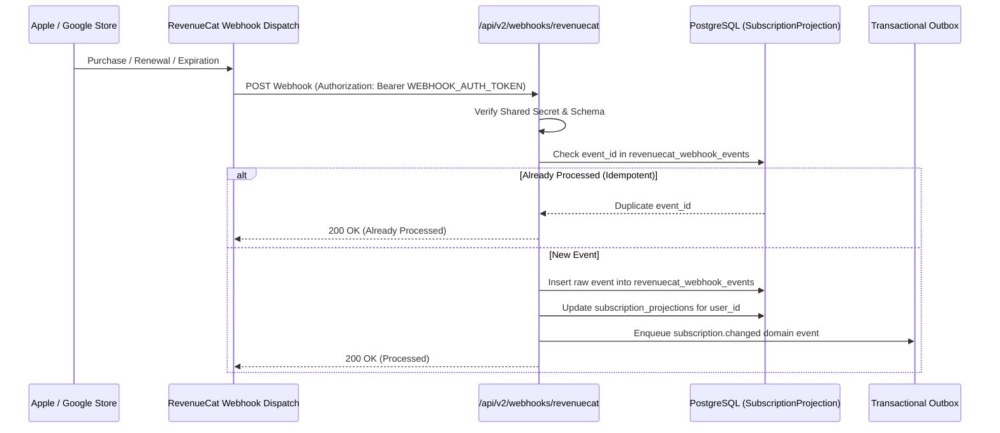

---

## 8. Anchor Domain

### Anchor as an Aggregate Root

In Anchor 2.0, the `Anchor` is the **Aggregate Root** governing intention, geometric formation, aesthetic expression, visualization, and ritual lifecycle:

```
Anchor
├── Formation (Canonical Geometry, Planetary Grid, Distilled Consonants)
├── Expressions (AI-Rendered Textures, Selected Visual Candidate)
├── Visions (Text Scenario, Atmospheric Imagery, Sensory Prompts)
├── Practice History (Immutable Practice Session Records)
├── Thread State (Reinforcement Movement, Versioned Decay State)
├── Chart Links (Active Destination or Waypoint Assignments)
└── Release (Culmination Record, Final Thread Strength, Retained Memory)
```

### The Anchor Lifecycle State Machine

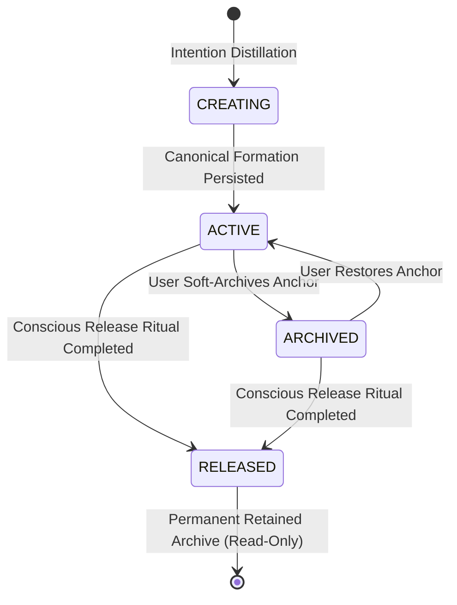

- **Legal Transitions**:
  - `CREATING` → `ACTIVE`
  - `ACTIVE` → `ARCHIVED`
  - `ARCHIVED` → `ACTIVE`
  - `ACTIVE` → `RELEASED`
  - `ARCHIVED` → `RELEASED`
- **Illegal Transitions**:
  - `RELEASED` → `ACTIVE` (A released anchor can never be un-burned or re-activated).
  - `RELEASED` → `ARCHIVED`
  - `CREATING` → `RELEASED`
- **State Invariants**:
  - A `RELEASED` anchor cannot be practiced with, linked to an active course, or selected for new AI expressions.
  - A `RELEASED` anchor remains permanently readable in historical queries, reflections, and past course logs.

---

## 9. Formation Domain

> **ADR-001: Formation Authority & Reproducibility**  
> - **Decision**: Extract sigil distillation, planetary Kamea mapping, and coordinate generation into a shared TypeScript package: `packages/anchor-formation` (published internally to `@anchor/formation`).  
> - **Context**: Mobile previously computed all geometry client-side, while backend accepted arbitrary SVG text. The server was unable to validate or regenerate geometry.  
> - **Alternatives**: (A) Keep client-only; (B) Move formation strictly to backend; (C) Shared TypeScript package.  
> - **Rationale**: Option C enables immediate interactive client preview during intention typing (0 latency, offline capable) while providing 100% deterministic, bit-for-bit server-side geometry verification and headless generation.  
> - **Consequences**: Both mobile and backend consume `@anchor/formation`. Geometry calculation algorithms are strictly versioned.

### Formation Provenance & Immutability

To guarantee that an Anchor created in 2026 can be explained in 2028:
1. `AnchorFormation` records the exact algorithm version (e.g. `2.0.0`).
2. The raw intention string, normalized intention, distilled letters, planetary Kamea grid identifier, coordinate sequence, and generation seed are immutably stored in PostgreSQL.
3. The canonical SVG path geometry generated by the algorithm is persisted as the mathematical ground truth.

```typescript
interface AnchorFormationRecord {
  id: string;
  anchorId: string;
  algorithmVersion: '2.0.0' | 'legacy-client-v1';
  rawIntention: string;
  normalizedIntention: string;
  distilledLetters: string; // e.g. "MSFNGRD"
  category: string; // e.g. "COURAGE", "CLARITY"
  planetaryGrid: 'SATURN' | 'JUPITER' | 'MARS' | 'SUN' | 'VENUS' | 'MERCURY' | 'MOON';
  coordinateSequence: Array<{ x: number; y: number; char: string }>;
  canonicalSvg: string; // Sanitized, deterministic vector path
  geometryHash: string; // SHA-256 of canonical vector path
  createdAt: string;
}
```

---

## 10. Expression Domain

### Decoupling Geometry from Visual Styling

Anchor 2.0 strictly separates **Symbolic Geometry** (the authentic, consecrated vector structure) from **Visual Expression** (the atmospheric textures, physical materials, lighting, and environments generated by AI).

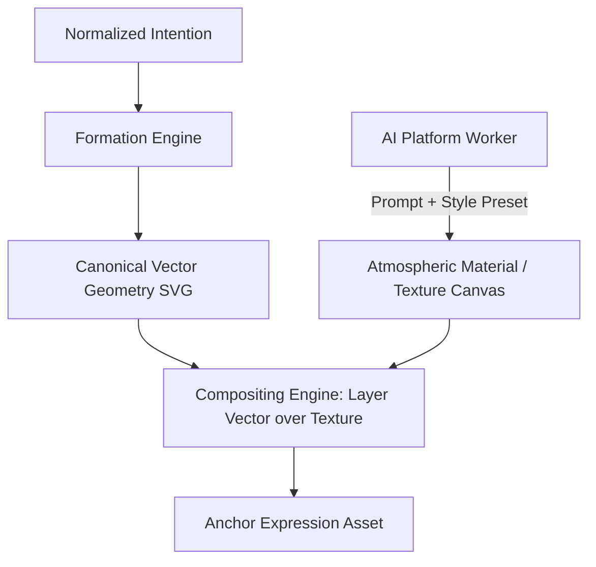

### Structure Preservation Architecture

The audit revealed that previous Gemini 3 Pro enhancements used hardcoded IoU constants (`0.94 / 0.92 / 0.93`). Anchor 2.0 abolishes simulated metrics.

**Approved Decision**:
1. Deceptive numeric scores (`iouScore`, `combinedScore`) are **completely removed** from API contracts.
2. The AI platform generates styled textural backgrounds and contextual visual layers.
3. The server worker deterministically composites the canonical vector path onto the asset canvas, guaranteeing **100% mathematical preservation of the authentic geometry by construction**.

### Expression Candidate Retention (Approved: 48 Hours)

- **Selected Expression**: Durable asset, retained for the lifetime of the Anchor.
- **Unselected Expression Candidates**: Temporary assets, eligible for automated purge **48 hours** after generation.
- **Active Protection Rules**:
  - Generations currently resolving are never purged.
  - Candidates currently referenced in an active client selection transaction are protected from purge.
  - Failed or abandoned temporary generations may be purged earlier by the cleanup worker.

---

## 11. Vision Domain

> **ADR-006: Vision Entity & Persistence Model**  
> - **Decision**: Promote Vision to a first-class, versioned aggregate entity (`Vision`) decoupled from the physical destruction of the Anchor.  
> - **Context**: The existing `VisualizationScene` was bound 1-to-1 to `Anchor` with `onDelete: Cascade`. Burning an anchor irrevocably destroyed its scene text, and no visual scenes could be generated.  
> - **Alternatives**: (A) Keep 1-to-1 cascade; (B) Independent versioned entity with snapshotting; (C) Store scenes inside Anchor JSON column.  
> - **Rationale**: Option B allows users to maintain visualization history, edit scenes over time, attach rich AI-generated visual scenes, and retain their visual memories even after conscious Anchor release.  
> - **Consequences**: An Anchor has one active `Vision`, but past versions are preserved as `SUPERSEDED`. On Anchor release, the Vision status becomes `HISTORICAL` (read-only).

### Vision Lifecycle State Machine

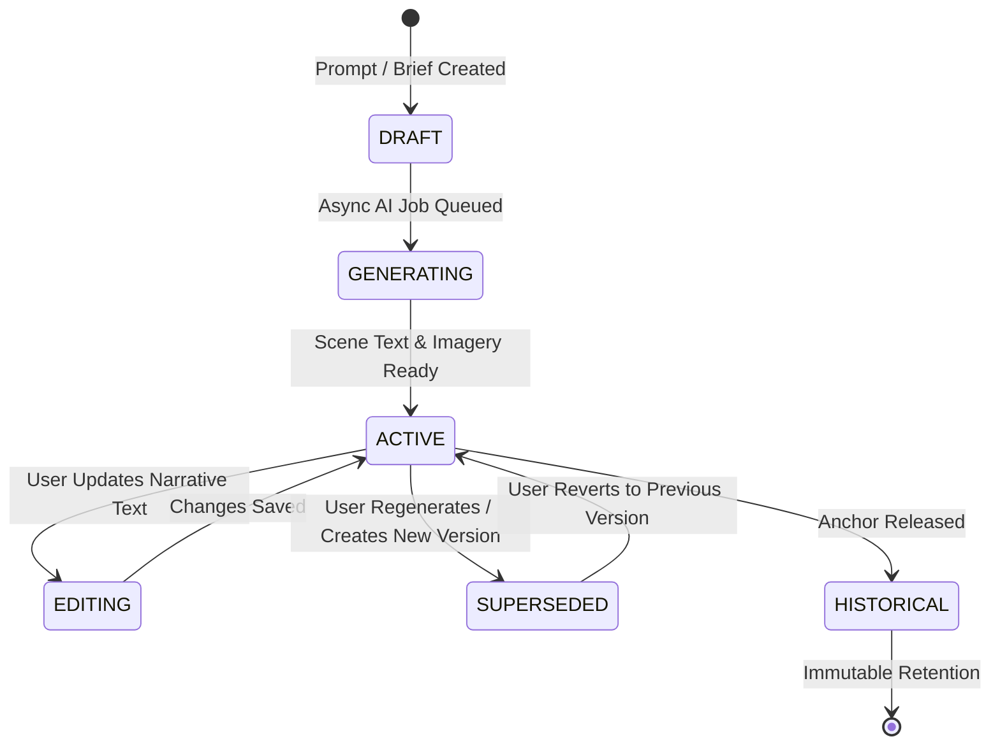

- **Explicit Generation Input**: Submitting a Vision scenario or prompt brief for AI generation inherently authorizes sending that text to the configured AI model. No redundant journal-style consent prompt is required for explicit generation requests.
- **Multi-Device Stability**: The active Vision ID is stored directly on `Anchor.activeVisionId`. Client devices fetching an Anchor receive the exact same active visual and narrative scenario.

---

## 12. Practice Domain

### Practice Session Lifecycle

Anchor 2.0 establishes four canonical practice modes:
1. `FOCUS`: Timed contemplation and breath-synced meditation.
2. `DEEP_PRIME`: Extended intention priming and sensory deepening.
3. `VISUALIZE`: Immersion into the Anchor's visual scenario and narrative.
4. `RELEASE`: The conscious dissolution ritual.

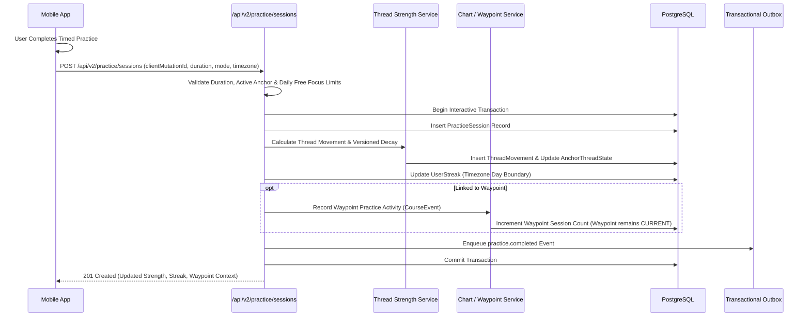

### Practice Ingestion Authority & Chart Decoupling

- The client submits verified execution facts: `clientMutationId`, `anchorId`, `practiceMode`, `startedAt`, `completedAt`, `completedDurationSeconds`, `timeZone`, and optional `waypointId`.
- The server validates duration thresholds, verifies the Anchor is `ACTIVE`, checks the daily Free Focus allowance if un-subscribed, and determines resulting Thread Strength movements.
- **Chart Rule**: Practice linked to a Waypoint records evidence of progress, but **does NOT automatically complete the Waypoint**. The Waypoint remains `CURRENT` until explicitly completed by the user.

---

## 13. Thread Strength Domain

> **ADR-002: Thread Strength Authority & Algorithm Versioning**  
> - **Decision**: Freeze the **backend authority, algorithm versioning framework, and deterministic movement derivation** for Thread Strength, while decoupling specific mathematical constants (such as exact half-life days or practice gain scales) as versioned algorithm specifications.  
> - **Context**: Thread Strength was previously computed 100% client-side via mobile Zustand stores. Moving it to the backend is essential for cross-device consistency and reliable analytics. However, hardcoding a single mathematical formula (e.g. 7-day half-life) into the architectural contract would prevent product formula tuning.  
> - **Alternatives**: (A) Client-authoritative; (B) Hardcode specific mathematical formula into architecture; (C) Backend-authoritative with versioned algorithm engine.  
> - **Rationale**: Option C establishes strict server authority while allowing the algorithm specification to evolve through explicit versioning (e.g. `v2.1`, `v3.0`). Old sessions and historical movements retain their algorithmic provenance.  
> - **Consequences**: Deterministic calculation, zero client spoofing, transparent audit trail ("Why is my strength 74?"), and safe algorithm evolution.

### Core Architecture Principles Frozen for Thread Strength

1. **Server Authority**: The backend derives all Thread Strength values. Client submissions of arbitrary strength integers are rejected.
2. **Versioned Algorithm Framework**: Every movement and materialized state references a formal `threadStrengthAlgorithmVersion` (e.g. `'v2.0-server'`, `'v2.1'`).
3. **Explainable Thread Movements**: Every practice logs an immutable `ThreadMovement` recording:
   - `delta`: Numerical change
   - `reason`: `PRACTICE_GAIN`, `DECAY_EVALUATION`, `MIGRATION_BASELINE`, `ADMIN_CORRECTION`
   - `effectiveTimestamp`: Timestamp of movement
   - `algorithmVersion`: Version in effect
4. **Historical Immutability**: Deploying a new algorithm version **never silently recalculates historical user movements**. New rules apply forward from an explicit migration baseline.

### Thread Strength Flow

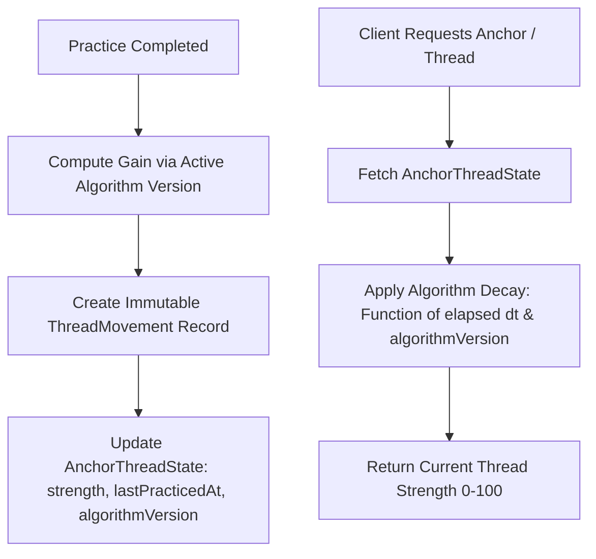

### Algorithm Specification Scope (Configurable via Algorithm Version)

The following parameters belong to the **Thread Algorithm Specification** and are managed via versioned code modules:
- Half-life decay duration ($T_{\text{half}}$)
- Practice gain base values and mode multipliers
- Same-day diminishing returns curves
- Grace period windows (e.g. 36 hours for timezone shifts)
- Daily reinforcement ceilings

---

## 14. Progress / Weekly Review Projection Architecture

Progress metrics, the Daily Weave, and Weekly Reviews are **dynamic projections** over the canonical `PracticeSession`, `ThreadMovement`, and `CourseEvent` ledgers:
- **No Competing Stats Tables**: There are no duplicate `DailyActivity` or `DailyStats` tables.
- **Aggregation Engine**: SQL aggregation views and cached Redis hashes group sessions by `userId` and `localDateKey`.
- **Weekly Review Generation**: Evaluated on-demand or weekly via worker, summarizing total minutes, mode distribution, strongest reinforced Anchor, and completed Waypoints.

---

## 15. Chart / Course Domain

### Preserving the Core Chart Architecture

Anchor 2.0 preserves the verified strengths of the existing Chart system:
- **Naming Rule**: Customer-facing UI is `Chart`; internal database and domain model is `Course`.
- **Cardinality**: Exactly **one active Course per account** enforced by PostgreSQL partial unique index:
  `CREATE UNIQUE INDEX "courses_one_active_per_user" ON "courses" ("user_id") WHERE "status" = 'ACTIVE' AND "deleted_at" IS NULL;`
- **Current Waypoint Authority**: `Course.currentWaypointId` is the single source of truth for course position.
- **Derived Waypoint Status**: As implemented in `WaypointStateService`, waypoint status (`LOCKED`, `AVAILABLE`, `CURRENT`, `COMPLETED`, `SKIPPED`) is dynamically projected based on `currentWaypointId` and timestamp markers (`reachedAt`, `skippedAt`, `cancelledAt`).

### Waypoint Progression Flow (Manual Milestone Confirmation)

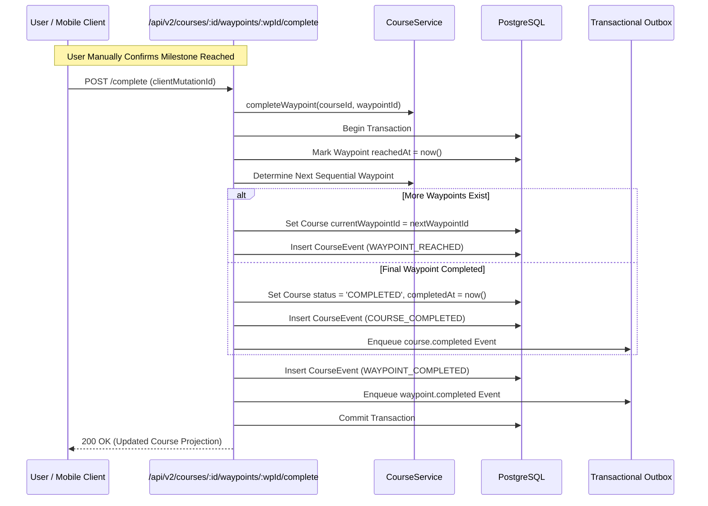

- **Practice Decoupling Frozen**: Completing a practice session linked to a waypoint emits `practice.completed` and records activity on the course log, but **does NOT advance the waypoint**. Waypoint completion is an intentional, manual user milestone action.

---

## 16. Reflection Domain

### Durable Journaling & Privacy Guardrails

- `Reflection` is a first-class immutable record capturing prompts, body text, and emotional mood states (`CALM`, `FOCUSED`, `ENERGIZED`, `UNCHANGED`, `DISTRACTED`).
- **Associations**: Polymorphically linked via optional foreign keys to `practiceSessionId`, `anchorId`, `courseId`, `waypointId`, or `releaseId`.
- **Strict Privacy & Two-Tier AI Consent**: Reflections are confidential personal journals. Reflection content is **never included in generative AI prompts** unless the user explicitly checks an interactive opt-in toggle (`aiConsent: true`) for that specific entry as optional private context.

---

## 17. Release Domain

> **ADR-003: Anchor Release Data Retention & Never Paywalled**  
> - **Decision**: Transform Release from a destructive SQL `DELETE` into a state transition (`status = 'RELEASED'`) accompanied by an immutable `AnchorRelease` milestone snapshot, and guarantee that Release is never blocked by subscription status.  
> - **Context**: `POST /api/anchors/:id/burn` previously hard-deleted `Anchor`, which cascade-deleted `VisualizationScene`, orphaned Cloudflare R2 assets, and returned 404 on network retries. Furthermore, gating release behind a paywall would create an unacceptable dark pattern trapping user intentions.  
> - **Alternatives**: (A) Hard delete; (B) Soft delete with `isDeleted` flag; (C) First-class `RELEASED` lifecycle state with `AnchorRelease` snapshot.  
> - **Rationale**: Release is an emotional culmination. Users want to look back at their journey of letting go. Option C preserves the Anchor, formation history, expressions, scenes, and practice sessions, while cleanly unlinking it from active rituals.  
> - **Consequences**: Zero cascade destruction. Idempotent retries return the existing release snapshot. Always available on Free, Trial, Pro, and Expired tiers.

### Release Execution Sequence

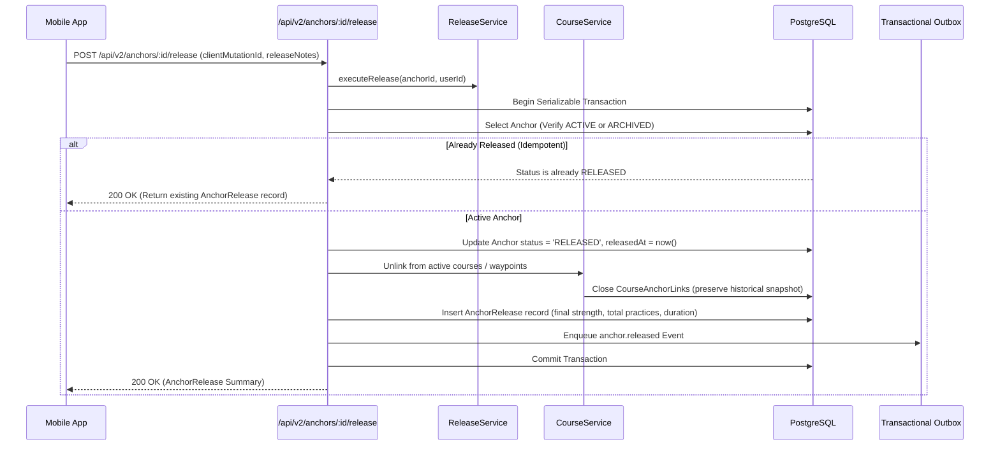

### Released Anchors History Retention

- **Terminology Rule**: Do not use marketing terms like "Memorial" or "Memorial Gallery". Use neutral product/backend language: **"Released Anchors"** or **"Released history"**.
- **Historical Data Retained**:
  - Anchor artwork and canonical geometry
  - Raw and normalized intention
  - Formation provenance and algorithm version
  - Selected expression and selected vision
  - Release date, active duration days, practice count
  - Complete Thread history and final thread strength
  - Associated Chart milestones and reflections
- **UX Independence**: Backend historical data retention is fully frozen; specific mobile UI navigation screens for released anchors are deferred without blocking backend implementation.

---

## 18. AI Platform Architecture

Anchor 2.0 replaces ad-hoc provider calls with a unified **AI Platform Abstraction Layer**:

```
AI Platform Service
   │
   ├── Anchor Expression Adapter (Gemini 3 Pro / ControlNet Pipeline)
   ├── Vision Image Adapter (Gemini 3 Pro Multi-Modal)
   ├── Vision Scene Text Adapter (Gemini Flash)
   ├── Course Planner Adapter (Gemini Flash)
   └── Audio Synthesis Adapter (Google Cloud TTS)
          │
          ▼
   Vendor Provider Clients (Google GenAI, Cloud TTS)
```

### Prompt Versioning, Cost Ledger & Consent Boundary

- **Prompt Versioning**: Prompts are managed as versioned templates (`promptTemplateId: 'anchor-vision-v2.1'`).
- **Cost & Token Tracking**: Models log input tokens, output tokens, provider latency, and approximate cost in USD in `AIUsage`.
- **Two-Tier Consent Assembly**:
  1. *Explicit Generation Input*: The user-provided text specifically typed or selected for the generation request is authorized by the act of submitting the job.
  2. *Optional Private Context*: Personal reflections, past notes, or historical journal text are strictly excluded from AI prompts unless the user has explicitly granted private context consent.

---

## 19. Async Job Architecture

> **ADR-004: Durable Asynchronous Job Execution**  
> - **Decision**: Migrate all image generation, atmospheric vision rendering, and batch maintenance from synchronous HTTP handlers to **BullMQ** job queues running on Node.js worker processes.  
> - **Context**: Synchronous Gemini 3 Pro image generation took 30–120 seconds, causing proxy timeouts, thread pool starvation, and lost assets upon mobile disconnects.  
> - **Alternatives**: (A) Keep synchronous; (B) Client polling with in-memory jobs; (C) BullMQ over Redis.  
> - **Rationale**: BullMQ provides atomic job locking, durable retries, exponential backoff, progress tracking, and complete resilience against client disconnects.  
> - **Consequences**: API routes accept requests immediately (returning `202 Accepted` + `jobId`), while client polls or streams job progress.

> **ADR-005: Dedicated Queue Redis Instance vs. Rate-Limit Redis**  
> - **Decision**: Deploy a **Dedicated Queue Redis Instance** configured strictly with `maxmemory-policy = noeviction` for BullMQ queues, separate from the existing **Redis Rate-Limit Instance** (configured with `allkeys-lru` and MemoryStore fallback).  
> - **Context**: Redis `maxmemory-policy` is configured at the **instance level**, not per logical database. Attempting to share an instance between rate limiting and BullMQ is architecturally unsafe: an LRU policy can drop durable job keys, while a `noeviction` policy causes rate limiting to crash when memory fills.  
> - **Alternatives**: (A) Shared instance with multiple DBs; (B) Dedicated Queue Redis instance.  
> - **Rationale**: Complete isolation of failure domains, memory pressure, and eviction policies. The Queue Redis is production-critical durable infrastructure; rate limiting remains an ephemeral traffic-management layer.  
> - **Consequences**: Two distinct connection configurations (`REDIS_QUEUE_URL` vs `REDIS_RATE_LIMIT_URL`).

### Redis Failure Domain Separation Matrix

| Failure Condition | Impact on Queue Redis | Impact on Rate-Limit Redis | System & API Degradation Behavior |
| :--- | :--- | :--- | :--- |
| **Queue Redis Unavailable** | BullMQ workers halt polling; retry loop | Unaffected | API returns `503 Service Unavailable` for new AI generation jobs with `Retry-After: 30`. **All core synchronous rituals (Focus practice, Chart, Reflections, Release) operate with 100% availability.** |
| **Rate-Limit Redis Unavailable**| Unaffected | In-memory fallback engaged | Distributed rate limiter falls back to local `MemoryStore`. **Zero user requests are dropped or rejected.** |
| **Memory Pressure on Rate Limiting**| Unaffected | Ephemeral keys evicted via LRU | Ephemeral rate limit counters are reclaimed safely without affecting BullMQ job states. |
| **Memory Pressure on Queue Redis**| Rejects new job inserts (noeviction)| Unaffected | Alarms fire; queue workers drain existing jobs; API returns temporary 503 until queue backlog clears. |

### AI Job Lifecycle State Machine

```mermaid
stateDiagram-v2
    [*] --> QUEUED: POST /api/v2/generations (202 Accepted)
    QUEUED --> RUNNING: Worker Picks Up Job
    RUNNING --> VALIDATING: AI Generation Succeeded; Compositing Geometry
    VALIDATING --> PERSISTING: Geometry Validated; Uploading to R2
    PERSISTING --> READY: Asset Indexed; DB Records Updated
    
    RUNNING --> RETRYABLE_FAILED: Provider Timeout / 503 Overloaded
    RETRYABLE_FAILED --> QUEUED: Exponential Backoff (Max 3 Attempts)
    
    RUNNING --> PERMANENT_FAILED: Safety Violation / Non-Retryable Error
    RETRYABLE_FAILED --> PERMANENT_FAILED: Max Retries Exhausted
    
    QUEUED --> CANCELLED: Client Cancels Job
    READY --> [*]
    PERMANENT_FAILED --> [*]
    CANCELLED --> [*]
```

### Client Polling Contract

1. Client dispatches `POST /api/v2/anchors/:id/expressions/generate` with `clientMutationId`.
2. Backend responds immediately with `202 Accepted`:
   ```json
   {
     "data": {
       "jobId": "job_9b1deb4d-3b7d-4bad-9bdd-2b0d7b3dcb6d",
       "status": "QUEUED",
       "estimatedWaitSeconds": 25
     }
   }
   ```
3. Client polls `GET /api/v2/generations/job_9b1deb4d-3b7d-4bad-9bdd-2b0d7b3dcb6d` every 2.5 seconds.
4. When `status === "READY"`, the payload returns the completed `expression` and presigned asset URLs.

---

## 20. Asset & Media Architecture

> **ADR-007: Media Asset Ownership, Privacy & 48-Hour Purge**  
> - **Decision**: Create an authoritative `Asset` entity in PostgreSQL for every Cloudflare R2 object, enforce private access via 1-hour presigned URLs, retain selected assets indefinitely (including through Release), and automatically purge unselected expression candidates after **48 hours**.  
> - **Context**: R2 storage keys had random prefixes that mismatched `deleteAnchorFiles()`, deletion was never called on burn or account deletion, and files were exposed via a public bucket domain.  
> - **Alternatives**: (A) Keep public URLs; (B) Purge candidates immediately; (C) First-class `Asset` model with 48-hour candidate retention and full account purge.  
> - **Rationale**: 48 hours provides ample time for users to compare, review, and choose their preferred expression without allowing storage costs to grow unbounded. Selected expressions and released anchors remain preserved.  
> - **Consequences**: Public domain is disabled for user artwork. All reads issue 1-hour presigned URLs. Automated cleanup worker purges orphaned candidates at $T + 48\text{h}$.

### Asset Model Schema

```typescript
interface AssetRecord {
  id: string; // UUID
  ownerAccountId: string; // FK to User
  storageProvider: 'CLOUDFLARE_R2';
  bucketName: string;
  objectKey: string; // e.g. "users/{userId}/anchors/{anchorId}/expressions/{id}.png"
  mediaType: 'IMAGE' | 'AUDIO' | 'VECTOR';
  mimeType: 'image/png' | 'image/jpeg' | 'audio/mpeg' | 'image/svg+xml';
  byteSize: number;
  checksumSha256: string;
  visibility: 'PRIVATE' | 'SHAREABLE' | 'PUBLIC';
  createdAt: string;
  deletedAt?: string;
}
```

### Asset Retention Rules

1. **Selected Expression**: Durable asset, retained for the lifetime of the Anchor and preserved in the Released history.
2. **Unselected Expression Candidates**: Temporary assets, purged 48 hours after generation.
3. **Active Protection**: Candidates undergoing generation or referenced by an active selection transaction are shielded from cleanup.
4. **Account Deletion**: Full background purge of all R2 objects owned by the account.

---

## 21. Event Architecture

> **ADR-012: Transactional Outbox Pattern for Domain Events**  
> - **Decision**: Implement a lightweight **Transactional Outbox** pattern (`outbox_events` table) inside PostgreSQL.  
> - **Context**: Cross-domain actions (practice completions updating streaks, course progression, and analytics) require multi-table writes. A network failure between PostgreSQL and an external message bus could result in ghost events or dropped updates.  
> - **Alternatives**: (A) Synchronous dual-writing; (B) External message bus (Kafka / RabbitMQ); (C) Postgres Transactional Outbox.  
> - **Rationale**: Option C commits the domain mutation and event record in the exact same ACID database transaction. A background relayer polls or listens to outbox events and reliably dispatches them to internal handlers and Redis workers.  
> - **Consequences**: Zero dropped business events; zero architectural theater.

### Canonical Domain Events

- `account.created`, `account.deleted`
- `anchor.created`, `anchor.archived`, `anchor.restored`, `anchor.released`
- `expression.generated`, `expression.selected`
- `vision.created`, `vision.generated`, `vision.selected`
- `practice.started`, `practice.completed`, `practice.abandoned`
- `thread.changed`, `thread.milestone_reached`
- `course.created`, `course.completed`, `course.archived`
- `waypoint.reached`, `waypoint.completed`, `waypoint.skipped`
- `reflection.created`
- `trial.started`, `subscription.changed`

---

## 22. Notification Architecture

> **ADR-011: Notification Infrastructure Migration**  
> - **Decision**: Adopt a hybrid model: maintain the current Supabase `pg_cron` + Deno Edge Function for bulk daily practice reminders during Phase 1–2, while routing all transactional, event-driven notifications (AI plan ready, thread milestone, streak freeze alert) through Node.js BullMQ workers on the Dedicated Queue Redis.  
> - **Context**: Supabase `pg_cron` currently executes hourly to call a Deno Edge Function dispatching daily reminders. Moving everything to Node immediately introduces unnecessary operational migration risk.  
> - **Alternatives**: (A) Move everything to Node/BullMQ immediately; (B) Keep everything on Supabase; (C) Hybrid transition.  
> - **Rationale**: Preserves proven daily reminder delivery while giving the Node modular monolith full authority over real-time transactional push events.

---

## 23. Offline / Sync Architecture

Anchor 2.0 establishes a clear, deterministic offline capability contract:

### Offline Operations Matrix

| Operation | Offline Read | Offline Write | Retry Strategy | Requires Online |
| :--- | :---: | :---: | :--- | :---: |
| **View Active Anchors & Geometry** | Yes | No | Local Cache Read | No |
| **View Active Vision Text & Image** | Yes | No | Local Cache Read | No |
| **Start & Complete Practice Session**| Yes | Yes | Sequential Drain (`clientMutationId`) | No |
| **Create Structured Reflection** | Yes | Yes | Sequential Drain (`clientMutationId`) | No |
| **View Chart Course & Current Waypoint**| Yes | No | Local Cache Read | No |
| **Complete Current Waypoint** | No | No | Interactive Network Call | **Yes** |
| **Conscious Anchor Release** | No | No | Interactive Network Call | **Yes** |
| **Generate AI Expression / Vision** | No | No | Worker Queue Submission | **Yes** |
| **Start Subscription / Trial** | No | No | RevenueCat / StoreKit | **Yes** |

### Offline Practice Retry Flow

```mermaid
sequenceDiagram
    participant Mobile as Mobile App (Offline)
    participant Storage as Encrypted AsyncStorage
    participant API as /api/v2/practice/sessions
    participant DB as PostgreSQL

    Note over Mobile: Network Disconnected
    Mobile->>Mobile: User Completes 15m Focus Practice
    Mobile->>Storage: Enqueue Session { id: uuid, clientMutationId: uuid, ... }
    Note over Mobile: Network Reconnected
    Mobile->>Storage: Read Pending Queue Items (FIFO)
    loop For Each Pending Session
        Mobile->>API: POST /api/v2/practice/sessions (payload)
        alt Success (201 Created)
            API->>DB: Commit Session & Thread Movement
            API-->>Mobile: 201 Created
            Mobile->>Storage: Remove Session from Queue
        else Duplicate Submission (409 Conflict / 200 Idempotent)
            API-->>Mobile: 200 OK (Already Recorded)
            Mobile->>Storage: Remove Session from Queue
        else Server Error (5xx)
            API-->>Mobile: 500 / 503
            Note over Mobile: Halt Drain; Retry with Exponential Backoff
        end
    end
```

---

## 24. Idempotency Architecture

Every state-mutating API endpoint in Anchor 2.0 requires a client-generated UUIDv4 `clientMutationId` (either via HTTP header `X-Client-Mutation-Id` or request body):

```typescript
interface MutationPayload {
  clientMutationId: string; // UUIDv4 generated once per user intent
}
```

### Idempotency Behavior Under Retry

- If a network failure occurs after the server commits a transaction, the client retries with the exact same `clientMutationId`.
- The server detects the key in the database and returns the **canonical existing result with 200 OK** (never a 404 or 409 error).
- **Release Idempotency**: Re-submitting a release request for an already released Anchor returns `200 OK` with the existing `AnchorRelease` record.

---

## 25. API Contract Strategy

> **ADR-010: API Versioning Strategy**  
> - **Decision**: Introduce `/api/v2` as a clean, standardized RESTful namespace for Anchor 2.0, while maintaining existing `/api` endpoints with non-breaking compatibility layers during the migration window.  
> - **Context**: The existing 61 endpoints have inconsistent envelopes, missing idempotency keys, and mixed responsibility contracts.  
> - **Alternatives**: (A) Mutate existing `/api` in-place; (B) Query parameter versioning; (C) Clean `/api/v2` namespace.  
> - **Rationale**: Option C allows old mobile app versions to continue functioning during rollout without fear of breaking breaking changes, while enabling a clean, fully typed contract for Anchor 2.0.  
> - **Consequences**: Deprecation schedule established for `/api/v1` routes.

### Standardized Response Envelope

Every response emitted by `/api/v2` conforms to a unified JSON contract:

```typescript
// Success Envelope
interface ApiResponse<T> {
  success: true;
  data: T;
  meta?: {
    page?: number;
    limit?: number;
    total?: number;
    serverTime: string;
  };
}

// Error Envelope
interface ApiErrorResponse {
  success: false;
  error: {
    code: string; // e.g. "TRIAL_EXPIRED", "ANCHOR_ALREADY_RELEASED"
    message: string; // User-facing descriptive message
    details?: Record<string, unknown>;
  };
}
```

---

## 26. Proposed Data Model

The Anchor 2.0 data model refines existing structures and introduces dedicated domain entities:

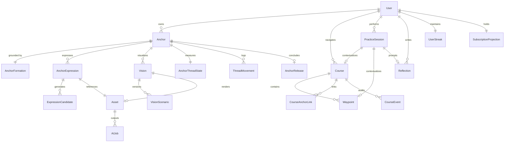

### Proposed Model Inventory

| # | Model Name | Table Name | Purpose | Authority | Existing / New | Migration Source |
| :--- | :--- | :--- | :--- | :--- | :--- | :--- |
| 1 | `User` | `users` | Identity and account root | Server | Existing (Modify) | `users` |
| 2 | `UserSettings` | `user_settings` | Preferences and audio settings | Server | Existing | `user_settings` |
| 3 | `UserStreak` | `user_streaks` | Timezone-aware streak state | Server | New (Split from User)| `users` (scalar columns) |
| 4 | `SubscriptionProjection`| `subscription_projections` | Authoritative entitlement cache | Server / RC | New | `users.subscriptionStatus` |
| 5 | `RevenueCatWebhookEvent`| `revenuecat_webhook_events`| Ingested webhook audit log | Remote (RC) | New | None (New table) |
| 6 | `Anchor` | `anchors` | Anchor aggregate root | Server | Existing (Modify) | `anchors` |
| 7 | `AnchorFormation` | `anchor_formations` | Immutable geometry provenance | Server / Package | New | `anchors` (SVG columns) |
| 8 | `AnchorExpression` | `anchor_expressions` | AI-rendered visual styles | Server | New | `anchors.enhancedImageUrl` |
| 9 | `ExpressionCandidate` | `expression_candidates` | Unselected variations (48h purge)| Server | New | `anchor_variation_pool` |
| 10 | `Vision` | `visions` | First-class visualization aggregate| Server | New | `visualization_scenes` |
| 11 | `VisionScenario` | `vision_scenarios` | Versioned narrative text | Server | New | `visualization_scenes` |
| 12 | `PracticeSession` | `practice_sessions` | Immutable practice ledger | Server | Existing (Modify) | `practice_sessions` |
| 13 | `AnchorThreadState` | `anchor_thread_states` | Materialized strength & version | Server | New | `practice_sessions` (snapshots) |
| 14 | `ThreadMovement` | `thread_movements` | Immutable reinforcement delta | Server | New | `practice_sessions` (snapshots) |
| 15 | `Course` | `courses` | Guided Chart course | Server | Existing | `courses` |
| 16 | `Waypoint` | `waypoints` | Course progression milestone | Server | Existing | `waypoints` |
| 17 | `CourseAnchorLink` | `course_anchor_links` | Anchor-to-Course/Waypoint link | Server | Existing | `course_anchor_links` |
| 18 | `CourseEvent` | `course_events` | Immutable Chart audit log | Server | Existing | `course_events` |
| 19 | `AIPlanProposal` | `ai_plan_proposals` | Generated course outlines | Server | Existing | `ai_plan_proposals` |
| 20 | `Reflection` | `reflections` | Structured user journaling | Server | Existing (Modify) | `reflections` |
| 21 | `AnchorRelease` | `anchor_releases` | Milestone archive of released anchor| Server | New | `burned_anchors` |
| 22 | `AIJob` | `ai_jobs` | Durable async task descriptor | Server | New | None (New table) |
| 23 | `AIJobAttempt` | `ai_job_attempts` | Worker execution retry log | Server | New | None (New table) |
| 24 | `AIUsage` | `ai_usage` | Cost, token, and provider ledger| Server | New | None (New table) |
| 25 | `Asset` | `assets` | First-class Cloudflare R2 media | Server | New | S3 Object Store |
| 26 | `OutboxEvent` | `outbox_events` | Transactional domain outbox | Server | New | None (New table) |
| 27 | `NotificationSchedule`| `notification_schedules` | Transactional push queue | Server | New | Supabase pg_cron |

---

## 27. Database Invariants

Anchor 2.0 enforces data integrity at the database engine level via constraints, unique indexes, and foreign key cascades:

1. **One Active Course Per Account**:
   Enforced via PostgreSQL partial unique index:
   `CREATE UNIQUE INDEX "courses_one_active_per_user" ON "courses" ("user_id") WHERE "status" = 'ACTIVE' AND "deleted_at" IS NULL;`
2. **One Active Destination Anchor Per Course**:
   `CREATE UNIQUE INDEX "course_anchor_links_one_active_destination" ON "course_anchor_links" ("course_id") WHERE "role" = 'DESTINATION' AND "unlinked_at" IS NULL;`
3. **One Active Primary Anchor Per Waypoint**:
   `CREATE UNIQUE INDEX "course_anchor_links_one_active_waypoint_primary" ON "course_anchor_links" ("waypoint_id") WHERE "role" = 'WAYPOINT_PRIMARY' AND "unlinked_at" IS NULL;`
4. **Exactly One Formation Per Anchor**:
   `anchor_formations.anchor_id` has a strict `UNIQUE` foreign key constraint referencing `anchors.id` with `ON DELETE CASCADE`.
5. **Formation Immutability**:
   Database trigger prevents any SQL `UPDATE` operations on `anchor_formations` once inserted.
6. **One Active Selected Expression Per Anchor**:
   `CREATE UNIQUE INDEX "anchor_expressions_one_active_per_anchor" ON "anchor_expressions" ("anchor_id") WHERE "is_active" = TRUE;`
7. **One Active Vision Per Anchor**:
   `CREATE UNIQUE INDEX "visions_one_active_per_anchor" ON "visions" ("anchor_id") WHERE "status" = 'ACTIVE';`
8. **Released Anchor Immutability**:
   Application state machine and transaction checks reject any `PracticeSession` or `CourseAnchorLink` mutation targeting an Anchor where `status = 'RELEASED'`.
9. **Release Must Never Be Blocked by Subscription**:
   Business logic invariant: `release.perform` is guaranteed executable regardless of user billing state.
10. **Practice Does Not Auto-Advance Waypoints**:
    Completing a practice session linked to a waypoint increments session activity but never updates `course.currentWaypointId`. Waypoint advancement requires an explicit waypoint completion mutation.
11. **Idempotency Uniqueness**:
    Unique index on `client_mutation_id` across `practice_sessions`, `anchor_releases`, `reflections`, and `ai_jobs`.

---

## 28. Privacy / Consent Architecture

1. **Two-Tier AI Consent Model**:
   - **Explicit Generation Input**: Data explicitly submitted by the user when requesting AI generation (e.g. Vision scenario text, Anchor vector paths, Chart destination text) is authorized for AI processing by the act of submitting the job.
   - **Optional Private Context**: Sensitive personal journals, historical reflections, and private user notes are strictly excluded from AI prompts unless the user explicitly checks an opt-in toggle (`aiConsent: true`) for that specific entry.
2. **Reflection Confidentiality**: Reflections are classified as **Confidential Personal Data**. They are scrubbed from Sentry events (`sentryPrivacy.ts`) and excluded from third-party analytics.
3. **Signed Object Security**: Cloudflare R2 bucket access is private. Public bucket domain reads for user artwork are permanently deprecated. All asset retrieval flows through short-lived (1-hour) presigned URLs.

---

## 29. Analytics & Observability

### Telemetry Isolation

Analytics must observe state, but **never become state**.
- In-process domain logic writes business telemetry events directly to the `OutboxEvent` table.
- A dedicated background consumer forwards events to PostHog and internal metrics systems.
- If the telemetry service experiences an outage, core user rituals proceed with 100% availability.

### Production Observability Requirements

Every HTTP request and BullMQ job logs structured JSON containing:
- `requestId` (UUIDv4)
- `accountIdHash` (SHA-256 one-way hash of `userId` to prevent PII leakage)
- `jobId` / `clientMutationId`
- `providerLatencyMs`
- `queueDepth`
- Database transaction duration

---

## 30. Migration Strategy

Anchor 2.0 provides an uninterrupted migration path for all existing 1.5 users without data loss.

### The 5-Phase Zero-Downtime Migration

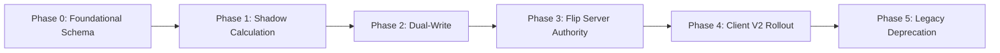

1. **Phase 0 — Foundational Schema Migration**:
   - Apply non-breaking migrations creating `anchor_formations`, `anchor_expressions`, `visions`, `assets`, `thread_movements`, and `outbox_events`.
   - Existing tables and columns remain fully operational.
2. **Phase 1 — Shadow Computation**:
   - Backend calculates Thread Strength and Formation hashes in shadow mode upon receiving existing `/api/practice/sessions` calls.
   - Logs discrepancies between mobile client snapshots and server calculations to telemetry for tuning.
3. **Phase 2 — Dual-Write**:
   - Backend populates both legacy snapshot columns and new `thread_movements` / `anchor_thread_states` records.
   - Migrates existing `VisualizationScene` records into `visions` and `vision_scenarios`.
4. **Phase 3 — Flip Server Authority**:
   - Backend becomes the sole authority for Thread Strength and capability evaluation.
   - Provisions dynamic 7-day trial access for all eligible accounts upon their first practice or vision trigger.
5. **Phase 4 — Client V2 Rollout**:
   - Mobile app updates to consume `/api/v2` endpoints.
   - Distillation and geometry calculations use the shared `@anchor/formation` library.
6. **Phase 5 — Legacy Deprecation & Cleanup**:
   - Decommission dead code (`ai-service/`, `SyncQueue`, unused npm packages).
   - Drop legacy columns after a 90-day grace window.

---

## 31. Backward Compatibility

To support users who do not immediately update their mobile application:
- Existing routes (`POST /api/anchors`, `POST /api/practice/sessions`, `GET /api/anchors/:id/visualization-scene`) remain active as compatibility wrappers.
- When an old client calls `POST /api/anchors/:id/burn`:
  - The backend executes the new **Release workflow** under the hood.
  - It snapshots the release into `burned_anchors` (satisfying legacy mobile client expectations), but **soft-releases** the `Anchor` rather than hard-deleting it.
- When an old client submits practice snapshots, the backend records the session and calculates server-authoritative strength transparently.

---

## 32. Rollout & Feature Flags

Feature flags are centralized in `backend/src/config/flags.ts` with strict separation of concerns:
1. **Deployment Safety Flags**: Kill switches for external integrations (`GEMINI_KILL_SWITCH`, `REVENUECAT_KILL_SWITCH`).
2. **Product Entitlement Gates**: Evaluated dynamically by `EntitlementService` based on subscriber tier.
3. **Gradual Rollout Buckets**: Deterministic user rollout percentages using SHA-256 hash modulo 100 on `userId`:
   `isUserInRollout(userId, 'V2_THREAD_AUTHORITY', 25); // 25% of user base`

---

## 33. Testing Strategy

Anchor 2.0 requires a comprehensive, multi-tiered test pyramid:

```
          / \
         /   \       E2E Integration (Real Postgres + Redis Mock)
        /-----\
       /       \     Concurrency & Race Condition Suites
      /---------\
     /           \   Algorithm Golden Fixtures (Formation & Thread)
    /-------------\
   /               \ Domain Unit Tests (Pure Functions & Services)
  /-----------------\
```

### Golden Fixtures for Formation & Thread

- **Formation Golden Suite**: 50 deterministic intention strings across all 7 planetary grids. Tests verify that distilled letters, coordinate matrices, and SVG paths match bit-for-bit across TypeScript, backend, and mobile runtimes.
- **Thread Strength Golden Suite**: 25 ritual scenarios testing the versioned algorithm specification (same-day practices, multiple inactive days, timezone shifts across the International Date Line, late offline sync). Tests verify that calculated movements match the algorithm version's mathematical definition without freezing formula constants into the core architecture.

### Concurrency & Race Condition Testing

- Simultaneous practice completion submissions under identical `clientMutationId`.
- Simultaneous waypoint completion and skip actions.
- Double-tap release requests.
- Duplicate RevenueCat webhook ingestion under concurrent threads.

---

## 34. Failure / Recovery Strategy

| Failure Scenario | Immediate System Behavior | Automated Compensating Action | User Impact |
| :--- | :--- | :--- | :--- |
| **Dedicated Queue Redis Outage** | BullMQ workers halt queue polling; enter reconnect backoff | Express API returns `503 Service Unavailable` for new AI generation requests (`Retry-After: 30`). Core DB operations continue. | AI generation temporarily unavailable. **All core rituals (Focus practice, Chart, Reflections, Release) function with 100% availability.** |
| **Rate-Limit Redis Outage** | Rate limiter fails open to local in-memory store | In-memory `MemoryStore` maintains local IP / token rate limits. | **Zero user impact.** All requests proceed without error. |
| **Google Gemini API Outage (503 / Timeout)** | AI worker catches failure; marks attempt retryable | BullMQ retries with exponential backoff (3 attempts). If all fail, marks job `PERMANENT_FAILED`. | User notified in app: "Generation temporarily delayed. Tap to retry." No quota lost. |
| **Cloudflare R2 Outage** | Image upload fails in worker persisting phase | Worker preserves image buffer in temporary volume; re-enqueues persist job. | Image renders once R2 connectivity recovers. |
| **RevenueCat API Outage** | Webhook queue buffers in memory / proxy | System falls back to persisted `SubscriptionProjection` in Postgres. | Existing Pro subscribers retain full access without interruption. |
| **Client Disconnects Mid-Generation** | Express request dropped | Worker completes generation in background; persists asset to DB. | User re-opens app; visual is ready and waiting on Home screen. |

---

## 35. Preserve / Refactor / Replace Decisions

The authoritative disposition of all existing backend systems is frozen below:

| Existing Subsystem / Component | Disposition | Architectural Rationale |
| :--- | :--- | :--- |
| **Firebase Auth (`verifyIdToken`)** | **PRESERVE** | Flawless token validation, zero auth regressions, clean integration. |
| **Prisma ORM & PostgreSQL** | **PRESERVE + HARDEN** | Rock-solid foundation; add missing composite indexes and partial SQL constraints. |
| **Redis Rate Limiter** | **PRESERVE** | Maintain existing Redis instance for distributed rate limiting with MemoryStore fallback. |
| **Dedicated Queue Redis** | **PROVISION / BUILD** | Dedicated Redis instance configured with `noeviction` for BullMQ tasks. |
| **Cloudflare R2 Storage** | **REFACTOR** | Migrate to private signed URLs; implement exact asset tracking, 48h candidate cleanup, and complete account purge. |
| **RevenueCat Integration** | **REFACTOR** | Fix post-cutoff trial lockout; implement authoritative webhook handler (`/webhooks/revenuecat`). |
| **CourseService & WaypointState** | **PRESERVE** | Exceptional domain modeling, dynamic status projection, and immutable audit trails. |
| **StreakService** | **PRESERVE** | Solid timezone day-boundary calculations and freeze logic. |
| **CoursePlannerService** | **PRESERVE & HARDEN** | Proven Gemini Flash integration with resilient mathematical fallback. |
| **AIEnhancer.ts** | **REPLACE** | Replace synchronous execution and fake IoU scoring with BullMQ worker pipeline over Queue Redis. |
| **Thread Strength (Client)** | **REPLACE / BUILD** | Migrate from client-side Zustand calculation to server-authoritative versioned engine. |
| **Formation (Client)** | **PORT / REFACTOR** | Extract into shared `@anchor/formation` package used by both mobile and backend. |
| **VisualizationScene** | **REFACTOR / MIGRATE** | Promote to first-class versioned `Vision` domain; eliminate cascade deletion on burn. |
| **BurnedAnchor** | **REFACTOR / MIGRATE** | Replace hard-delete with soft `RELEASED` state on `Anchor` + `AnchorRelease` snapshot. |
| **SyncQueue Model** | **REMOVE** | Drop dead database table; formalize client sequential drain with `clientMutationId`. |
| **ai-service/ (Python)** | **REMOVE** | Delete disconnected, unused repository folder. |
| **Mantra Backend Routes** | **REMOVE / DEPRECATE** | Prune uncalled mantra audio generation endpoints from `/api/ai`. |
| **Unused Dependencies** | **REMOVE** | Remove `compromise` and `jsonwebtoken` from `package.json`. |

---

## 36. Implementation Workstreams

The execution of Anchor 2.0 is partitioned into 12 independent engineering workstreams:

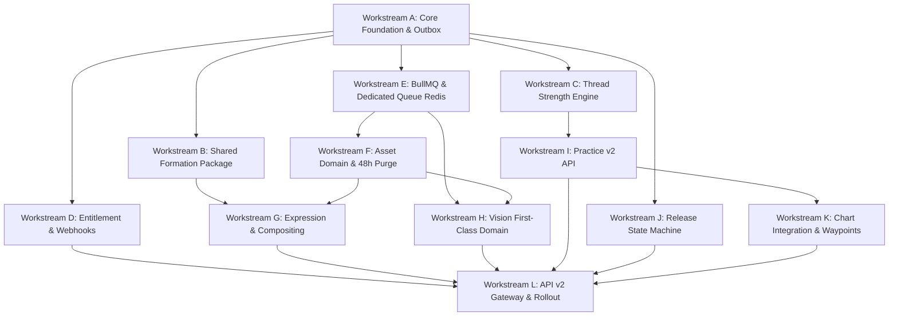

### Workstream Specifications

| Workstream | Scope & Deliverables | Prerequisites | Independent Parallelism |
| :--- | :--- | :--- | :--- |
| **WS-A: Foundation & Outbox** | Prisma schema migrations, `OutboxEvent`, base repository structure | None | Blocks all other workstreams |
| **WS-B: Formation Package** | Extract `@anchor/formation` TS package, golden tests | WS-A | Parallel with C, D, E |
| **WS-C: Thread Engine** | Server authority, algorithm version framework, migration/shadow comparison | WS-A | Parallel with B, D, E |
| **WS-D: Entitlements** | RevenueCat webhook, daily Free Focus allowance, trial fix, Release always open | WS-A | Parallel with B, C, E |
| **WS-E: BullMQ Workers** | Dedicated Queue Redis setup (`noeviction`), worker process, `AIJob` tracking | WS-A | Parallel with B, C, D |
| **WS-F: Asset Pipeline** | `Asset` entity, R2 presigned URLs, 48h candidate purge worker, account purge | WS-E | Parallel with G, H |
| **WS-G: Expression Engine** | AI background generation, vector compositing, variation selection | WS-B, WS-F | Parallel with H, I |
| **WS-H: Vision Subsystem** | `Vision` & `VisionScenario` models, suggestion worker, image attach | WS-F | Parallel with G, I |
| **WS-I: Practice API** | `/api/v2/practice/sessions` with server validation, daily Free Focus limit, streaks | WS-C | Parallel with J, K |
| **WS-J: Release Domain** | Soft release transition, `AnchorRelease` snapshot, historical queries (never paywalled)| WS-A | Parallel with I, K |
| **WS-K: Chart & Waypoints** | Waypoint manual completion mutation, Practice activity logging | WS-I | Parallel with J |
| **WS-L: API v2 Gateway** | Final `/api/v2` router mounting, client compatibility wrappers | All | Final consolidation phase |

---

## 37. Contract Freeze Checklist

### 1. State Authority Freeze

| Consequential State | True Authority | Persistence Store | Client Role |
| :--- | :--- | :--- | :--- |
| **Anchor Formation Record** | Backend / Formation Engine | PostgreSQL (`anchor_formations`) | Interactive drafting & vector preview |
| **Anchor Lifecycle State** | Backend State Machine | PostgreSQL (`anchors.status`) | Triggers legal transition requests |
| **Selected Expression** | Backend Expression Service | PostgreSQL (`anchor_expressions`) | Displays artwork; selects favorite |
| **Vision Narrative & Image** | Backend Vision Service | PostgreSQL (`visions`) + R2 | Edits narrative; views scene |
| **Practice Session Ledger** | Backend Practice Service | PostgreSQL (`practice_sessions`) | Drives ritual timer; posts facts |
| **Thread Strength State** | Backend (Versioned Engine) | PostgreSQL (`anchor_thread_states`) | Renders strength curve; local cache |
| **Active Course & Waypoint** | Backend Course Service | PostgreSQL (`courses`, `waypoints`) | Displays map; completes milestones |
| **Waypoint Advancement** | Manual User Mutation | PostgreSQL (`waypoints.reached_at`) | Explicit user milestone confirmation |
| **Reflection Body & Mood** | Backend Reflection Service | PostgreSQL (`reflections`) | Enters journal text; sets mood |
| **Anchor Release Archive** | Backend Release Service | PostgreSQL (`anchor_releases`) | Initiates dissolution ritual |
| **Subscription & Trial Tier**| RevenueCat / Entitlement Svc | PostgreSQL (`subscription_projections`)| Displays paywall; initiates purchase |

### 2. Domain Events Freeze

| Domain Event | Emitting Domain | Primary Consumers | Transactional Outbox? |
| :--- | :--- | :--- | :---: |
| `account.created` | Identity | Entitlements, Welcome Notification | Yes |
| `anchor.created` | Anchor | Chart, Analytics | Yes |
| `anchor.released` | Release | Chart, Thread, Historical Projections | Yes |
| `expression.selected`| Expression | Anchor, Analytics | Yes |
| `vision.selected` | Vision | Anchor, Analytics | Yes |
| `practice.completed` | Practice | Thread Engine, Streak Service, Chart Activity | Yes |
| `thread.changed` | Thread | Progress Projections, Milestone Alert | Yes |
| `waypoint.completed` | Waypoint | Course Engine, Analytics | Yes |
| `course.completed` | Chart | Notification Dispatch, Analytics | Yes |
| `trial.started` | Entitlements | Notification Scheduler, Analytics | Yes |
| `subscription.changed`| Entitlements | Capability Cache Invalidation | Yes |

### 3. API Mutations Freeze

| Endpoint Mutation | Required Idempotency Key | Transaction Boundary | Emitted Event |
| :--- | :--- | :--- | :--- |
| `POST /api/v2/anchors` | `clientMutationId` (Body) | `Anchor` + `AnchorFormation` + `Outbox` | `anchor.created` |
| `POST /api/v2/anchors/:id/release` | `clientMutationId` (Body) | `Anchor` + `AnchorRelease` + `Links` + `Outbox` | `anchor.released` |
| `POST /api/v2/practice/sessions` | `clientMutationId` (Body) | `Session` + `ThreadMovement` + `Streak` + `Outbox`| `practice.completed` |
| `POST /api/v2/courses/:id/waypoints/:wpId/complete`| `clientMutationId` (Body)| `Waypoint` + `Course` + `CourseEvent` + `Outbox` | `waypoint.completed` |
| `POST /api/v2/reflections` | `clientMutationId` (Body) | `Reflection` + `Outbox` | `reflection.created` |
| `POST /api/v2/generations` | `clientMutationId` (Body) | `AIJob` + `Queue Redis` | `ai.job_queued` |
| `POST /api/v2/billing/trial/start` | `clientMutationId` (Body) | `User` + `SubscriptionProjection` + `Outbox` | `trial.started` |

### 4. Entitlements Freeze

| Capability Key | FREE Tier | TRIAL_AVAILABLE | TRIAL_ACTIVE | PRO Tier | EXPIRED Tier | COMPED Tier |
| :--- | :---: | :---: | :---: | :---: | :---: | :---: |
| `anchor.view` | **Yes** | **Yes** | **Yes** | **Yes** | **Yes** | **Yes** |
| `practice.focus` | **1 / Day** | **1 / Day** | **Unlimited** | **Unlimited** | **1 / Day** | **Unlimited** |
| `practice.deep_prime` | No | No (Until Trial) | **Yes** | **Yes** | No | **Yes** |
| `practice.visualize` | No | No (Until Trial) | **Yes** | **Yes** | No | **Yes** |
| `vision.generate` | No | No (Until Trial) | **Yes** | **Yes** | No | **Yes** |
| `anchor.expression.generate`| 0 | 0 | 5 / Day | 20 / Day | 0 | 20 / Day |
| `chart.view` | Starter Course| Starter Course | Full Access | Full Access | Starter Course| Full Access |
| `chart.plan_ai` | 0 | 0 | 3 / Day | 10 / Day | 0 | 10 / Day |
| `release.perform` | **YES** | **YES** | **YES** | **YES** | **YES** | **YES** |

### 5. Assets Freeze

| Asset Type | Owner Scope | Visibility Tier | Signed URL Expiry | Retention Policy |
| :--- | :--- | :--- | :--- | :--- |
| **Selected Anchor Artwork** | `userId` | `PRIVATE` | 3,600 seconds (1 hr) | Durable; retained through Release; purged on account delete |
| **Unselected Candidate** | `userId` | `PRIVATE` | 1,800 seconds (30 m) | **Auto-purged after 48 hours** by maintenance worker |
| **Vision Scene Image** | `userId` | `PRIVATE` | 3,600 seconds (1 hr) | Durable; retained through Release; purged on account delete |
| **User Profile Picture**| `userId` | `PUBLIC` | Static / CDN Public | Purged on profile update or account delete |
| **Synthesized Audio** | `userId` | `PRIVATE` | 3,600 seconds (1 hr) | Retained with anchor; purged on account delete |

### 6. Offline Capabilities Freeze

| Domain Mutation | Offline Execution Permitted | Local Conflict Resolution | Server Ingestion Path |
| :--- | :---: | :--- | :--- |
| **Practice Session Complete** | **YES** | FIFO Queue with `clientMutationId` | `POST /api/v2/practice/sessions` |
| **Write Reflection** | **YES** | FIFO Queue with `clientMutationId` | `POST /api/v2/reflections` |
| **Create Anchor** | **NO** | Interactive network required | `POST /api/v2/anchors` |
| **Release Anchor** | **NO** | Interactive network required | `POST /api/v2/anchors/:id/release` |
| **Complete Waypoint** | **NO** | Interactive network required | `POST /api/v2/courses/.../complete`|
| **AI Generation Request** | **NO** | Interactive network required | `POST /api/v2/generations` |

### 7. Data Migration Freeze

| Existing 1.5 Record / Column | Target 2.0 Domain Model | Migration Transformation Rule |
| :--- | :--- | :--- |
| `anchors.baseSigilSvg` | `anchor_formations.canonical_svg` | Extract SVG; generate SHA-256 `geometryHash`; set `algorithmVersion = 'legacy-client-v1'`. |
| `anchors.enhancedImageUrl` | `assets` + `anchor_expressions` | Index R2 object key into `assets`; link as active `anchor_expressions` row. |
| `visualization_scenes` | `visions` + `vision_scenarios` | Migrate `currentText` into `vision_scenarios`; link active `visions` aggregate root. |
| `practice_sessions.afterStrength` | `thread_movements` | Create baseline `MIGRATION_BASELINE` event for latest session; initialize `anchor_thread_states`. |
| `burned_anchors` | `anchor_releases` | Backfill `anchor_releases` records; mark legacy burned state for historical queries. |
| `users.subscriptionStatus` | `subscription_projections` | Reconcile with RevenueCat REST API; clear invalid post-cutoff trial flags. |

---

## 38. Product Decisions: Frozen & Approved

All four previously pending product decisions are formally resolved and frozen:

1. **Free Tier Practice Allowance**: **APPROVED WITH MODIFICATION**.
   - Free tier users receive **1 completed Focus practice per user-local calendar day**.
   - Deep Prime, Visualize, and AI Vision generation require `TRIAL_ACTIVE` or `PRO`.
   - Release is always available.
2. **Expression Candidate Expiration Window**: **APPROVED**.
   - Unselected AI expression candidates automatically purge after **48 hours**. Selected expressions remain durable.
3. **Historical Released Anchors**: **APPROVED BACKEND CAPABILITY; UX DEFERRED**.
   - Released Anchors retain full historical context on the backend (formation, artwork, thread movements, reflections, course links).
   - Marketing terms like "Memorial" or "Memorial Gallery" are abolished in favor of neutral product language ("Released Anchors", "Released history"). Front-end screen navigation is deferred without blocking backend implementation.
4. **Waypoint Practice Association**: **APPROVED**.
   - Completing a practice session linked to a waypoint records progress activity on the course log, but does **not** advance or complete the waypoint. Waypoint completion requires manual user milestone confirmation.

---

# Contract Freeze Status

```text
================================================================================
STATUS: READY FOR CONTRACT FREEZE
CONTRACT FREEZE: APPROVED
================================================================================
```

### Frozen Decisions (Ready for Engineering Execution)
1. **Isolated Redis Topology**: Dedicated Queue Redis instance (`noeviction`) for BullMQ workers, completely isolated from the ephemeral Rate-Limit Redis instance.
2. **Formation Authority**: Shared TypeScript package `@anchor/formation` with immutable provenance stored in `anchor_formations`.
3. **Thread Strength Authority**: 100% backend authority over Thread Strength calculation, versioned algorithm specifications, and explainable `ThreadMovement` records.
4. **Release Lifecycle & Never Paywalled**: State transition (`status = 'RELEASED'`) with `AnchorRelease` snapshot. Permanently available across all billing tiers.
5. **AI Asynchrony & Workers**: BullMQ worker queues on Dedicated Queue Redis. Zero synchronous long-running HTTP endpoints.
6. **Structure Preservation**: Deterministic vector compositing over AI textural backgrounds. Deceptive numeric IoU scores abolished.
7. **Asset Privacy & 48h Candidate Purge**: First-class `Asset` model, 1-hour presigned S3 URLs, 48-hour unselected candidate cleanup, complete cloud purge on account deletion.
8. **RevenueCat Webhooks & Locked Trial**: Webhook ingestion at `POST /api/v2/webhooks/revenuecat`. Dual paywall presentation at first practice/vision trigger.
9. **Two-Tier AI Consent**: Explicit generation requests authorize user-provided inputs; optional private historical context requires separate explicit consent.
10. **Chart Progression**: Manual milestone confirmation for Waypoint completion; Practice records activity without auto-advancing Waypoints.
11. **Transactional Outbox**: ACID Transactional Outbox pattern (`outbox_events`) in PostgreSQL.
12. **API Gateway**: Dedicated `/api/v2` namespace with unified JSON envelopes and mandatory `clientMutationId`.

### Remaining Open Decisions
```text
None blocking implementation.
```

### Implementation Prerequisites
Before Workstream A begins:
1. Dedicated Queue Redis instance provisioned on Railway with `maxmemory-policy = noeviction`.
2. Cloudflare R2 bucket credentials provisioned with `DeleteObject` permissions.
3. RevenueCat webhook secret generated for staging and production environments.
4. Internal monorepo workspace configured for `packages/anchor-formation`.

---
*End of Master Architecture Specification.*  
*Ready for Workstream Sequencing.*
